# RPDPTW 구현 중심 아키텍처 및 도메인 설계

```yaml
status: REVIEW
version: 1.3-review
last_updated: 2026-07-26
owner: RPDPTW Domain·Architecture·Application·Platform 설계 역할
document_role: Domain 계약과 project architecture를 실제 구현 순서로 통합한 신규 설계안
source_documents:
  - architecture-design.md@1.3-review
  - domain-design.md@2.3-review
  - master-design.md
selected_target_reference_runtime:
  storage: AWS S3
  orchestration: AWS Step Functions
  compute: AWS Lambda
database: none
future_substitution_targets:
  storage:
    - Google Cloud Storage
    - Azure Blob Storage
    - local filesystem
  workflow:
    - Google Cloud Workflows or another approved GCP durable orchestration
    - Kubernetes controller
  compute:
    - Amazon ECS
    - Google Cloud Run
    - Kubernetes Job
supersedes: null
```

## 1. 목적, 지위와 읽는 법

### 1.1 목적

이 문서는 [Architecture Design](architecture-design.md)과 [Domain Design](domain-design.md)을 별도로 왕복하지 않고도 구현자가 다음 질문에 순서대로 답할 수 있도록 만든 통합 설계안이다.

1. 어떤 Maven module과 Java package부터 만드는가?
2. 외부 입력을 내부 표준 형식(canonical input)과 생성 후 바뀌지 않는 domain 객체로 어떻게 변환하는가?
3. 이동 시간·거리 준비, 경로 전파 계산(propagation), 평가(evaluation)와 고객 정책을 어떻게 분리하는가?
4. 항상 일관된 탐색 해(solution), 복사 후 변경 방식(COW)의 ALNS, 독립 검증과 결과 공개를 어떤 순서로 구현하는가?
5. 신규 고객을 POM·solver·worker 변경 없이 어떻게 추가하는가?
6. Database 없이 object storage에 중간·최종 산출물(artifact)과 실행 상태를 어떻게 보존하는가?
7. 현재 AWS S3 + Step Functions + Lambda를 어떻게 연결하는가?
8. 이후 GCS, Azure Blob, Cloud Run 또는 Kubernetes로 바꿀 때 무엇만 교체하는가?
9. Optional route pool/MIP를 verified baseline 뒤에 어떻게 추가하는가?

이 문서는 **구현 순서가 곧 읽기 순서**다. 앞 단계(phase)의 산출물과 완료 조건(gate)이 다음 단계의 입력이 된다. 뒤 단계의 편의를 위해 앞 단계에 cloud SDK, 고객 이름에 따른 `if` 문, 변경 가능한 cache 또는 특정 최적화 엔진 API를 미리 넣지 않는다.

### 1.2 결정 표기

| 표기 | 의미 |
|---|---|
| **`[CONTRACT]`** | Master/Domain의 현재 의미 계약을 상속한다. |
| **`[USER-CONSTRAINT]`** | 이 문서 작성 시 사용자가 명시한 운영 제약이다. 현재는 database를 사용하지 않는다. |
| **`[RECOMMENDED]`** | 계약을 구현하기 위한 project/module/package 구조 제안이다. |
| **`[PORTABLE]`** | Storage, workflow, compute provider와 무관하게 유지해야 하는 application contract다. |
| **`[CURRENT-REFERENCE]`** | 현재 선택된 AWS S3 + Step Functions + Lambda mapping이다. Domain 의미의 권위가 아니다. |
| **`[FUTURE-ADAPTER]`** | GCS, Azure Blob, Cloud Run, Kubernetes 채택 시 추가할 adapter다. 미리 구현할 필요가 없다. |
| **`[GATED]`** | Verified baseline과 별도 evidence/승인 뒤에만 활성화할 optional 기능이다. |
| **`[OPEN-EXPERIMENT]`** | 실행 protocol은 있지만 공식 수치가 없는 항목이다. |

구체 Java class/interface 이름, descriptor serialization 형식, public HTTP schema와 deployment product 세부는 승인 전까지 추천안이다. Domain 의미와 불변조건은 이름 변경으로 약화할 수 없다.

### 1.3 권위와 충돌 처리

이 문서는 두 원문의 내용을 구현 순서로 재배치하고 고객·인프라 확장 구조를 개선한 신규 `REVIEW` 문서다.

- Domain 값과 propagation/evaluation/result 의미는 [Domain Design](domain-design.md)이 원 소유자다.
- 기존 Maven/module/application port 제안은 [Architecture Design](architecture-design.md)이 원 소유자다.
- 전체 requirement와 decision authority는 [Master Design](master-design.md)을 따른다.
- 질문 상태와 미결정은 [질문 등록부](master-design-open-questions.md)를 따른다.

충돌 시 이 문서가 승인된 상위 계약을 자동으로 대체하지 않는다. 변경이 필요하면 관련 ADR, 원문과 이 문서를 같은 변경 단위에서 갱신한다.

기존 repository의 Java/GCP source와 deployment 자료는 legacy/current-state inventory로 남아 있으며 `AlnsBatchEngine`은 synthetic objective placeholder다. 2026-07-26 승인 결정에 따라 AWS S3 + Step Functions + Lambda가 선택된 target/reference runtime이다. GCP path의 존재는 migration characterization evidence일 뿐 목표 topology가 아니다. 실제 배포 상태가 inventory와 다르면 Phase 0에서 두 경로를 각각 characterization하고 AWS production cutover 전 운영 사실을 ADR로 확정한다.

### 1.4 통합 설계의 핵심 변경

기존 `profile-<customer>` JAR 중심 구조와 단일 `adapters/<provider>` 구조를 다음처럼 바꾼다.

```text
기존:
  customer → customer-specific Maven module/JAR
  cloud provider → storage + workflow + compute가 한 adapter

개선:
  customer → versioned profile descriptor
  reusable business behavior → capability code
  storage provider → independent object-storage adapter
  workflow provider → independent durable-orchestration adapter
  worker compute → independent worker-dispatch adapter
  distribution → profile + capability + storage + workflow + compute의 composition root
```

이 변경의 목적은 네 변화 축을 독립시키는 것이다.

| 변화 축 | 예 | 기본 변경 범위 |
|---|---|---|
| Customer policy | 비용, SLA, objective order | Profile descriptor와 test |
| Business capability | Cold-chain, SOC, patient ride time | `rpdptw-capabilities` package와 test |
| Storage | S3 → GCS/Azure Blob | Object-storage backend adapter |
| Workflow | Step Functions → approved GCP workflow 또는 Kubernetes controller | Workflow adapter와 deployment |
| Worker compute | Lambda → ECS/Cloud Run/Kubernetes Job | Compute adapter와 deployment |

이 분리는 이 프로젝트의 다섯 독립 변경 축을 반영한다.

| 변경 축 | 질문 | 안정적으로 유지할 경계 |
|---|---|---|
| 고객 | 어떤 고객이 어떤 승인 설정을 쓰는가? | Profile identity, binding, tenant authorization |
| Domain/capability | 어떤 새로운 물리 상태나 제약을 계산해야 하는가? | Canonical domain과 typed facet SPI |
| 채점 | 같은 물리 사실을 어떤 비용·soft penalty로 환산하는가? | Metric → score 단방향 계약 |
| 목적함수 | 여러 score/outcome을 어떤 우선순위로 비교하는가? | Stable objective vector/comparator |
| Infrastructure | Artifact를 어디에 두고 누가 workflow와 worker를 실행하는가? | Application port, logical identity, CAS와 idempotency |

고객 변경이 항상 domain 변경인 것은 아니며, score 변경이 objective 순서 변경인 것도 아니다. 예를 들어 km 단가 변경은 profile parameter이고, `비용 → 거리`를 `SLA → 비용 → 거리`로 바꾸는 것은 objective 조합 변경이다. 반면 배터리 SOC처럼 다음 정차의 가능성에 영향을 주는 새 상태만 domain facet 변경이다.

### 1.5 현재 비범위

- Multi-trip/rotation 활성화
- MDVRP·OVRP·SDVRP 구현
- Dynamic traffic, realtime replanning, geocoding
- Route pool/MIP의 production 기본 활성화와 특정 optimizer license 승인
- `Q-BENCH-02` calibration 전 공식 worker/round/step/watchdog 수치
- Database 기반 검색·집계·관리 화면
- Object storage listing에 의존하는 query API
- GCP/Azure/Kubernetes adapter를 현재 미리 구현하는 일

### 1.6 대상 독자와 필요한 사전 지식

대상 독자는 다음 정도의 경험을 가진 개발자다.

- Java의 class, interface, record, enum과 Maven dependency를 이해한다.
- 다른 조직이나 제품에서 CVRPTW solver를 사용하거나 구현해 본 적이 있다.
- 이 repository의 용어, 기존 코드, 고객별 정책과 cloud 운영 방식은 모른다.

따라서 이 문서는 CVRPTW의 일반 개념은 짧게 연결해서 설명하고, 이 프로젝트에서만 쓰는 의미는 처음 등장할 때 정의한다. 영어 용어는 코드·업계 문서 검색에 필요할 때 병기하되, 이후 문장만 읽어도 역할을 알 수 있게 한다.

처음 읽는다면 다음 순서를 권장한다.

1. 1.7의 전체 처리 이야기와 1.8의 예제를 읽는다.
2. 1.9 용어 표를 옆에 두고 2장과 3장의 전체 구조를 읽는다.
3. Phase 0부터 Phase 12까지 순서대로 읽는다.
4. Phase 13의 route pool/MIP는 선택 기능이므로 첫 구현에서는 건너뛴다.
5. 19장 이후는 구현 중 확인하는 운영·검증 체크리스트로 사용한다.

### 1.7 한 건의 요청이 처리되는 전체 이야기

이 시스템은 배송 요청과 차량을 받아, 물리적으로 실행 가능하고 고객의 우선순위에 가장 잘 맞는 운행 계획을 만든 뒤, 그 계획을 다시 독립 검증해서 저장하는 시스템이다.

```mermaid
flowchart LR
    K["입력 key와 exact profile identity"] --> R["ArtifactStore exact-key 조회와 digest 검증"]
    R --> P["Versioned adapter 파싱·schema 검증"]
    P --> N["Canonical input 정규화"]
    N --> B["Profile 조회·capability binding"]
    B --> D["ProblemInstance·PreparedTravel·BoundProfile 생성"]
    D --> S["Portfolio·ALNS solver 실행"]
    S --> E["Cache-free score·objective 재평가"]
    E --> V["Candidate verifier → finalization → result verifier"]
    V --> A["Immutable result/audit 저장"]
    A --> C["Published pointer CAS와 상태 전이"]
```



전체 흐름은 다음과 같다.

1. Inbound adapter가 `tenant`, 외부 input key, exact `customer/profile/version/preset`과 idempotency key를 받는다.
2. Raw key를 provider path로 직접 이어 붙이지 않고 typed `ArtifactKey`/`ArtifactRef`로 바꾼 뒤 권한, schema version과 digest를 확인한다.
3. 선택된 `ArtifactStore` adapter가 exact key로 파일/S3/GCS object를 조회한다. 정상 흐름은 prefix listing에 의존하지 않는다.
4. Versioned input adapter가 bytes를 파싱하고 alias 충돌, 필수 field, 숫자·시간 표현과 참조 무결성을 검사한다.
5. Normalization이 외부 표현을 canonical business input으로 바꾸고, travel preparation이 필요한 모든 방향별 거리·시간을 확정한다.
6. `ProfileCatalogPort`가 exact profile을 조회하고 binder가 capability key/version, typed parameter, score dependency와 objective 순서를 검증해 `BoundProfile`을 만든다.
7. Immutable `ProblemInstance`, `PreparedTravel`, `BoundProfile`과 `SolveSnapshot`을 fingerprint와 함께 저장한다.
8. Solver가 초기 portfolio와 ALNS를 실행한다. 각 후보의 propagation은 경로의 물리 사실을 계산하고, bound evaluation은 hard constraint, metric, score와 objective vector를 차례로 만든다.
9. Solver와 compile dependency가 분리된 candidate verifier가 cache 없이 후보를 재계산한다. Finalizer가 outcome/audit를 만들고 result verifier가 payload와 요약을 다시 검사한다.
10. 검증된 artifact를 `putIfAbsent`로 먼저 저장한 뒤 하나의 authoritative state/result pointer를 CAS로 전이한다. Retry는 같은 logical identity와 digest에 수렴한다.

각 화살표의 책임은 분리한다.

| 처리 | 담당 | 질문 |
|---|---|---|
| 입력 변환 | `rpdptw-core/input`, `normalization` | 외부 값이 내부에서 정확히 무엇을 뜻하는가? |
| 이동 준비 | `rpdptw-core/travel` | A에서 B까지 거리와 시간은 얼마인가? |
| 경로 전파 계산 | `rpdptw-core/propagation` | 이 방문 순서로 실제 운행하면 언제 도착하고 적재량은 어떻게 변하는가? |
| 평가 | `rpdptw-core/evaluation` + capabilities | 실행 가능한가? 비용과 고객 우선순위 값은 얼마인가? |
| 탐색 | `rpdptw-solver` | 어떤 방문 순서를 시험하고 채택할 것인가? |
| 독립 검증 | `rpdptw-verification` | solver의 내부 상태를 믿지 않고 다시 계산해도 맞는가? |
| 실행 조정 | `rpdptw-application` | 여러 worker와 실행 단계를 어떤 순서로 진행하는가? |
| 외부 시스템 연결 | `adapters/*` | 같은 요청을 S3, GCS, Azure Blob 또는 local file에서 어떻게 읽고 쓰는가? |

### 1.8 `propagation`을 이해하기 위한 작은 예

이 문서에서 **경로 전파 계산(route propagation)**은 “이미 정해진 방문 순서를 출발지부터 끝까지 따라가면서, 앞 방문의 결과를 다음 방문의 시작 상태로 넘겨 시간·적재량·운행 자원을 계산하는 것”이다. 통신의 메시지 전파나 오류 전파를 뜻하지 않는다.

다음 입력을 가정한다.

```text
차량 V1
  용량: 1,000 kg
  출발: 차고지, 08:30

요청 D1
  배송 전용: 고객 A에 300 kg 배송
  시간창: 09:00~10:00
  서비스 시간: 10분

요청 P1
  고객 B에서 200 kg 픽업 후 고객 C에 배송
  B 시간창: 09:20~10:30, 서비스 10분
  C 시간창: 10:00~11:30, 서비스 10분

선택된 경로
  차고지 → A → B → C
```

배송 전용 물량 300 kg은 차고지에서 이미 실었다고 보므로 초기 적재량은 300 kg이다. 전파 계산은 다음처럼 진행한다.

| 순서 | 계산 | 결과 예 |
|---:|---|---|
| 1 | 차고지 → A 이동 20분 | 08:50 도착 |
| 2 | A 시간창 시작까지 대기 | 10분 대기, 09:00 서비스 시작 |
| 3 | A 배송 완료 | 09:10 출발, 적재량 `300-300=0 kg` |
| 4 | A → B 이동 15분, B 픽업 | 09:25 도착, 09:35 출발, 적재량 `0+200=200 kg` |
| 5 | B → C 이동 20분, C 배송 | 09:55 도착 후 5분 대기, 10:10 출발, 적재량 `200-200=0 kg` |

이 계산이 만드는 값은 `도착 시각`, `대기 시간`, `서비스 시작·종료 시각`, `구간별 적재량`, `누적 거리`, `운전 시간`, `정차 수` 같은 **사실(fact)**이다. 여기서는 아직 “비용이 비싸다” 또는 “A 고객에게 더 좋은 해다”라고 판단하지 않는다.

그 다음 평가 단계가 전파 결과를 사용한다.

```text
hard constraint:
  모든 적재량이 0~1,000 kg인가?
  모든 서비스가 허용 시간 안에 시작했는가?

metric:
  총 거리 42 km, 총 대기 15분, 사용 차량 1대

score:
  고객 profile의 단가를 적용한 운행 비용

objective:
  미배정 수 → SLA 위반 → 비용 → 거리 순으로 두 해 비교
```

따라서 solver가 방문 순서를 바꾸면 propagation이 물리 사실을 다시 계산하고, evaluation이 그 사실을 제약·점수·우선순위로 해석한다. 이 분리 덕분에 고객별 비용 방식이 달라져도 시간과 적재량 계산을 고객마다 복제하지 않는다.

### 1.9 이 문서에서 사용하는 핵심 용어

#### 1.9.1 Domain과 solver 용어

| 용어 | 이 문서에서의 의미 |
|---|---|
| CVRPTW | 차량 용량과 고객 시간창을 지키는 차량 경로 문제. 이 문서는 여기에 pickup-delivery의 같은 차량·선행 순서 조건이 포함된 RPDPTW를 다룬다. |
| Canonical input | 여러 외부 입력 표현을 하나로 모은 내부 표준 입력. 예: `"09:00"`, 별칭 field와 단위를 검증한 뒤 명확한 Java 값으로 변환한다. |
| Normalization | 외부 입력을 canonical domain 값으로 검증·변환하는 과정. 단순 JSON deserialization보다 범위가 넓다. |
| Immutable | 생성 후 내부 값이 바뀌지 않는 상태. 변경이 필요하면 새 객체를 만든다. |
| Prepared travel | solve 전에 모든 필요한 방향별 지점 쌍의 거리와 시간을 확정한 자료. 탐색 중 외부 지도 API를 호출하지 않는다. |
| Propagation | 정해진 경로를 앞에서 뒤로 계산하여 도착·대기·서비스·적재량·운행 자원을 산출하는 절차. 1.8의 계산이다. |
| Hard constraint | 위반하면 후보 해를 사용할 수 없는 규칙. 용량, pickup-before-delivery, 허용 시간 등이 해당한다. 큰 벌점으로 대신하지 않는다. |
| Metric | 가격이나 선호를 넣기 전의 측정값. 예: 42 km, 15분 대기, 차량 1대. |
| Score | metric과 고객 설정을 조합한 비용 또는 soft penalty. 예: `거리 × 고객별 km 단가`. |
| Objective | 두 해 중 어느 것이 나은지 판단하는 비교 기준과 순서. 예: 미배정 수를 먼저, 비용을 다음으로 비교한다. |
| Stable solution/state | request가 정확히 한 route 또는 미배정 bank에 있고 pair·route 불변조건이 모두 맞는, 다음 계산의 기준으로 써도 되는 상태. 단순히 “변화가 적은 해”라는 뜻이 아니다. |
| Candidate | 아직 최종 결과는 아니지만 비교·검증 대상으로 완성된 후보 해. |
| ALNS | 일부 request를 제거(destroy)하고 다시 삽입(repair)하면서 해를 개선하는 탐색 방법. |
| COW | Copy-on-write. 현재 해를 직접 고치지 않고 변경할 부분을 복사해 시험한 뒤, 채택하면 새 해로 확정하고 실패하면 복사본을 버리는 방식. |
| Request bank | 현재 어떤 route에도 배정되지 않은 request ID 집합. 최종 미배정 사유를 저장하는 장소는 아니다. |
| Verifier | solver의 cache와 판단을 신뢰하지 않고 입력·경로로부터 가능성과 결과 무결성을 다시 계산하는 구성 요소. |

#### 1.9.2 고객 확장 용어

| 용어 | 이 문서에서의 의미 |
|---|---|
| Profile | 한 고객에게 적용할 capability, parameter, 점수와 objective 순서를 선언한 versioned 설정 문서. 고객별 Java project가 아니다. |
| Preset | 같은 profile 안에서 선택하는 승인된 설정 묶음. 예: `economy`, `express`. |
| Capability | 여러 고객이 재사용할 수 있는 실행 가능한 업무 기능. 예: 냉장 제약, 지각 비용, 전기차 SOC 계산. |
| Binding | profile의 key/version/parameter를 실제 Java capability 구현과 연결하고 solve 전에 전체 구성이 유효한지 검사하는 과정. |
| BoundProfile | binding이 끝나 더 이상 해석할 것이 없는 immutable 실행 설정. 정확한 version과 fingerprint를 가진다. |
| Facet | 일반 route fact만으로 표현할 수 없는 추가 물리 상태를 위한 typed 확장점. 예: 배터리 SOC, 환자 탑승 시간. 단순 고객 label이나 가격에는 쓰지 않는다. |
| SPI | Service Provider Interface. core가 “구현체는 이 메서드를 제공해야 한다”고 정의하는 Java interface 계약이다. 구현체는 capability module에 있고 core가 그 interface를 호출한다. |

#### 1.9.3 Application과 infrastructure 용어

| 용어 | 이 문서에서의 의미 |
|---|---|
| Port | application이 외부 기능에 요구하는 provider-neutral Java interface. 예: `ArtifactStore.readVerified(ref)`. |
| Adapter | port를 특정 기술로 구현하는 코드. 예: 같은 `ArtifactStore`를 S3 SDK, GCS SDK, Azure SDK 또는 local filesystem으로 구현한다. |
| Provider | AWS, GCP, Azure, Kubernetes처럼 storage·workflow·compute 기능을 제공하는 외부 환경. |
| Artifact | 단계 사이에 저장하고 다시 읽는 immutable 자료. 입력 snapshot, prepared travel, 실행 manifest, 후보 해, 검증 보고서, 최종 결과 등이 해당한다. |
| Artifact reference | 큰 artifact 자체 대신 전달하는 주소표. 종류, schema version, content digest와 provider 내부 위치를 가진다. |
| Fingerprint/digest | 내용이 같은지 검증하기 위해 정규화된 내용에서 계산한 식별값. provider의 S3 key나 file path와 구분한다. |
| Manifest | 한 실행을 재현하는 데 필요한 입력·profile·build·algorithm·seed·step 계획을 묶은 명세서. |
| Coordinator | round와 worker 상태를 읽고 다음 논리 작업을 결정하는 application 코드. Step Functions 정의 자체가 아니다. |
| Worker | 하나의 선언된 solver 작업을 실행하고 immutable 결과를 저장하는 실행 단위. Lambda, Cloud Run 또는 Kubernetes Job에서 동일한 application 작업을 수행할 수 있다. |
| Idempotency | 같은 논리 요청이 retry나 중복 전달되어도 결과가 한 번 처리한 것과 같게 수렴하는 성질. |
| CAS | Compare-and-set. “내가 읽은 version이 아직 같을 때만 새 상태로 교체”하는 조건부 쓰기. 동시에 두 실행이 같은 champion이나 결과를 덮어쓰는 일을 막는다. |
| Provenance/lineage | 입력, 설정, build, 이전 산출물과 현재 결과 사이의 생성 근거와 연결 관계. 문제 발생 시 무엇으로부터 만들어졌는지 추적한다. |
| Gate | 다음 단계로 넘어가기 전에 반드시 통과해야 하는 test와 evidence의 묶음. |

#### 1.9.4 설계 문서에서 반복하는 표현

| 표현 | 이 문서에서의 의미 |
|---|---|
| Contract | 구현이 바뀌어도 지켜야 하는 입력·출력·오류·불변조건의 약속. 단순한 Java interface 선언보다 넓은 뜻이다. |
| Invariant | 정상 객체나 상태라면 항상 참이어야 하는 조건. 예: 한 request는 정확히 한 route 또는 bank에만 존재한다. |
| Authority/source of truth | 같은 값의 여러 표현 중 정답으로 인정하는 원천. 예: route sequence가 정답이고 arrival cache는 다시 만들 수 있는 파생값이다. |
| Descriptor | 실행 code가 아니라 “무엇을 어떤 version과 parameter로 사용할지” 선언하는 자료. Profile descriptor가 대표 예다. |
| Snapshot | 특정 시점의 관련 값을 함께 고정한 immutable 묶음. 나중에 설정이 바뀌어도 해당 solve는 같은 snapshot을 사용한다. |
| Composition root | 실행할 때 구체 구현을 한곳에서 조립하는 시작 지점. 예: AWS distribution이 S3·Step Functions·Lambda adapter를 application port에 연결한다. |
| Reactor | Root Maven build가 여러 하위 module을 정해진 dependency 순서로 함께 build하는 기능. |
| Characterization test | 기존 code의 현재 동작을 먼저 기록하는 test. 그 동작이 목표 설계와 같은지는 별도로 판단한다. |
| Oracle | 구현 결과가 맞는지 비교할 더 단순하고 신뢰 가능한 기준 계산. 예: 작은 경로의 모든 삽입 위치를 전수 검사한 결과. |
| Baseline/reference | 새 구현이나 최적화를 비교할 기준 구현·결과. `reference`가 항상 production provider라는 뜻은 아니다. |
| Fallback | 선택 기능이 실패하거나 적용 불가능할 때 돌아갈 승인된 기본 경로. 오류를 숨기기 위한 임의 대체값은 아니다. |
| Parity | Provider나 구현이 달라도 같은 논리 입력에서 domain 의미와 검증 결과가 일치하는 성질. |
| Shadow run | 기존 경로의 운영 결과에 영향 주지 않고 새 경로를 함께 실행해 결과를 비교하는 단계. |
| Cutover | 검증을 마친 새 실행 경로를 실제 요청의 기본 경로로 전환하는 작업. |
| ADR | Architecture Decision Record. 선택지, 결정, 근거와 영향을 기록하는 짧은 설계 결정 문서. |

#### 1.9.5 약어 빠른 참조

| 약어 | 풀어 쓴 이름 | 여기서의 역할 |
|---|---|---|
| RPDPTW | Rich Pickup and Delivery Problem with Time Windows | 이 문서가 구현하는 pickup-delivery·시간창 기반 경로 문제 |
| ALNS | Adaptive Large Neighborhood Search | Destroy/repair를 반복하는 기본 탐색 |
| COW | Copy-on-write | 시험 변경이 현재 해를 손상하지 않게 하는 상태 관리 |
| SPI | Service Provider Interface | Core가 capability 구현에 요구하는 interface |
| SDK | Software Development Kit | AWS/GCP/optimizer 등 외부 제품의 Java library |
| DTO | Data Transfer Object | 외부 API/event 경계의 전달용 객체 |
| DAG | Directed Acyclic Graph | 순환이 없는 module dependency 방향 그래프 |
| CAS | Compare-and-set | Version이 같을 때만 상태를 교체하는 조건부 쓰기 |
| SLA | Service Level Agreement | 고객별 서비스 수준·지각 정책 |
| SOC | State of Charge | 전기차 배터리 잔량 상태 |
| MIP | Mixed-Integer Programming | Phase 13에서 route 조합을 고르는 선택적 최적화 방식 |

이후 표와 코드에서 영어 이름을 유지하는 이유는 실제 Java type·package와 대응시키기 위해서다. 뜻이 불분명하면 일반 사전 뜻보다 이 절의 정의가 우선한다.

## 2. 전체 구현 순서

### 2.1 Phase overview

| 순서 | Phase | 구현 결과 | 다음 phase로 가는 gate |
|---:|---|---|---|
| 0 | Build와 architecture 뼈대 | Maven module 관계, package 규칙, provider/customer dependency 차단 | Root build와 architecture test 통과 |
| 1 | 내부 표준 입력과 정규화 | 정확한 숫자·시간·서비스·호환성 사실 | 경계값·overflow·별칭 test 통과 |
| 2 | 이동 자료 준비와 immutable problem | 모든 방향의 이동 자료 `PreparedTravel`과 `ProblemInstance` | 모든 지점 쌍과 ID 불변조건 통과 |
| 3 | 경로 전파 계산과 평가 | Cache 없이 재계산 가능한 물리 사실, metric/score/objective SPI | 손 계산 예제와 comparator 법칙 통과 |
| 4 | 재사용 기능과 고객 profile | Data-driven 고객 profile, 실행 준비가 끝난 `BoundProfile` | Profile 격리와 fingerprint 검증 |
| 5 | Pickup-delivery pair, 삽입과 초기 후보군 | 일관된 route/bank 분할, 최대 8개 후보 해 | Pair 원자성과 insertion 전수 검사 |
| 6 | 복사 후 변경 방식의 ALNS | 재현 가능한 `SearchSnapshot`, 정상 종료 상태 | Cache 없는 재계산 일치와 실패한 복사본 격리 |
| 7 | 독립 검증과 최종 결과 | 후보·결과 두 검증을 통과한 `PublishableResult` | 손상 결과 거부와 audit 근거 |
| 8 | Application interface와 local 실행 | Provider-neutral use case, filesystem 기준 실행 | Local end-to-end와 정확한 key 조회 |
| 9 | DB 없는 object storage | Immutable artifact + CAS 상태 저장소 | 모든 storage에 공통 contract test |
| 10 | 여러 round를 조정하는 coordinator | Provider-neutral run/round/worker 상태 전이 | 전체 worker 완료·중복 요청·취소 test |
| 11 | AWS reference distribution | S3 + Step Functions + Lambda adapter/assembly | AWS parity, failure, retry와 cutover evidence |
| 12 | Provider substitution | GCS/Azure Blob/Cloud Run/Kubernetes adapter 추가 절차 | 동일 port contract와 migration rehearsal |
| 13 | Optional hybrid | Route pool, exact projection, backend adapter | Verified baseline 뒤 별도 gated evidence |
| 14 | Official calibration/cutover | Approved manifest, shadow, rollback, publication | `Q-BENCH-02`와 production 승인 |

### 2.2 Dependency path

```text
Phase 0
  → Phase 1
  → Phase 2
  → Phase 3
  → Phase 4
  → Phase 5
  → Phase 6
  → Phase 7
  → Phase 8
  → Phase 9
  → Phase 10
  → Phase 11
  → Phase 12

Phase 7 + Phase 6
  → Phase 13 optional hybrid

Phase 11 + approved experiment values
  → Phase 14 official cutover
```

Port interface와 deterministic fake는 Phase 0 이후 미리 scaffold할 수 있지만, local/cloud 정상 결과를 주장하려면 Phase 7의 두 verifier가 선행되어야 한다. Provider adapter가 먼저 존재한다는 이유로 raw solver output을 정상 result로 게시하지 않는다.

### 2.3 기존 AR/RM phase와의 crosswalk

| 이 문서 | 기존 Architecture/roadmap |
|---|---|
| Phase 0 | `AR-0 / RM-0` |
| Phase 1~2 | `AR-1 / RM-1` |
| Phase 3~4 | `AR-2 / RM-2` |
| Phase 5 | `AR-3 / RM-3` |
| Phase 6 | `AR-4 / RM-4` |
| Phase 7 | `AR-5 / RM-5` |
| Phase 8 | `AR-6 / RM-8-local` |
| Phase 9 | 기존 logical artifact/state port의 no-DB object-storage 구체화 |
| Phase 10 | `AR-7 / RM-6-logical` |
| Phase 11~12 | `Q-INFRA-01 RESOLVED`의 selected AWS target/reference 및 future substitution 구체화 |
| Phase 13 | `AR-H1~H3 / RM-9A~C` |
| Phase 14 | `AR-8~10`의 migration/calibration/cutover |

Phase 번호는 이 문서의 구현 읽기 순서를 위한 것이다. 기존 질문/roadmap 상태를 자동 변경하지 않는다.

## 3. 목표 project architecture

### 3.1 서로 대체하지 않는 세 가지 architecture 관점

이 설계에는 세 가지 이름이 함께 등장한다. 이들은 같은 층위의 후보 중 하나를 고르는 대체안이 아니라, **한 시스템을 서로 다른 질문으로 보는 직교 관점**이다.

| 관점 | 이 프로젝트에서 답하는 질문 | 구체 적용 |
|---|---|---|
| **DDD-inspired Modular Monolith** | 업무 의미와 변경 책임을 어디에 둘 것인가? | Domain, solver, verification, application, capability, profile을 명시적 module/package 경계로 나누되 하나의 repository와 Maven reactor에서 함께 개발·검증한다. |
| **Clean/Hexagonal Architecture (Ports & Adapters)** | 의존 방향과 외부 기술 교체를 어떻게 통제할 것인가? | Core/application이 port를 소유하고 S3, Step Functions, Lambda, GCS, Cloud Run, ECS, Kubernetes가 adapter로 바깥에서 구현한다. |
| **Microkernel/Plugin 또는 Capability/Profile 조합** | 고객별 변형을 stable engine에 어떻게 꽂을 것인가? | Core/solver가 kernel, typed capability가 승인된 executable plugin, profile이 plugin 선택·parameter·objective 순서를 선언하는 조합 명세다. |

`DDD-inspired`라고 부르는 이유는 aggregate나 bounded context 용어를 형식적으로 모두 도입하기보다, domain 의미의 소유자와 ubiquitous language, 변경 경계를 우선하기 때문이다. `Modular Monolith`는 모든 module을 한 JVM에만 배포한다는 뜻이 아니다. 하나의 제품 source와 build 안에서 경계를 강제하며, API/coordinator/worker는 필요에 따라 별도 process로 package할 수 있다.

Hexagonal 관점에서 dependency는 안쪽을 향한다. Application은 `ArtifactStore`나 `WorkerDispatcher`를 정의하지만 S3 SDK나 ECS task type을 모른다. Distribution의 composition root만 구체 adapter를 선택한다.

Microkernel 관점의 “plugin”은 임의 JAR·script를 production 중 동적 실행한다는 뜻이 아니다. Capability code는 build와 security 검토를 거쳐 distribution에 포함되고 stable key/version으로 등록된다. Profile은 실행 code가 아니라 승인된 capability의 조합과 typed parameter를 선택한다. 이 제약이 reproducibility, verifier closure와 공급망 통제를 보존한다.

세 관점의 관계는 다음처럼 요약할 수 있다.

```text
DDD-inspired modules        = 의미와 소유권 경계
Clean/Hexagonal ports       = 의존 방향과 기술 교체 경계
Kernel + capability/profile = 고객 변형의 조합 경계
```

### 3.2 전체 directory tree

**`[RECOMMENDED]`**

```text
ro-next/
├── pom.xml                                  # parent + reactor aggregator
│
├── build/
│   ├── architecture-rules/                 # forbidden dependency/package/bytecode
│   ├── test-fixtures/                      # test-only builders/oracles
│   ├── port-contract-tests/                # storage/workflow/compute contract suite
│   └── profile-validation/                 # descriptor schema/fingerprint validation
│
├── rpdptw/
│   ├── pom.xml
│   ├── core/                               # artifactId: rpdptw-core
│   │   ├── pom.xml
│   │   └── src/main/java/com/ronext/rpdptw/
│   │       ├── input/
│   │       ├── domain/
│   │       ├── normalization/
│   │       ├── travel/
│   │       ├── propagation/
│   │       └── evaluation/
│   │           ├── api/
│   │           ├── runtime/
│   │           └── insertion/
│   │
│   ├── solver/                             # artifactId: rpdptw-solver
│   │   ├── pom.xml
│   │   └── src/main/java/com/ronext/rpdptw/solver/
│   │       ├── portfolio/
│   │       ├── search/
│   │       │   ├── destroy/
│   │       │   ├── repair/
│   │       │   ├── acceptance/
│   │       │   └── adaptive/
│   │       ├── state/
│   │       ├── pool/                       # Phase 13 gated
│   │       ├── selection/                  # Phase 13 gated
│   │       ├── hybrid/                     # Phase 13 gated
│   │       └── termination/
│   │
│   ├── verification/                       # artifactId: rpdptw-verification
│   │   ├── pom.xml
│   │   └── src/main/java/com/ronext/rpdptw/
│   │       ├── verification/api/
│   │       ├── verification/candidate/
│   │       ├── result/api/
│   │       ├── result/finalization/
│   │       └── verification/result/
│   │
│   ├── application/                        # artifactId: rpdptw-application
│   │   ├── pom.xml
│   │   └── src/main/java/com/ronext/rpdptw/application/
│   │       ├── port/in/
│   │       ├── port/out/
│   │       ├── service/
│   │       ├── execution/
│   │       └── hybrid/                     # Phase 13 gated
│   │
│   ├── capabilities/                       # artifactId: rpdptw-capabilities
│   │   ├── pom.xml                         # 고객 수와 무관하게 기본 1개
│   │   └── src/main/java/com/ronext/rpdptw/capability/
│   │       ├── standard/
│   │       ├── servicelevel/
│   │       ├── fleetcost/
│   │       ├── coldchain/
│   │       ├── energy/
│   │       └── patienttransport/
│   │
│   └── profiles/                           # artifactId: rpdptw-profile-catalog
│       ├── pom.xml                         # 고객 수와 무관하게 1개
│       └── src/
│           ├── main/java/com/ronext/rpdptw/profile/catalog/
│           ├── main/resources/profiles/
│           │   ├── schemas/
│           │   └── customers/
│           └── test/java/
│
├── adapters/
│   ├── pom.xml
│   ├── common/                             # JSON + local transport mapping
│   ├── object-common/                      # Object storage 공통 semantic adapter
│   ├── object-filesystem/                  # Local reference backend
│   ├── object-s3/                          # CURRENT
│   ├── workflow-aws-stepfunctions/         # CURRENT
│   ├── compute-aws-lambda/                  # CURRENT
│   ├── compute-aws-ecs/                     # FUTURE: Lambda 대체 시 생성
│   ├── object-gcs/                         # FUTURE: 실제 채택 시 생성
│   ├── object-azure-blob/                  # FUTURE: 실제 채택 시 생성
│   ├── workflow-gcp-workflows/             # FUTURE: 승인 시 reference
│   ├── workflow-<approved-provider>/       # FUTURE: 다른 durable runtime 채택 시 생성
│   ├── compute-gcp-cloudrun/               # FUTURE: 실제 채택 시 생성
│   ├── workflow-kubernetes-controller/     # FUTURE: 실제 채택 시 생성
│   ├── compute-kubernetes-job/             # FUTURE: 실제 채택 시 생성
│   └── route-selection-gurobi/             # OPTIONAL/GATED algorithm backend
│
├── apps/
│   ├── pom.xml
│   ├── cli/
│   ├── api/
│   ├── coordinator/
│   └── worker/
│
├── distributions/
│   ├── pom.xml
│   ├── local/
│   ├── aws-serverless/
│   ├── aws-ecs/                            # FUTURE: S3/Step Functions + ECS
│   ├── gcp-cloudrun/                       # FUTURE
│   └── kubernetes/                         # FUTURE
│
├── deployment/
│   ├── aws/
│   │   ├── stepfunctions/
│   │   ├── lambda/
│   │   └── ecs/                            # FUTURE
│   ├── gcp/                                # FUTURE
│   └── kubernetes/                         # FUTURE
│
└── docs/
```

미래 adapter/distribution 디렉터리는 현재 빈 module로 만들지 않는다. 실제 provider 채택 시 추가한다.

### 3.3 POM 수를 결정하는 기준

이 repository는 **하나의 제품 source repository이자 하나의 Maven multi-module project**다. `core`, `solver`, `verification`, `application` 등에 각각 `pom.xml`이 있지만, 일반적으로 서로 무관한 별도 제품이나 별도 repository라는 뜻은 아니다. 각 하위 POM은 compile dependency와 외부 SDK 침투를 build 단계에서 물리적으로 제한하기 위한 경계다.

```text
root pom.xml
  └── 여러 하위 module을 한 번에 build하는 reactor

하위 pom.xml
  └── 자기 module의 dependency와 공개 가능한 code 범위를 선언

distribution pom.xml
  └── 실제 실행에 필요한 module과 provider adapter를 최종 조립
```

즉 개발자는 보통 root에서 `mvn verify`를 실행하고, 배포는 선택한 distribution을 기준으로 한다. 하위 module마다 별도 server를 띄우거나 별도 고객 운영 조직을 둔다는 의미는 아니다.

Maven module은 다음 중 하나가 필요할 때만 만든다.

1. 독립 deployable artifact
2. Cloud/optimizer SDK처럼 무겁고 교체 가능한 dependency 격리
3. Solver와 verifier처럼 compile dependency 물리 차단
4. 독립 release/security/license lifecycle

고객 수는 POM 수를 결정하지 않는다.

```text
신규 고객
  → profile descriptor 추가
  → POM 변화 없음

신규 재사용 capability
  → capabilities module의 package 추가
  → 기본적으로 POM 변화 없음

신규 storage/workflow/compute provider
  → SDK 격리를 위해 adapter POM 추가
```

Capability가 독립 외부 dependency, license 또는 배포 선택성을 가질 때만 `capabilities/<capability>` 별도 module로 분리한다.

### 3.4 Module 책임

| Module | 소유 책임 | 금지 |
|---|---|---|
| `rpdptw-core` | Canonical input, normalized domain, travel, propagation, evaluation SPI/runtime | Cloud SDK, customer implementation, search state |
| `rpdptw-solver` | Portfolio, COW ALNS, optional pool/selection contract | Customer/provider/verifier dependency |
| `rpdptw-verification` | Cache-free candidate verifier, finalization, result verifier | Solver/search/cache dependency |
| `rpdptw-application` | Use case, logical state machine, outbound port, identity/idempotency | Provider SDK와 provider workflow type |
| `rpdptw-capabilities` | Reusable constraint/metric/score/facet 구현 | Customer name branch, solver internal |
| `rpdptw-profile-catalog` | Versioned customer descriptor, schema, authorization metadata | Arbitrary executable rule, raw route reflection |
| `adapters/object-common` | Object storage 위 artifact/state/publication/profile semantics | AWS/GCP/Azure SDK |
| `adapters/object-*` | Provider SDK mapping과 conditional operation | Domain/search 의미 |
| `adapters/workflow-*` | Durable workflow start/wakeup/status/cancel mapping | Objective, champion, verifier 의미 |
| `adapters/compute-*` | Worker assignment/dispatch/status/stop mapping | Domain/search 의미 재구현 |
| `apps/*` | Provider-neutral entrypoint와 bootstrap contract | 모든 provider SDK를 한 app에 직접 포함 |
| `distributions/*` | 선택한 app/capability/profile/storage/workflow/compute 조립 | Domain 의미 재구현 |

### 3.5 Compile dependency DAG

```text
rpdptw-core

rpdptw-solver
  → rpdptw-core

rpdptw-verification
  → rpdptw-core
  # solver dependency 금지

rpdptw-capabilities
  → rpdptw-core

rpdptw-profile-catalog
  → rpdptw-core

rpdptw-application
  → rpdptw-core
  → rpdptw-solver
  → rpdptw-verification

adapters/common
  → rpdptw-core
  → rpdptw-application
  → rpdptw-verification

adapters/object-common
  → rpdptw-application

adapters/object-filesystem | object-s3 | object-gcs | object-azure-blob
  → adapters/object-common

adapters/workflow-*
  → rpdptw-application

adapters/compute-*
  → rpdptw-application

adapters/route-selection-gurobi
  → rpdptw-core
  → exported rpdptw-solver selection API only

apps/*
  → rpdptw-application

distributions/*
  → selected apps
  → rpdptw-capabilities
  → rpdptw-profile-catalog
  → exactly selected storage adapter(s)
  → exactly selected workflow adapter
  → exactly selected compute adapter
  → optional selected route-selection backend
```

`rpdptw-application`은 `rpdptw-capabilities`나 특정 profile 구현을 compile-depend하지 않는다. Distribution composition root가 capability registry와 profile catalog를 application binder에 주입한다.

### 3.6 Architecture enforcement

`mvn verify`는 최소한 다음을 검사한다.

1. Core/solver/verification/application에서 AWS/GCP/Azure/Kubernetes SDK reference 0개
2. Core/solver/verification에서 customer-name conditional 0개
3. Verification → solver dependency 0개
4. Generic module에서 optimizer vendor API reference 0개
5. Profile descriptor가 승인된 capability key/version만 참조
6. Customer identity가 profile catalog와 adapter authorization 밖에 나타나지 않음
7. Provider adapter가 application port를 구현하고 역방향 interface를 강요하지 않음
8. Provider workflow/deployment에 objective/comparator/champion 로직이 없음
9. Test fixture가 production scope에 포함되지 않음
10. Reactor cycle과 다른 module의 `.internal` package reference가 없음

## 4. Phase 0 — Build와 architecture skeleton

### 4.1 목표

기능 구현 전에 dependency 위반을 build에서 차단하고, 기존 source를 characterization 대상으로 보존한다.

### 4.2 구현

1. Root POM을 `packaging=pom` parent/aggregator로 준비한다.
2. Java release 25, Maven/Java Enforcer, dependency/plugin version과 reproducible archive policy를 중앙화한다.
3. `rpdptw-core`, solver, verification, application, capabilities, profile-catalog skeleton을 만든다.
4. `build/architecture-rules`와 test fixture scope 차단을 만든다.
5. 기존 `com.ronext.optimizer`와 provider code는 characterization 뒤 legacy 경계에 격리한다.
6. 새 target namespace는 `com.ronext.rpdptw`를 사용한다.

Root parent는 business, customer, cloud 또는 optimizer SDK dependency를 공통 `<dependencies>`에 넣지 않는다.

### 4.3 Package 규칙

- External/application boundary에만 `*Dto`를 사용한다.
- Domain value는 immutable value/record/sealed type으로 표현한다.
- 구현 세부는 `.internal` 또는 package-private로 숨긴다.
- `util`, `common`, `helper`, `manager`를 semantic owner 대신 만들지 않는다.
- Core에서 environment variable, system clock, global random, static mutable registry를 읽지 않는다.
- Maven module 수와 논리 계층 수를 같게 만들지 않는다.

### 4.4 Phase 0 gate

```text
mvn verify
→ reactor cycle 없음
→ forbidden provider/customer/vendor dependency 0
→ Java 25/Maven enforcement
→ test dependency production leakage 0
→ legacy characterization test 통과
```

## 5. Phase 1 — Canonical input와 normalization

### 5.1 목표와 output

**`[CONTRACT]`** External bytes/object reference를 provider-neutral `CanonicalInput`으로 변환하고 numeric, time, service, compatibility 의미를 search 전에 확정한다.

외부 고객별 JSON을 곧바로 solver domain 객체로 사용하지 않는다. 고객 A의 `dueDate`와 고객 B의 `reqDate`가 같은 뜻이라면 versioned input adapter가 하나의 내부 field로 바꾼다. 단위·반올림·누락값 의미도 이 단계에서 확정한다.

```text
고객/provider별 외부 bytes 또는 object reference
  → versioned adapter: schema·field 이름·문자열 형식 확인
  → CanonicalInput: 외부 차이를 제거한 내부 표준 입력
  → normalization: 단위·시간 원점·별칭·기본값·범위 확정
  → immutable normalized facts: solver가 직접 사용할 값
```

Adapter는 schema/version/alias/syntax를 소유하지만 feasibility, price, objective와 fallback을 소유하지 않는다. Core가 JSON/Jackson/cloud event를 직접 deserialization하지 않는다.

### 5.2 Plan envelope

Canonical solve input은 최소한 다음 의미를 제공한다.

```text
plan identity
planStart / planEnd
depot/location
depot open/close/duration
orders or requests
vehicles
travel input
trips policy
waitInDepot
global route-resource limits
customer/profile/version
objective preset key or omission
```

- Date-time string은 timezone/offset 없는 exact `yyyy-MM-dd HH:mm:ss`다.
- Frontend/backend가 timezone과 offset을 solver 밖에서 처리한다.
- Solver는 timezone 이름, locale 또는 DST를 추정하지 않는다.
- Planning period는 `planStart <= t < planEnd`의 반개구간이다.

### 5.3 Request와 item

Delivery-only order:

```text
orderId
delivery location
openTime / closeTime
duration
reqDate or dueDate
items[]
vehicleFeatureList
required capabilities
zoneId
optional mandatory flag when profile supports it
approved typed extension input
```

Real pickup-delivery request는 pickup과 delivery 각각의 location, window, duration, size/zone restriction을 제공한다. 두 작업은 같은 immutable request pair로 bind한다.

`reqDate`와 `dueDate`는 같은 서비스 완료기한의 versioned alias다.

```text
serviceStart <= serviceEnd <= reqDate(dueDate)
```

- 두 alias가 함께 있으면 normalized value가 같아야 한다.
- Release date로 해석하지 않는다.
- Plan end와 같더라도 plan의 제외 경계를 늘리지 않는다.

서비스 시간:

```text
serviceTime
= request.duration
 + Σ(item.taskTime × item.qty)
```

- `duration`: order/request 수준 고정 서비스 시간
- `item.taskTime`: item 한 단위 서비스 시간
- `qty`: 양의 정수
- Legacy order-level `taskTime`: item이나 duration으로 추정하지 않고 input error

### 5.4 Vehicle, ownership와 trip

Vehicle input:

```text
vehicleId
maxWeight / maxVolume
vehicleFeature
capabilities
zoneId
vhclOwnTyp
workStart / workEnd
speed
maxStopCnt
maxDriveTime / maxDriveDist
terminal policy
```

Ownership normalization:

| Raw value | Normalized value |
|---|---|
| missing, `null`, empty | `DIRECT` |
| exact `DIRECT` | `DIRECT` |
| exact `LEASE` | `LEASE` |
| 그 밖의 non-empty | Input error |

값은 case-sensitive다. `DIRECT/LEASE`는 vehicle ownership이며 request outcome이 아니다.

Depot/trip:

- `depot.taskTime`은 propagation에 사용하지 않는다.
- Rotation 사이 작업시간의 의미는 `depot.duration`이지만 multi-trip은 현재 비범위다.
- 최초 출발과 마지막 복귀에 depot duration을 적용하지 않는다.
- `trips=oneway`: depot 출발 후 마지막 customer에서 종료하며 `multiRotation`은 provenance만 남기고 무시한다.
- `roundtrip + multiRotation=0`: 같은 depot으로 한 번 복귀한다.
- Non-oneway + `multiRotation != 0`: `UNSUPPORTED_INPUT`.

### 5.5 Numeric normalization

| 차원 | External contract | Internal representation |
|---|---|---|
| Weight | Exact decimal kg, `n=3`, nonnegative `FLOOR` | checked `long`, kg × 1,000 |
| Volume | Exact decimal CBM, `n=3`, nonnegative `FLOOR` | checked `long`, CBM × 1,000 |
| Cost | Integer only | checked integer/long |
| Distance | Integer meter only | checked integer/long meter |
| Time | Integer second only | checked `long` second |
| Quantity | Positive integer | checked integer |

Decimal은 `double`로 먼저 변환하지 않고 원문 10진수로 읽는다.

```text
raw item weight/volume
→ exact decimal validation
→ n=3 FLOOR
→ normalized integer × qty
→ request checked sum
→ route/solution checked sum
```

금지:

- Line decimal 합계 후 한 번만 rounding
- Decimal cost/distance/time 자동 절삭·반올림
- Negative/NaN/infinite value
- Overflow wraparound/saturation/sentinel
- Missing resource limit를 큰 숫자로 변환

Volume 차원을 사용하지 않는다고 adapter가 명시한 vehicle은 유한한 `999 CBM`으로 정규화하고 provenance를 남긴다. Policy ID/version, unit, scale, rounding과 normalization order는 fingerprint에 포함한다.

### 5.6 Time normalization

Adapter가 exact date-time을 parsing한 뒤 planning origin 기준 `long` second로 변환한다.

```text
origin = normalized planStart
normalizedTime = seconds from origin
```

Core는 `ZoneId`, UTC offset, DST, `LocalDateTime`과 원문 string을 다루지 않는다.

Boundary:

- Plan: `[planStart, planEnd)`
- Window open: inclusive
- Window close: inclusive
- Close를 1초 줄이지 않는다.
- Feasible time과 typed infeasible evidence를 같은 numeric sentinel로 표현하지 않는다.

Customer service:

```text
serviceStart = max(arrival, openTime)
customerWaiting = serviceStart - arrival
serviceEnd = departure = serviceStart + serviceTime
```

Default는 `START_ONLY`다.

```text
serviceStart <= closeTime
```

Profile은 `COMPLETE_WITHIN_WINDOW`를 선택할 수 있다.

```text
serviceEnd <= closeTime
```

Waiting은 neutral metric이며 자동 score/objective가 아니다.

Repeating/overnight window:

- Date 없는 window는 plan에 포함되는 날짜마다 반복한다.
- `openTime > closeTime`은 `D open → D+1 close`의 하나의 overnight window다.
- Expansion은 `[planStart, planEnd)`로 clip한다.
- 놓친 window 뒤 plan 안의 다음 반복 window까지 기다릴 수 있다.
- `openTime == closeTime`은 별도 schema가 없으면 거부한다.

Vehicle work window:

```text
departure + fullTravelTime <= currentWorkEnd
```

현재 window에 arc 전체가 들어가지 않으면 같은 location에서 쉬고 다음 `workStart`에 arc 전체를 처음부터 시작한다. Arc 중간 pause/resume과 일부 거리 누적은 금지한다.

`waitInDepot`:

```text
earliestDeparture = max(vehicleWorkStart, depotOpen)
```

- `N`: earliest departure 후 first customer에서 대기
- `Y`: `max(earliestDeparture, firstCustomerOpen - travelTime)`으로 가능한 조기 대기를 depot으로 이동

Depot waiting과 customer waiting을 별도 metric으로 보존한다.

### 5.7 Size, capability와 zone

Size:

```text
vehicle.vehicleFeature = one concrete non-empty code

request.vehicleFeatureList
= one or more concrete codes
  or exactly ["ALL"]
```

- Vehicle missing/null/empty/`ALL`: input error
- Request missing/null/empty: input error
- `["ALL", "T1"]`: input error
- Code는 free-form, case-sensitive
- Fleet에 없는 request code는 input error가 아니라 eligible vehicle 0개를 만든다.
- Real pickup과 delivery의 size list가 다르면 같은 vehicle이 두 작업을 수행할 수 있는 교집합을 사용한다.

Compatibility:

```text
sizeCompatible
= vehicle.vehicleFeature in request.vehicleFeatureList
  or request list == ["ALL"]

capabilityCompatible
= request.requiredCapabilities subsetOf vehicle.capabilities
```

Size와 냉장/lift/위험물/기사 자격을 하나의 generic string으로 합치지 않는다.

Zone missing/null/empty는 `"ALL"`로 정규화한다.

```text
concreteRouteZones
= { request.zoneId | visited request and zoneId != "ALL" }

size(concreteRouteZones) <= 1
```

- Zone-neutral vehicle은 한 concrete zone route 또는 ALL-only route를 수행할 수 있다.
- Concrete-zone vehicle은 같은 concrete zone과 ALL request만 방문한다.
- Delivery-only logical pickup은 zone visit가 아니다.
- Real pickup/delivery의 concrete zone이 서로 다르면 그 request는 배정 불가다.
- Size와 zone은 독립 hard constraint이며 AND로 결합한다.

### 5.8 Phase 1 error model

Pre-solve에서 다음을 거부한다.

- Schema/version/alias conflict
- Invalid numeric/time string
- Decimal cost/distance/time
- Order-level `taskTime`
- Invalid size/zone/ownership shape
- Unsupported rotation
- Checked arithmetic overflow
- Customer-specific raw field를 canonical meaning 없이 통과시키는 경우

### 5.9 Phase 1 gate

- `n=3/FLOOR` boundary와 item-first test
- Decimal cost/distance/time rejection
- Alias equality/conflict
- `[start,end)`와 inclusive close
- Repeating/overnight window
- Full-arc next-window restart
- Service-time composition
- Size/zone/capability compatibility property
- 모든 normalized snapshot의 deterministic fingerprint

## 6. Phase 2 — Travel preparation과 immutable ProblemInstance

### 6.1 Travel identity와 authority

`PreparedTravel`은 solve 중 필요한 이동 거리와 시간을 미리 완성한 읽기 전용 표다. `A→B`와 `B→A`는 교통 방향에 따라 다를 수 있으므로 별도 값으로 취급한다. Solver와 verifier가 같은 표를 사용해야 같은 경로를 같은 결과로 계산할 수 있다.

Travel key는 solver node가 아니라 physical location ID다.

```text
solver node
→ physicalLocationIndex
→ prepared directed travel
```

| Field | Meaning |
|---|---|
| `D` | Authoritative directed integer meter |
| `U` | Authoritative directed integer second, vehicle-independent |
| `C` | Non-authoritative; feasibility/score/generation에 사용하지 않음 |

Decimal `D/U`는 거부한다.

### 6.2 Complete preparation

External input은 sparse arc 또는 matrix 전체 생략을 허용할 수 있지만 solve 전에 모든 physical-location directed pair `M²`를 해소한다.

Priority:

1. Provided `D/U`
2. Missing `D` generation
3. Missing `U` generation

Self arc:

```text
D = 0 meter
U = 0 second
```

Missing `D`:

- Coordinate 기반 approved Great Circle function
- Decimal meter를 `HALF_UP` integer meter로 변환
- Required coordinate가 없으면 input error
- Reverse arc 복사, symmetry assumption와 평균 금지

Missing `U`:

```text
generatedUSeconds
= CEILING(D_meter × 3.6 ÷ speed_km_h)
```

- Vehicle speed missing이면 `45 km/h`
- Provided `U`는 common authoritative time
- Generated `U`는 vehicle-resolved time
- Present but invalid speed를 missing으로 취급하지 않음

### 6.3 Runtime prohibition와 provenance

Solver와 두 verifier는 `PreparedTravel`만 사용한다.

금지:

- Search 중 coordinate/speed lazy calculation
- Reverse lookup/symmetrization
- Solver와 verifier의 서로 다른 preparation
- Provider routing SDK의 core 침투

보존:

```text
raw input digest
physical location mapping
provided/generated source per value
Great Circle function/version
speed source/default 여부
rounding formula
coverage/diagonal policy
prepared travel fingerprint
```

### 6.4 Dense identity와 immutable problem

Normalization은 external ID와 dense core ID의 양방향 mapping을 만든다. Dense ID는 외부의 긴 문자열 ID를 `0..N-1`의 연속 index로 매핑해 array 기반 solver가 빠르고 안전하게 접근하도록 하는 내부 ID다. 결과를 외부로 보낼 때는 역방향 mapping으로 원래 ID를 복원한다.

```text
RequestId
VehicleId
SolverNodeId
PhysicalLocationId
```

같은 physical location을 참조하더라도 pickup, delivery, terminal solver node를 합치지 않는다.

Request:

```text
Request
  id
  pickupNodeId
  deliveryNodeId
  demandWeight
  demandVolume
  servableVehicles
  servicePattern
```

Service pattern:

| Pattern | Pickup meaning |
|---|---|
| Delivery-only | 출발 전 initial load ownership |
| Real pickup-delivery | 실제 location/time/service pickup |

Delivery-only logical pickup은 travel, stop, customer service node를 만들지 않는다.

Vehicle:

```text
capacity
size/capability/zone
ownership
work windows
terminal/trips policy
optional resource limits
prepared travel-time view
```

Missing limit는 `Optional/AbsentConstraint`이며 numeric sentinel이 아니다.

Terminal:

- 모든 route는 start depot/terminal에서 시작한다.
- Oneway는 마지막 customer에서 끝난다.
- Single roundtrip은 같은 depot으로 끝난다.
- Internal depot revisit는 현재 금지한다.

`ProblemInstance`:

```text
dense ID mappings
requests/nodes/vehicles
physical locations
PreparedTravel reference/fingerprint
numeric/time/service policies
compatibility facts
profile dependency declarations
provenance/fingerprints
```

생성 시 ID bijection, array length, pair/node/location reference, numeric/time range, travel completeness, compatibility fact와 dependency declaration을 검증한다.

Compatible vehicle 0개인 request는 structural input error가 아니다. Static precheck가 `PROVEN` unassignability evidence를 만들 수 있다.

### 6.5 Phase 2 artifacts

| Artifact | Identity |
|---|---|
| `CanonicalInput` | Schema, raw digest, adapter version |
| `PreparedTravel` | Coverage, source policy, location/vehicle mapping, fingerprint |
| `ProblemInstance` | Dense mappings와 모든 normalization policy fingerprint |

### 6.6 Phase 2 gate

- Provided/generated priority
- Decimal `D/U` rejection
- Self `0/0`
- Great Circle `HALF_UP`
- Vehicle-specific generated `U` `CEILING`
- Missing speed 45km/h provenance
- Asymmetric arc
- Complete directed coverage
- Dense ID bijection
- Solver/verifier prepared fingerprint equality

## 7. Phase 3 — 경로 전파 계산과 평가 kernel

### 7.1 이 phase가 답하는 질문

이 단계는 solver가 제시한 `차고지 → A → B → C` 같은 방문 순서 하나를 받아 다음 두 질문에 답한다.

1. 이 순서로 실제 운행할 때 각 지점의 도착·대기·서비스·출발 시각과 적재량은 무엇인가?
2. 계산된 사실이 hard constraint를 만족하며, 고객 profile 기준으로 얼마의 metric·score·objective를 가지는가?

`stateless` 또는 `cache-free`는 이전 계산 결과를 정답으로 믿지 않고, 입력 경로와 `PreparedTravel`만 있으면 언제든 같은 값을 처음부터 다시 만들 수 있다는 뜻이다. 성능을 위한 cache는 허용하지만 정답의 소유자는 아니다.

### 7.2 처음부터 끝까지 수행하는 propagation

Route propagation은 stable service sequence를 앞에서 뒤로 한 번 계산한다.

```text
terminal/start state
→ resolve full travel in one work window
→ arrival
→ customer/depot waiting
→ service start
→ service end/departure
→ load change
→ stop/resource accumulation
→ next leg
```

Neutral facts:

```text
arrival
serviceStart
serviceEnd/departure
loadWeight/loadVolume
distance
driveTime
customerWaitingTime
depotWaitingTime
serviceTime
interWorkWindowRestTime
routeOperationalTime
stopCount
typed facet facts
```

앞 방문의 `departure`와 `load`가 다음 이동의 시작 상태가 되므로 “전파”라고 부른다. 중간 방문 하나만 독립 계산하는 것이 아니다. 어느 구간에서 hard constraint를 위반하면 `INFEASIBLE`과 원인을 반환하며, 유한한 비용 벌점으로 바꿔 계속 사용하지 않는다.

개념적인 Java 계약은 다음과 같다. 실제 type 이름은 달라질 수 있지만 입력과 출력의 책임은 유지한다.

```java
public interface RoutePropagator {
    PropagationResult propagate(
        ProblemInstance problem,
        BoundProfile profile,
        RoutePlan route
    );
}

public sealed interface PropagationResult {
    record Feasible(RouteFacts facts) implements PropagationResult {}
    record Infeasible(ConstraintRejection rejection)
        implements PropagationResult {}
}
```

`RouteFacts`는 1.8의 손 계산 결과와 같은 물리 사실만 가진다. 고객별 km 단가나 objective 순서는 포함하지 않는다.

### 7.3 적재량(load)과 pickup-delivery pair

Delivery-only와 real pickup-delivery는 같은 route에 혼합할 수 있다.

```text
initialLoad
= Σ(demand of assigned delivery-only requests)
```

- Delivery-only customer service: load 감소
- Real pickup: load 증가
- Real delivery: load 감소
- 모든 prefix에서 `0 <= load <= capacity`
- Pair는 같은 vehicle/route에서 pickup-before-delivery

여기서 `prefix`는 경로의 앞부분을 뜻한다. 예를 들어 `차고지 → A → B → C`의 prefix는 `차고지`, `차고지 → A`, `차고지 → A → B`다. 최종 적재량만 맞는 것으로는 부족하며 모든 중간 시점에서 용량과 음수 적재를 검사한다.

### 7.4 정차 수(stop)와 운행 자원

Stop:

```text
if current customer service location
   != immediately previous customer service location
then stopCount += 1
```

- 연속 same-location service는 첫 진입만 증가
- `A → B → A`는 세 customer-location transition을 계산
- Start/end depot와 logical pickup은 제외
- Work window/rest에서 reset하지 않음

Vehicle/global stop limit가 모두 있으면 inclusive upper bound의 `min`을 사용한다.

Drive:

```text
driveDist = Σ(actual traversed D_meter)
driveTime = Σ(actual traversed vehicle-resolved U_second)
```

Waiting, service와 inter-work-window rest는 drive resource에서 제외한다. Max drive time/distance는 route 전체 inclusive upper bound다.

Route operational time:

```text
driveTime
+ customerWaitingTime
+ depotWaitingTime
+ serviceTime
+ interWorkWindowRestTime
```

### 7.5 Propagation과 evaluation의 분리

```text
normalized immutable facts
→ structural/static hard gates
→ propagation facts
→ composed hard constraints
→ policy-neutral metrics
→ score components
→ objective vector/comparator
→ SolvePlan
```

| Extension | Input | Output | 금지 |
|---|---|---|---|
| Hard constraint | Normalized/propagated facts | Feasible 또는 typed rejection | Finite penalty |
| Metric contributor | Neutral facts | Unit-aware amount/fact | Price/preference |
| Score component | Bound metric snapshot + typed config | Cost/soft penalty | Raw route/input reinterpretation |
| Objective dimension | Score/metric/outcome | Comparable dimension | Physical propagation |
| Comparator | Ordered objective vector | Stable total order | Stage execution/hidden Big-M |
| SolvePlan | Available objectives/operators/budget refs | Stage/handoff/guard | Hard rule 해제 |

위 흐름을 배송 예제로 다시 읽으면 다음과 같다.

```text
propagation: A 도착 08:50, 10분 대기, 총 거리 42 km
hard constraint: 시간창·용량을 모두 지켰으므로 feasible
metric: 거리 42 km, 대기 15분, 차량 1대
score: 고객 profile의 단가를 적용해 58,000원
objective vector: [미배정 0, SLA 위반 0, 비용 58,000, 거리 42,000m]
comparator: 두 vector의 앞 항목부터 비교해 더 나은 해 선택
```

같은 propagation 결과라도 고객 A는 비용을 먼저, 고객 B는 CO₂를 먼저 비교할 수 있다. 물리 계산은 공유하고 정책 해석만 profile로 바뀐다.

### 7.6 Evaluation SPI

SPI(Service Provider Interface)는 core가 구현체에 요구하는 Java interface다. 예를 들어 core는 `ScoreComponent`를 호출하지만, “냉장 위험 비용” 같은 구체 구현은 capabilities module에 둔다. 신규 고객은 승인된 구현을 profile에서 선택하므로 core가 고객 이름을 알 필요가 없다.

`rpdptw-core/evaluation/api`가 interface와 typed descriptor/config contract를 소유한다. Concrete implementation은 `rpdptw-capabilities`가 소유한다.

```text
HardConstraint
MetricContributor
ScoreComponent
ObjectiveDimension
ObjectiveComparator
SolvePlan
DomainFacetProvider
```

Core는 implementation을 찾기 위해 customer name, classpath order 또는 reflection scanning 결과에 의존하지 않는다.

### 7.7 Phase 3 gate

- Hand-calculated load/time/window/wait/rest/stop/drive example
- Mixed delivery-only/real-pickup prefix property
- Full-arc restart
- Hard violation이 score로 상쇄되지 않음
- Metric unit/type validation
- Comparator transitivity, antisymmetry와 stable tie-break
- Incremental/cache-free 평가 equality의 reference implementation

## 8. Phase 4 — Capability와 data-driven customer profile

### 8.1 Customer는 module이 아니라 descriptor

기본 onboarding 단위는 Maven module/JAR가 아니라 immutable profile descriptor다.

`capability`와 `profile`은 다음처럼 구분한다.

```text
capability = 실행 가능한 재사용 Java 기능
              예: 지각 시간 계산, 냉장 온도 제약, 차량 고정비 계산

profile    = 어느 capability를 어떤 parameter와 순서로 쓸지 정한 고객 설정
              예: 고객 A는 지각 비용 v2를 10원/초로 사용하고 비용보다 먼저 비교
```

Java로 비유하면 capability는 interface 구현체이고, profile은 그 구현체를 선택하고 constructor/config 값을 제공하는 versioned 설정이다. 같은 capability 하나를 여러 고객 profile이 다른 parameter로 공유할 수 있다.

```text
rpdptw/profiles/src/main/resources/profiles/customers/
└── <customer-key>/
    └── <profile-key>/
        ├── <profile-version>.<approved-format>
        └── presets/
```

`rpdptw-capabilities`는 여러 고객이 공유하는 executable behavior를 소유한다.

```text
Customer profile data
  → capability key/version/typed parameters 선택
  → objective order/preset 구성
  → binder
  → immutable BoundProfile
```

고객별 `ProfileProvider` Java class와 POM을 기본적으로 만들지 않는다. 하나의 `CatalogProfileProvider`가 descriptor를 읽고 capability registry를 resolve한다.

### 8.2 Profile identity

```text
CustomerKey
ProfileKey
ProfileVersion
PresetKey
ProfileSchemaVersion
ImplementationContractVersion
ProfileFingerprint
```

- Request는 exact customer/profile/version과 허용 preset을 지정한다.
- Omitted preset은 해당 exact profile version에 명시된 exact default만 사용한다.
- `latest`, name similarity, 다른 고객 fallback 금지
- 같은 identity의 content overwrite 금지
- Descriptor/config/resource는 canonical fingerprint를 가진다.

### 8.3 Capability descriptor 원칙

Profile descriptor는 승인된 component를 선택하고 typed parameter를 제공한다.

```yaml
identity:
  customer: example
  profile: default
  version: 1.0.0

requires:
  - mandatory@1
  - vehicle-cost@2
  - distance@1

constraints:
  - component: time-window
    version: 1

scores:
  - component: lateness-cost
    version: 2
    parameters:
      graceSeconds: 600
      ratePerSecond: 10

objective:
  order:
    - mandatory-unassigned
    - total-unassigned
    - lateness-cost
    - total-distance
```

위 serialization은 예시이며 승인된 wire 형식이 아니다. 다음은 금지한다.

- Raw route/object를 reflection으로 읽는 generic expression
- Arbitrary script/class name 실행
- `Map<String,Object>` parameter의 무검증 전달
- Descriptor에서 cloud locator/secret 사용
- Profile이 search internal operator를 직접 호출

각 component는 stable key/version, typed parameter schema, fact dependency, unit, output type와 fingerprint contribution을 선언한다.

### 8.4 Binding

Binding은 profile 문서에 적힌 문자열을 실행 중 매번 해석하는 작업이 아니다. Solve 시작 전에 profile 전체를 읽어 실제 capability 구현과 typed parameter를 연결하고, 빠진 dependency나 잘못된 단위를 한 번에 거부하는 준비 단계다. 성공 결과인 `BoundProfile`만 propagation/evaluation/solver에 전달한다.

Binder는 solve 전에 다음을 검증한다.

1. Customer/profile/version/preset 존재와 권한
2. Descriptor schema와 canonical fingerprint
3. Duplicate constraint/metric/score/objective key
4. Capability key/version availability
5. Fact/metric dependency closure
6. Unit, scale, value type compatibility
7. Typed parameter required/range
8. Objective dimension availability와 direction
9. SolvePlan objective/operator reference
10. `LEASE` support와 ownership objective 일치
11. Mandatory support와 top-level ordering
12. Domain facet/provider/verifier contract version 일치
13. 모든 code/config/resource/build fingerprint

Validation failure는 pre-solve binding error다. 다른 profile로 재시도하지 않는다.

### 8.5 Mandatory와 ownership objective

Mandatory를 지원하는 preset:

```text
mandatoryUnassignedCount
```

를 최상위 lexicographic dimension으로 사용한다. Hard assignment 또는 finite penalty가 아니다.

Ownership dimensions:

```text
regularVehicleVolumeCost
= Σ(maxVolume of each used DIRECT vehicle once)

outsourcedVehicleVolumeCost
= Σ(maxVolume of each used LEASE vehicle once)
```

기본 order:

```text
optional mandatoryUnassignedCount
→ totalUnassignedCount
→ optional outsourcedVehicleVolumeCost
→ regularVehicleVolumeCost
→ remaining customer objectives
```

Instance Big-M, 음수 score 또는 고정 비율로 strict priority를 흉내 내지 않는다.

### 8.6 Typed domain facet

다음 조건을 모두 만족할 때만 common facet SPI를 사용한다.

1. 기존 normalized/propagation fact로 실제 물리 상태를 표현할 수 없다.
2. Price, label, priority, output formatting 문제가 아니다.
3. Customer-specific nullable core field 없이 typed contract로 격리할 수 있다.
4. Full propagation과 candidate verifier가 독립 재계산할 수 있다.
5. Facet 부재가 기존 profile fingerprint/result를 바꾸지 않는다.
6. Domain/algorithm/verifier 영향이 ADR과 test에 기록된다.

예:

```text
ColdChainFacet
Energy/SocFacet
PatientRideStateFacet
```

Facet 구현은 가능하면 customer가 아니라 재사용 business capability 이름으로 `rpdptw-capabilities`에 둔다.

### 8.7 다섯 고객의 descriptor 조합 예시

| Customer | 요구와 가장 좁은 seam | Capability/score | Objective order | 주 변경 위치 |
|---|---|---|---|---|
| Fresh-chain | 적재 중 온도 노출이라는 새 물리 상태 | `cold-chain` facet, thermal-risk score | Mandatory → thermal risk → cost → distance | `capability/coldchain`, profile, verifier fixture |
| Express SLA | 기존 arrival/lateness fact의 비선형 가격화 | `service-level`, tiered lateness score | Gold unassigned → total unassigned → SLA → distance | `capability/servicelevel`, profile |
| Economy | 기존 metric에 다른 단가·조합 적용 | Fixed + distance + lease + overtime | Unassigned → total cost → leased vehicles → distance | Profile descriptor 중심 |
| Green EV | 배터리 SOC와 충전이라는 새 물리 상태 | `energy` facet, energy/carbon score | Unassigned → CO₂ → energy cost → distance | `capability/energy`, profile, verifier fixture |
| Medical | 환자별 탑승 후 경과 시간 상태 | `patient-transport` facet, fairness/SLA score | Critical unassigned → max ride time → SLA → cost | `capability/patienttransport`, profile, verifier fixture |

다섯 고객 모두 같은 `ProblemInstance` 기본 계약, COW ALNS, application state machine과 provider adapter를 재사용한다. Facet이 필요한 세 고객도 고객 이름을 core field에 추가하지 않고 재사용 가능한 물리 capability로 표현한다.

### 8.8 고객 분기 금지, profile과 capability의 역할

다음 분기는 금지한다.

```java
if (customerId.equals("fresh-chain")) { ... }
switch (customerName) { ... }
if (presetName.contains("express")) { ... }
```

이런 분기가 core/solver/verifier에 들어가면 고객 onboarding이 stable engine release를 강제하고, 같은 규칙이 propagation·score·verification에서 서로 다르게 복제되며, 고객 조합 수만큼 test 경우가 폭증한다. Provider/customer 구현을 core가 compile-depend하면 distribution 선택도 domain build를 오염시킨다.

Profile은 **조합과 선택**만 담당한다. 알고리즘과 domain behavior는 customer-neutral capability 이름으로 구현한다. Capability가 route fact를 생산하거나 해석하고 profile은 exact key/version, typed parameter와 objective order를 제공한다.

예외적으로 customer identity를 읽을 수 있는 곳은 다음뿐이다.

- Inbound adapter의 tenant/customer authorization과 external schema 선택
- `ProfileCatalogPort`의 exact descriptor 조회
- Audit, billing, telemetry의 tenant metadata
- Distribution/bootstrap의 승인 profile inventory

이 예외에서도 customer identity로 propagation, feasibility, score, comparator 또는 ALNS 동작을 직접 분기하면 안 된다. 정말 한 고객만 쓰는 새 물리 규칙이라도 먼저 업무 의미로 이름 붙인 capability로 만들고, 재사용 가능성보다 **독립 검증 가능한 typed contract**를 기준으로 경계를 정한다.

### 8.9 고객 확장 플레이북

요구를 다음 순서에서 표현 가능한 가장 좁은 seam에 둔다.

```text
versioned input mapping
→ static compatibility
→ hard constraint
→ neutral metric
→ score calculator
→ objective dimension/order
→ profile composition
→ typed domain/propagation facet
```

| 고객 요구 유형 | 수정·추가 위치와 파일 유형 | 건드리지 않는 영역 | 필수 검증 |
|---|---|---|---|
| 설정/profile만 다름 | `profiles/.../customers/<customer>/<profile>/<version>` descriptor, preset, schema-valid fixture | Core, solver, verifier code, application, adapter POM | Exact version/default, parameter boundary, cross-customer denial, 기존 profile fingerprint 회귀 |
| 새 score calculator 필요 | `capabilities/<business-name>`의 typed `ScoreComponent`, parameter schema, descriptor reference | Propagation, ALNS, infrastructure; 기존 metric이 충분하면 domain도 유지 | Hand-calculated score, unit/overflow, dependency closure, comparator regression |
| Objective/objective score 우선순위·조합이 다름 | Profile의 objective vector/order; 새 dimension 자체가 필요할 때만 reusable `ObjectiveDimension` 추가 | Physical domain/propagation, score 계산 자체, solver operator | Lexicographic priority, transitivity/antisymmetry/stable tie, mandatory top-level rule |
| 새 물리·domain 상태 필요 | `capabilities/<business-name>` typed facet, normalization/propagation hook, verifier recomputation; generic seam 변경은 ADR | Customer field/nullable map, provider/application, unrelated profiles | Full propagation hand case, candidate verifier parity, facet 부재 회귀, fingerprint/version migration |
| 입력 schema/mapping만 다름 | `adapters/common` 아래 versioned typed mapper/DTO, alias/reference fixtures; profile exact identity | Canonical domain 의미, solver, verifier, storage/workflow/compute ports | Golden mapping, alias conflict, invalid reference/unit/time, canonical-equivalence test |
| 기존 capability의 새 조합 | Descriptor가 capability key/version/typed parameter와 preset만 조합 | Capability implementation, core, POM, worker | Binding closure, duplicate/missing component, end-to-end profile test |
| 독립 SDK/license/security lifecycle | 해당 capability만 별도 Maven module/POM과 distribution opt-in | Root/core 공통 dependency, 다른 distribution | License-free default build, dependency leakage, enabled distribution integration |

Core, solver, verifier, application, worker POM은 일반적인 신규 고객에서 변경하지 않는다. 새 facet seam이 genuinely 필요한 경우에만 core의 **customer-neutral SPI**를 확장할 수 있으며, 그때도 solver의 고객 분기는 허용되지 않는다.

### 8.10 Phase 4 gate

- Exact default preset
- Unknown/latest/cross-customer denial
- Duplicate/missing dependency/unit mismatch rejection
- Typed parameter validation
- Descriptor canonical fingerprint
- Profile isolation
- Customer 추가 전후 기존 customer result/fingerprint regression
- Facet full recomputation/verifier parity

## 9. Phase 5 — Stable solution, insertion과 initial portfolio

### 9.1 Stable request partition

여기서 stable은 “더 이상 개선되지 않는 해”가 아니라 **자료 구조가 완전하고 일관되어 다음 ALNS step이나 verifier의 입력으로 안전하게 쓸 수 있는 상태**를 뜻한다. 탐색 품질이 낮아도 모든 request가 정확히 한 route 또는 bank에 있고 모든 pair 규칙을 만족하면 stable일 수 있다.

모든 stable search state에서 각 input request는 정확히 하나의 위치에 있다.

```text
ASSIGNED_IN_SEARCH
= exactly one route owns RequestId
  and required service pair is complete and ordered
  and request not in SearchRequestBank

UNASSIGNED_IN_SEARCH
= no route owns RequestId
  and no physical service visit is present
  and request in SearchRequestBank exactly once
```

Partial pair, duplicate, split vehicle, reverse precedence, route+bank 중복과 양쪽 누락은 낮은 품질 candidate가 아니라 implementation defect다.

### 9.2 Route invariants

- Exactly one concrete input vehicle
- Terminal/trip policy 일치
- Approved service pattern
- Pair completeness/precedence
- 모든 load prefix capacity 준수
- Prepared directed travel만 사용
- Time/window/resource hard feasibility
- Internal depot revisit 없음
- 같은 concrete vehicle이 둘 이상의 stable route에 사용되지 않음

Delivery-only logical pickup은 route initial-load ownership으로 표현하고 가짜 node/arc/stop을 만들지 않는다.

### 9.3 SearchRequestBank

Bank는 현재 경로에서 빠져 있는 request ID의 집합이다. ALNS의 destroy가 request를 route에서 제거하면 bank에 넣고, repair가 성공적으로 삽입하면 bank에서 뺀다. 은행·영속 저장소를 뜻하지 않는다.

저장 금지:

```text
Node
Cost
Last insertion failure
Final status
Diagnostic
Outsourced/deferred meaning
```

Search bank membership은 final `UNASSIGNED` outcome이 아니다.

### 9.4 Authoritative state와 cache

Source of truth:

```text
route service sequence
request ownership
concrete vehicle/terminal binding
SearchRequestBank
```

Derived cache:

```text
arrival/service/departure/load
travel/resource aggregate
metric/score/objective
insertion table
fingerprint
```

Mutation은 영향 cache/fingerprint를 무효화한다. Cache-free full recomputation과 값이 다르면 candidate를 정상 비교·commit할 수 없다.

### 9.5 Copy-on-write trial

기본 변경 전략은 COW(copy-on-write)다. 현재 해를 직접 수정한 뒤 되돌리는 대신, 바뀔 route와 bank를 복사하여 시험한다.

```text
committed immutable current
→ copy changed routes + independent bank
→ invalidate derived state
→ structural validation + full evaluation
→ accept: freeze as new SearchSnapshot
→ reject/fail/cancel: discard entire trial
```

`current`, `stageBest`, `solveBest`를 `TrialDraft`가 직접 변경하지 않는다. Apply/undo는 측정된 COW 병목과 별도 ADR/evidence 전에는 구현하지 않는다.

예를 들어 request `R7`을 route A에서 제거해 route B에 넣어 보는 경우, route A·B와 bank만 시험용으로 복사한다. 삽입 후 시간창 위반이면 시험 복사본 전체를 버리므로 현재 해는 그대로다. 성공하고 acceptance 기준을 통과했을 때만 immutable `SearchSnapshot`으로 확정한다.

### 9.6 Search type vocabulary

| Type | Meaning | Stable? |
|---|---|---:|
| `ConstructionCandidate` | Initial construction output | Validation 뒤 가능 |
| `SearchSnapshot` | Immutable routes/bank/evaluation/fingerprint | Yes |
| `TrialDraft` | 한 ALNS step에서만 mutable COW state | No |
| `CompletedTrial` | Structural/full evaluation 완료, commit 전 | No |
| `CommittedCandidate` | Worker가 commit한 candidate + termination lineage | Yes |
| `VerifiedSolution` | Independent verifier `PASS` | Yes |

Route-selection intermediate는 Phase 13의 별도 type이며 `SearchSnapshot`으로 cast하지 않는다.

### 9.7 Destroy contract

Destroy operator는 route를 직접 mutate하지 않고 ordered proposal을 만든다.

```text
DestroyProposal
  operatorId/version
  requestedRemovalCount
  ordered unique RequestId list
  source RouteId set
  score/tie evidence
  decisionTraceDigest
```

중앙 atomic editor가 pair 전체를 제거해 `DestroyResult`를 만든다.

```text
DestroyResult
  actuallyRemovedRequests
  changedRouteIds
  postDestroyTrial
  before/after structural fingerprints
```

제거 전 request는 route에 exactly once, 제거 후 physical pair는 모두 사라지고 bank에 exactly once여야 한다.

### 9.8 Repair와 exact insertion

Insertion은 request의 pickup과 delivery를 기존 방문 순서의 가능한 위치에 끼워 넣는 계산이다. `exact`는 수학 최적화의 exact solver를 뜻하는 것이 아니라, shortlist 추정값만 믿지 않고 실제 propagation과 hard constraint를 모두 다시 계산한다는 뜻이다.

Repair outcome:

```text
COMPLETE_REINSERTION
PARTIAL_REINSERTION
NO_FEASIBLE_INSERTION
DEFECT
```

Partial/no-feasible도 route/bank exact partition과 hard feasibility를 지키면 정상 `CompletedTrial`이 될 수 있다. `DEFECT`는 evaluation/acceptance로 진행하지 않는다.

Cheap shortlist와 authoritative insertion을 분리한다.

```text
RepairRouteCandidate
  requestId
  targetRouteId | NEW_ROUTE
  promisingScore
  staticGate
  routeFingerprint

InsertionEvaluation
  FEASIBLE(InsertionOption)
  | REJECTED(typed constraint evidence)
```

`InsertionOption`은 concrete vehicle, pickup/delivery positions, new service sequence, exact propagated facts, objective delta와 new fingerprint를 가진다.

- Real pickup-delivery의 모든 합법 `pickupPosition < deliveryPosition` 조합을 평가할 수 있어야 한다.
- `NEW_ROUTE`는 실제 unused `VehicleId`를 소비한다.
- Promising score는 shortlist authority일 뿐 feasibility/objective authority가 아니다.
- Insertion evaluator는 side-effect-free다.

### 9.9 Initial portfolio

현재 계약은 네 request-route 성장 정책과 두 DIRECT-first vehicle order의 최대 8개 independent candidate다.

```text
CLOCK
SEQ_FARTHEST
SEQ_LARGE_DEMAND
SEQ_EARLIEST_DEADLINE

×

DIRECT_FIRST_LARGE
DIRECT_FIRST_SMALL
```

각 candidate는 독립 route/bank snapshot에서 시작하고 같은 atomic insertion evaluator와 bound comparator를 사용한다.

### 9.10 Phase 5 gate

- Pair/bank property test
- Destroy ordered-unique proposal와 central atomic edit
- Repair complete/partial/no-feasible partition
- Shortlist와 exact insertion의 역할 분리
- Small-route brute-force insertion oracle
- Oneway/roundtrip terminal property
- COW reject/failure/cancel 뒤 original fingerprint 불변
- 최대 8개 independent candidate와 stable tie-break

## 10. Phase 6 — COW ALNS와 reproducibility

### 10.1 ALNS state

ALNS(Adaptive Large Neighborhood Search)는 현재 해에서 일부 request를 제거하는 destroy, 다시 넣는 repair, 새 해를 받아들일지 정하는 acceptance를 반복한다. `adaptive`는 과거 성과에 따라 destroy/repair operator의 선택 확률을 조정한다는 뜻이다.

```text
현재 stable 해
  → destroy: 일부 request를 route에서 bank로 이동
  → repair: 다른 위치 또는 다른 차량 route에 다시 삽입
  → propagation/evaluation: 새 해의 가능성과 목적값 계산
  → acceptance: 현재 해로 채택하거나 시험 복사본 폐기
  → operator 성과 기록 후 다음 step
```

`reproducibility`는 같은 입력, build, profile, seed와 step 수로 실행하면 같은 결정과 결과를 재현할 수 있다는 뜻이다. 단순히 “대체로 비슷한 품질”이라는 의미가 아니다.

```text
AlnsSearchState
  current: SearchSnapshot
  stageBest: SearchSnapshot
  solveBest: SearchSnapshot
  progress: completedStep/stage/alnsRun
  operatorLearning: immutable snapshot
  acceptanceState: immutable snapshot
  rngLineage
  optional routePoolSnapshotId
```

- `current`, `stageBest`, `solveBest`는 alias되지 않는다.
- `TrialDraft`만 step 중 mutable하다.
- Operator/acceptance state는 completed step 뒤에만 새 immutable snapshot으로 교체한다.
- Solution comparison은 bound comparator를 사용한다.

### 10.2 Iteration outcome

```text
GLOBAL_BEST_IMPROVED
CURRENT_IMPROVED
ACCEPTED_NON_IMPROVING
REJECTED
INVALID_CANDIDATE
INTERRUPTED
```

`INVALID_CANDIDATE`와 `INTERRUPTED`는 일반 reject reward나 completed step을 만들지 않는다.

### 10.3 Phase-1과 phase-2

1. 각 available construction candidate는 exact `screenMaxSteps`까지 phase-1 ALNS를 실행한다.
2. 정상 `MAX_STEPS_REACHED`와 cache-free validation이 필요하다.
3. Stable comparator/tie-break로 하나의 phase-1 champion을 선택한다.
4. Phase-2 declared workers는 그 champion만 common warm start로 사용한다.

`screenMaxSteps`, `phase2MaxSteps`, worker count, max rounds, watchdog의 공식 수치는 `Q-BENCH-02` 전까지 없다. 테스트/실험 config는 explicit하게 제공하며 omitted official value를 hidden default로 채우지 않는다.

### 10.4 Termination

Normal quality termination:

```text
MAX_STEPS_REACHED
NO_STRICT_IMPROVEMENT
MAX_ROUNDS_REACHED
```

Exceptional:

```text
WATCHDOG_REACHED
RESOURCE_LIMIT_REACHED
PLATFORM_TIMEOUT
CANCELLED
FAILED
INCOMPLETE
```

Platform timeout을 `MAX_STEPS_REACHED`로 변환하지 않는다. Exceptional last committed best도 두 verifier 없이 정상 result가 아니다.

### 10.5 Strong reproducibility

다음을 고정한다.

```text
problem/travel/policy/profile fingerprints
build/runtime compatibility
algorithm/operator/state strategy
seed derivation version와 actual seeds
round/run/warm-start lineage
stage maxSteps
stable iteration/reduction/tie-break
normal termination
```

Elapsed time, thread scheduling과 provider completion order는 quality objective, seed 또는 strong result fingerprint의 hidden input이 아니다.

### 10.6 Phase 6 gate

- Operator family behavior fixture
- Adaptive weight가 finite/positive/sum-one
- Step-based cooling과 interrupted-step non-advance
- Same seed/config/snapshot의 decision trace/result fingerprint
- Cache-free equality
- Fault/cancel/interruption COW discard
- Stable champion tie-break
- Normal/exceptional termination 분리

## 11. Phase 7 — Independent verification, finalization과 result

### 11.1 Publication sequence

Solver가 `feasible`이라고 표시한 결과를 그대로 외부에 공개하지 않는다. Solver와 dependency가 분리된 verifier가 route sequence와 prepared facts로부터 propagation과 evaluation을 다시 수행한다. 이때 solver의 arrival/load/score cache는 참고하지 않는다.

```text
CommittedCandidate
→ candidate solution verifier
→ VerifiedSolution
→ preliminary ASSIGNED/UNASSIGNED partition
→ required final insertion audit
→ final outcomes/diagnostics/summary
→ result-integrity verifier
→ PublishableResult
```

### 11.2 Candidate verifier

Candidate verifier는 “경로가 실제로 실행 가능한가, solver가 보고한 metric과 objective가 맞는가”를 검사한다. Result-integrity verifier는 그 다음 단계에서 “모든 request가 정확히 하나의 최종 outcome을 가졌는가, audit와 summary가 payload와 일치하는가”를 검사한다. 서로 다른 오류를 잡으므로 둘 다 통과해야 한다.

Authority:

```text
immutable ProblemInstance
PreparedTravel
BoundProfile
candidate route/node order
candidate SearchRequestBank
```

Verifier는 route 전체를 cache-free traversal하고 structural partition, terminal, travel, load, time, resource, metric, score와 objective를 재계산한다.

금지:

- Solver cache
- Search feasibility flag
- Solver summary/objective
- Incremental evaluation state

Verification module은 core만 compile-depend하며 solver에 의존하지 않는다.

### 11.3 Final outcomes

모든 request는 exactly one outcome을 가진다.

| Status | Meaning |
|---|---|
| `ASSIGNED` | Exactly one verified input-vehicle route/pair reference |
| `UNASSIGNED` | 어떤 verified input-vehicle route에도 없음 |

DIRECT/LEASE vehicle에 배정된 request는 모두 `ASSIGNED`다. Solver는 fleet 밖 vehicle이나 `OUTSOURCED`/`DEFERRED` outcome을 생성하지 않는다.

### 11.4 Final-solution insertion audit

Static precheck가 순서/탐색과 무관한 불가능성을 증명한 request는 `PROVEN` evidence를 사용할 수 있다.

그 외 모든 final `UNASSIGNED` request:

1. Final route의 다른 request placement를 고정한다.
2. 모든 eligible concrete vehicle을 검사한다.
3. 모든 합법 pickup/delivery position pair를 검사한다.
4. Constraint rejection count와 work count를 기록한다.

모든 option이 실패할 때만 `EXHAUSTIVE_FOR_FINAL_SOLUTION`을 사용한다. 이는 현재 final solution 기준이지 전역 재배치 불가능성 증명이 아니다.

Audit가 feasible insertion을 찾더라도:

- 자동 insert하지 않음
- Solver 자동 재호출 금지
- Outcome은 `UNASSIGNED`로 게시 가능
- 발견은 internal audit record에 보존
- External diagnostic은 별도로 증명 가능한 범위만 사용

### 11.5 Result-integrity verifier

Authority:

```text
candidate PASS report
VerifiedSolution
final outcomes
diagnostic source/audit evidence
outcome-derived summary
publishable payload
```

Exactly-one outcome, route ownership reference, audit confidence, summary, payload digest와 provenance를 독립 검증한다.

두 verifier 중 하나라도 fail/incomplete이면 route/outcome/benchmark vector를 정상 게시하지 않는다.

### 11.6 Result metrics

Win/reference comparator:

```text
unassigned request count
→ dispatched vehicle count
→ total directed distance
→ total route operational time
```

모든 성분은 작을수록 좋고 첫 번째 다른 성분이 승패를 정한다. Customer solve objective와 reference benchmark comparator를 혼합하지 않는다.

```text
totalRouteOperationalTimeSeconds
= Σ_used_routes(
    driveTime
  + customerWaitingTime
  + depotWaitingTime
  + serviceTime
  + interWorkWindowRestTime
)
```

### 11.7 Error categories

Search/domain defect:

- Partial/duplicate/split pair
- Route+bank duplicate/omission
- Wrong terminal
- Stale cache mismatch
- Failed COW isolation
- Runtime unresolved travel

이 결함을 normal `UNASSIGNED` reason, 낮은 score 또는 empty result로 숨기지 않는다.

### 11.8 Phase 7 gate

- Corrupted pair/terminal/travel/metric/objective rejection
- Poisoned cache와 verifier 결과 무관
- DIRECT/LEASE outcome
- Static `PROVEN`
- Required exhaustive audit
- Feasible audit insertion의 no-auto-fix
- Outcome exactly-one
- Summary/payload digest corruption
- Both-gate publication block

## 12. Phase 8 — Application ports와 local reference runtime

### 12.1 Application use case

Application은 “solve를 제출한다”, “worker 하나를 실행한다”, “검증된 결과를 공개한다” 같은 업무 흐름을 소유한다. S3나 Lambda를 직접 호출하지 않고 필요한 외부 기능을 port라는 Java interface로 요청한다.

```text
application → port(interface) → adapter(implementation) → provider SDK

예:
application → ArtifactStore → S3ArtifactStore → AWS S3 SDK
application → ArtifactStore → GcsArtifactStore → Google Cloud Storage SDK
application → ArtifactStore → FileArtifactStore → java.nio.file
```

Port는 application 쪽에서 정의한다. 그래야 AWS adapter가 application에게 AWS식 interface와 type을 강요하지 못한다. 이 구조는 흔히 ports-and-adapters 또는 hexagonal architecture라고 부른다.

추천 inbound use case:

```text
SubmitSolve
PrepareSolveSnapshot
AdvanceSolve
ExecuteWorkerRun
CompleteWorkerRun
SelectRoundChampion
PublishVerifiedResult
RequestCancellation
GetSolveStatus
GetVerifiedResult
```

Application service가 core/solver/verifier를 조립한다. Provider adapter가 interface를 정의해 application이 구현하게 하지 않는다.

### 12.2 Immutable application artifacts

Artifact는 단계 사이의 입력과 결과를 보존하는 versioned 자료다. Java heap의 임시 객체와 달리 process가 끝나도 storage에서 다시 읽을 수 있어야 하며, 같은 내용인지 digest로 검증한다.

| Artifact | Identity |
|---|---|
| `BoundProfile` | Profile/preset/config/dependency closure fingerprint |
| `SolveSnapshot` | Problem + travel + bound profile identities |
| `ExecutionManifest` | Snapshot/build/algorithm/config/seeds/steps/round plan |
| `CommittedCandidate` | Route/bank source + termination/trace |
| `VerifiedSolution` | Cache-free evaluation + candidate report |
| `FinalResult` | Outcomes/audit/diagnostics/summary/provenance |
| `PublishableResult` | 두 verifier report + payload fingerprint |

### 12.3 Provider-neutral outbound ports

`provider-neutral`은 method 이름과 parameter가 AWS/GCP/Azure 중 무엇을 쓰는지 모른다는 뜻이다. 예를 들어 `readVerified(ArtifactRef)`는 허용하지만 `getS3Object(bucket, key)`는 application port에 두지 않는다.

| Port | Responsibility |
|---|---|
| `ArtifactStore` | Immutable artifact put/get/verify |
| `RunStateRepository` | Solve/round/worker state와 compare-and-set |
| `ResultPublisher` | Both-gate result pointer CAS |
| `ProfileCatalogPort` | Exact profile/version descriptor snapshot |
| `WorkerDispatcher` | Logical worker dispatch/query/stop |
| `WorkflowScheduler` | Durable top-level execution start/query/cancel |
| `CancellationPort` | Cancellation intent record/read |
| `SecretResolver` | Adapter-only credential/secret handle |
| `OptimizerCapacityLeasePort` | Optional distributed optimizer session/license capacity |
| `TelemetryPort` | Provider-neutral event/metric/trace |
| `Clock` | Application elapsed/lease observation |

Port method에 bucket/container, provider URI, workflow event, Lambda context, Cloud Run request, Kubernetes Job type를 넣지 않는다.

### 12.4 Local reference

```text
CLI/input
→ versioned adapter
→ PrepareSolveSnapshot
→ filesystem artifact store
→ same-process worker dispatcher
→ ExecuteWorkerRun
→ candidate verification
→ finalization/audit
→ result verification
→ atomic local publication
→ exact result reference
```

| Port | Local implementation |
|---|---|
| Artifact | Explicit workspace + atomic create/rename + digest |
| State | In-memory 또는 local versioned file |
| Dispatch | Same-process executor |
| Cancellation | Cooperative in-memory token |
| Publication | Atomic pointer/CAS |
| Telemetry | Structured log + test recorder |

Filesystem path는 local adapter 안에만 존재한다. Core/application은 `Path`를 domain identity로 사용하지 않는다.

### 12.5 Phase 8 gate

- Same application use case를 fake/local adapter가 구현
- Immutable artifact put/read/digest
- Same key/different content conflict
- Local state CAS
- Cancellation intent와 worker termination 구분
- 두 verifier 뒤에만 success exit/result
- Same-process deterministic rerun

## 13. Phase 9 — Database 없는 object-storage architecture

### 13.1 Storage 전제

**`[USER-CONSTRAINT]`** Database를 사용하지 않는다.

Storage implementation:

```text
CURRENT: AWS S3
FUTURE:  Google Cloud Storage
         Azure Blob Storage
LOCAL:   Explicit filesystem workspace
```

S3, GCS와 Azure Blob은 POSIX filesystem이 아니라 object storage로 취급한다. Directory rename, file lock, atomic multi-file transaction과 arbitrary query를 공통 계약으로 가정하지 않는다.

Object storage는 key를 알면 object 하나를 읽고 쓰는 데 적합하지만, 관계형 database처럼 임의 조건 검색이나 여러 record의 transaction을 기본 제공한다고 가정할 수 없다. 따라서 이 설계는 큰 immutable artifact와 작은 versioned state/pointer를 나누고, 정확한 key/reference를 따라 읽는다.

### 13.2 Logical key와 provider locator

API/application은 raw S3 key, bucket, GCS blob, Azure container 또는 filesystem path를 domain input으로 사용하지 않는다.

`ArtifactKey`는 application이 이해하는 논리 식별자이고, `opaqueLocator`는 adapter만 이해하는 실제 저장 위치다. 동일한 `ArtifactKey`의 실제 위치가 `s3://...`, GCS object 또는 local path로 달라져도 domain과 solver는 바뀌지 않는다.

```java
public record ArtifactKey(
    TenantId tenantId,
    ArtifactKind kind,
    ArtifactId artifactId
) {}
```

```java
public enum ArtifactKind {
    INPUT,
    PROBLEM,
    PREPARED_TRAVEL,
    BOUND_PROFILE,
    SOLVE_SNAPSHOT,
    EXECUTION_MANIFEST,
    WARM_START,
    WORKER_CANDIDATE,
    VERIFIER_REPORT,
    FINAL_RESULT,
    PROFILE,
    ROUTE_POOL,
    ROUTE_SELECTION_RECORD
}
```

`ArtifactRef`:

```text
artifactKind
schemaVersion
contentDigest
contentLength
mediaType
opaqueLocator
encryptionClassification
createdByRun
```

Application은 `opaqueLocator`를 parsing하거나 fingerprint 의미로 사용하지 않는다. Adapter의 `ObjectKeyLayout`이 typed key를 provider object name/path로 변환한다.

사용자가 “input key”를 보내는 흐름:

```text
External InputKey
→ inbound adapter가 tenant/access/schema 검증
→ typed ArtifactKey 또는 ArtifactRef
→ ArtifactStore.readVerified(...)
→ selected backend가 실제 object read
```

AWS이면 S3, GCP이면 GCS, Azure이면 Blob, local이면 filesystem을 읽지만 application use case는 동일하다.

### 13.3 Application-level storage ports

아래 `putIfAbsent`는 같은 key가 없을 때만 immutable artifact를 만든다. `compareAndSet`은 상태를 읽을 때 얻은 version이 아직 같을 때만 다음 상태로 바꾼다.

```text
worker A와 B가 state version 7을 읽음
worker A: expected 7 → version 8 쓰기 성공
worker B: expected 7 → 이미 version 8이므로 실패하고 다시 읽음
```

이 CAS 규칙으로 database transaction 없이도 champion 확정, 상태 전이와 결과 pointer 공개의 동시성 충돌을 감지한다. CAS 실패를 무시하고 마지막 write가 이기게 만들면 안 된다.

```java
public interface ArtifactStore {
    ArtifactRef putIfAbsent(
        ArtifactKey key,
        ArtifactContent content,
        ContentDigest expectedDigest
    );

    ReadableArtifact readVerified(ArtifactRef reference);

    ArtifactMetadata metadata(ArtifactRef reference);
}
```

```java
public interface RunStateRepository {
    CreateStateResult createIfAbsent(
        SolveId solveId,
        RunState initialState
    );

    VersionedRunState get(SolveId solveId);

    StateUpdateResult compareAndSet(
        SolveId solveId,
        StateVersion expectedVersion,
        RunState nextState
    );
}
```

```java
public interface ResultPublisher {
    PublicationResult compareAndSet(
        SolveId solveId,
        StateVersion expectedState,
        PublishableResultRef result
    );
}
```

구체 이름은 추천안이다. Immutable create와 conditional state transition 의미는 provider 간 동일해야 한다.

### 13.4 Adapter-internal object backend

Application port를 provider별로 전부 다시 구현하지 않도록 `adapters/object-common`에 object backend contract를 둔다.

```java
public interface ObjectStorageBackend {
    Optional<StoredObject> get(ObjectKey key);

    PutResult putIfAbsent(
        ObjectKey key,
        ObjectContent content,
        ContentDigest digest
    );

    ReplaceResult compareAndSet(
        ObjectKey key,
        ObjectVersionToken expectedVersion,
        ObjectContent replacement
    );

    ObjectMetadata metadata(ObjectKey key);
}
```

Provider implementation:

```text
FileSystemStorageBackend
S3StorageBackend
GcsStorageBackend
AzureBlobStorageBackend
```

공통 semantic implementation:

```text
ObjectArtifactStore implements ArtifactStore
ObjectRunStateRepository implements RunStateRepository
ObjectResultPublisher implements ResultPublisher
ObjectProfileCatalog implements ProfileCatalogPort
```

`ObjectVersionToken`/`StateVersion`은 opaque다. Adapter가 provider의 conditional-write/version 의미를 매핑하고 application은 내부 값을 해석하지 않는다.

Required conditional semantics를 제공하거나 증명할 수 없는 backend는 지원 adapter가 아니다. Provider가 약하다는 이유로 CAS를 last-write-wins로 바꾸지 않는다.

### 13.5 Immutable artifact와 mutable pointer 분리

Immutable create-once:

```text
CanonicalInput
ProblemInstance
PreparedTravel
BoundProfile snapshot
SolveSnapshot
ExecutionManifest
Warm start
Worker candidate
Verifier report
Final result
Audit evidence
Optional route pool/model/hybrid record
```

제한된 mutable/CAS state:

```text
submission pointer
current solve state
round state
worker committed outcome pointer
cancellation intent
published result pointer
```

Artifact를 먼저 저장하고 state pointer를 CAS로 commit한다.

```text
1. candidate content immutable put-if-absent
2. content digest/schema 검증
3. verifier report immutable put-if-absent
4. worker state가 candidate/report refs를 CAS commit
```

중간 실패로 생긴 unreferenced artifact는 정상 result가 아니며 별도 retention/garbage-collection 정책으로 정리한다.

### 13.6 Object key layout

Logical layout 예시:

```text
tenants/{tenantId}/
├── submissions/{submissionId}/
│   └── pointer
├── profiles/{profileKey}/{profileVersion}/
│   └── {profileFingerprint}
└── solves/{solveId}/
    ├── input/{inputDigest}
    ├── problem/{problemFingerprint}
    ├── travel/{travelFingerprint}
    ├── profiles/{profileFingerprint}
    ├── snapshots/{snapshotFingerprint}
    ├── manifests/{manifestFingerprint}
    ├── state/current
    ├── cancellation/intent
    ├── rounds/{roundOrdinal}/
    │   ├── state
    │   ├── workers/{workerOrdinal}/
    │   │   ├── assignment
    │   │   ├── attempts/{attemptId}/outcome
    │   │   └── committed
    │   └── champion
    └── results/
        ├── {resultDigest}
        └── published
```

Bucket/container 이름, region, account/project와 endpoint는 bootstrap platform config다. Logical layout과 artifact identity에 포함하지 않는다.

### 13.7 Listing 금지와 declared completeness

정상 orchestration에서 object listing 결과를 worker authority로 사용하지 않는다.

금지:

```text
workers/ prefix list
→ 보이는 성공 결과만 모음
→ champion 선택
```

권장:

```text
ExecutionManifest declares worker 0..N-1
→ exact key로 각 committed outcome read
→ all declared workers complete/verified인지 확인
→ 하나라도 없으면 INCOMPLETE
```

Event notification은 wake-up hint이고 source of truth가 아니다. Duplicate/out-of-order/lost notification에도 exact-key state를 다시 읽어 수렴해야 한다.

### 13.8 Multi-object transaction 금지

- 하나의 business transition을 여러 mutable object의 동시 commit으로 가정하지 않는다.
- Immutable artifact를 쓴 뒤 하나의 authoritative state object/pointer를 CAS한다.
- Distributed lock보다 idempotency + optimistic CAS를 우선한다.
- Retry는 같은 logical operation key를 사용한다.
- Same identity/different digest는 conflict/integrity failure다.

### 13.9 Profile catalog on object storage

Production profile은 repository resource JAR 또는 exact object artifact로 제공할 수 있다.

```text
ProfileCatalogPort
→ exact customer/profile/version key
→ immutable descriptor artifact
→ digest/signature/schema 검증
→ capability binding
```

Profile catalog에 executable JAR/script를 동적으로 업로드하지 않는다. Worker distribution에 이미 승인된 capability code만 descriptor가 참조한다.

기존 capability만 사용하는 신규 고객은 profile artifact 추가만으로 onboarding할 수 있다. Same profile identity overwrite와 `latest` lookup은 금지한다.

### 13.10 No-DB API 제약

Object storage만으로 지원할 기본 query:

```text
GetSolveStatus(SolveId)
GetVerifiedResult(SolveId)
GetSubmission(SubmissionId)
GetProfile(exact identity)
```

현재 약속하지 않을 query:

```text
최근 solve 100개
고객별 기간 검색
실패 run filter/pagination
현재 실행 중인 모든 solve
임의 조건 집계
```

향후 필요하면 optional read-model port를 추가한다.

```java
public interface RunIndexPort {
    RunSearchResult search(RunSearchQuery query);
}
```

이 read model은 authoritative artifact/state에서 재구성 가능한 index이며 core/domain source of truth가 아니다.

### 13.11 Storage contract suite

모든 backend에 동일한 abstract test를 실행한다.

```text
exact-key read
put-if-absent
same key + same digest idempotency
same key + different digest rejection
content digest verification
compare-and-set success
stale version conflict
immutable overwrite rejection
streaming/large-object behavior
tenant key isolation
atomic publication pointer
```

### 13.12 Phase 9 gate

- Filesystem reference와 S3 backend가 같은 contract suite 통과
- Listing 없이 declared worker/result retrieval
- No multi-object transaction assumption
- State CAS concurrency test
- Same submission/different digest conflict
- Artifact copy 후 digest identity 보존
- Profile exact-key resolution

## 14. Phase 10 — Provider-neutral logical coordinator

### 14.1 Application-owned state machine

Coordinator는 solver 계산 자체를 수행하는 worker가 아니다. 현재 `SolveState`를 읽어 “다음 round의 worker를 시작한다”, “모두 끝날 때까지 기다린다”, “champion을 검증한다”, “최종 결과를 공개한다”와 같은 **다음 동작**을 결정한다.

Step Functions나 Kubernetes controller는 coordinator를 재호출하고 기다리는 provider runtime이다. 고객 objective, worker 완료 조건과 champion 비교 규칙은 application coordinator에 남겨 provider 교체 시 동일하게 동작하게 한다.

Domain/application이 logical transition을 소유한다. Step Functions, Cloud Run 또는 Kubernetes definition에 champion/objective/verifier 의미를 구현하지 않는다.

```text
Provider runtime
→ AdvanceSolve command
→ SolveCoordinator reads exact state
→ validates transition
→ creates immutable assignments/artifacts
→ CAS commits next state
→ returns provider-neutral action
```

추천 action:

```text
DispatchWorkers(assignments)
WaitForWorkers(roundId)
FinalizeResult(championRef)
PublishResult(resultRef)
Complete(resultRef)
Fail(typed failure)
```

### 14.2 Solve state machine

```text
SUBMITTED
→ PREPARING
→ PREPARED
→ ROUND_DISPATCHING
→ ROUND_RUNNING
→ ROUND_VERIFYING
→ ROUND_AGGREGATING
→ next ROUND_DISPATCHING or FINALIZING
→ PUBLISHING
→ SUCCEEDED

exceptional:
REJECTED_INPUT
BINDING_FAILED
CANCEL_REQUESTED
CANCELLED
WATCHDOG_REACHED
RESOURCE_LIMIT_REACHED
PLATFORM_TIMEOUT
FAILED
INCOMPLETE
PUBLICATION_REJECTED
```

State 이름은 추천안이지만 normal termination, platform failure, cancellation과 integrity failure를 합치지 않는 것은 계약이다.

### 14.3 Multi-round flow

Round는 같은 `SolveSnapshot`을 여러 독립 worker가 서로 다른 선언된 seed로 개선하고, 모든 정상 결과 중 하나의 champion을 선택하는 단위다. 다음 round는 이전 champion을 warm start로 사용한다.

```text
immutable ExecutionManifest
→ build up to 8 independent initial candidates
→ phase-1 exact screen steps + cache-free validation
→ stable phase-1 champion
→ build declared phase-2 WorkerAssignments
→ dispatch workers
    → load same SolveSnapshot/warm start
    → derive declared seed
    → exact phase2MaxSteps
    → candidate verifier
    → immutable verified-candidate outcome
→ require all declared workers
→ stable comparator/tie-break round champion
→ strictly better: next round warm start
→ equal/worse: NO_STRICT_IMPROVEMENT
→ max rounds: MAX_ROUNDS_REACHED
→ finalization → result verification → publication
```

Official execution에서 하나의 declared worker라도 normal completion/verification을 만족하지 못하면 round와 solve는 `INCOMPLETE`다.

### 14.4 Logical identity

Retry와 중복 event를 구분하려면 “같은 논리 작업”과 “그 작업의 몇 번째 실행 시도”를 분리해야 한다. `WorkerRunId`는 같은 논리 작업 동안 유지하고, 실제 재시도만 `AttemptId`를 바꾼다.

```text
TenantId
SubmissionId
SolveId
ManifestFingerprint
RoundOrdinal
WorkerOrdinal
WorkerRunId
AttemptId
ArtifactDigest
```

규칙:

- Same submission key/different input/profile/manifest digest는 conflict
- `WorkerRunId`는 round/worker/warm-start/config identity에 고정
- Retry는 `AttemptId`만 바꾸고 seed/warm start/requested steps를 바꾸지 않음
- Duplicate success + same digest는 수렴 가능
- Same logical worker + different success digest는 integrity violation
- Champion/publication은 CAS로 한 번만 확정
- Completion order는 comparison input order가 아님

### 14.5 Worker dispatcher contract

```java
public interface WorkerDispatcher {
    DispatchReceipt dispatch(WorkerAssignmentRef assignment);

    WorkerDispatchStatus status(WorkerRunId workerRunId);

    CancellationReceipt requestStop(WorkerRunId workerRunId);
}
```

Assignment 전체 payload를 workflow state에 넣지 않고 immutable `ArtifactRef`를 전달한다.

### 14.6 Cancellation

- Cancellation은 cooperative intent다.
- Intent 기록, dispatch stop 요청, 실제 worker 종료와 last completed boundary를 분리한다.
- Incomplete `TrialDraft`는 discard한다.
- Last committed candidate도 두 verifier 없이는 normal result가 아니다.
- Cancel event 중복은 idempotent하게 수렴한다.

### 14.7 Phase 10 gate

- Legal/illegal state transition table
- Same-key idempotency conflict
- Duplicate dispatch/completion
- Completion-order independence
- Missing declared worker → `INCOMPLETE`
- Retry identity/seed/warm start preservation
- Cancellation intent vs actual termination
- Publication CAS convergence

## 15. Phase 11 — Selected AWS target/reference distribution

### 15.1 현재 mapping

**`[TARGET-REFERENCE]`** 2026-07-26에 선택된 기본 target runtime이며 현재 repository의 GCP deployment 또는 placeholder 구현이 이를 이미 제공한다는 뜻은 아니다.

| Logical responsibility | AWS implementation |
|---|---|
| Artifact/profile/state/publication | S3-based object backend |
| Top-level durable orchestration | Step Functions |
| API/coordinator/worker compute | Lambda |
| Secrets/credentials | AWS adapter/bootstrap |
| Telemetry | AWS adapter exporter |

AWS resource name, ARN, event DTO, SDK client와 retry policy는 `adapters/object-s3`, `adapters/workflow-aws-stepfunctions`, `adapters/compute-aws-lambda`, `distributions/aws-serverless`, `deployment/aws` 밖으로 나오지 않는다. 특히 domain/core/solver/verifier에는 AWS SDK dependency나 provider type이 0이어야 한다.

### 15.2 AWS request flow

```text
API Lambda
→ SubmitSolve
→ input/profile exact ref 검증
→ S3 ArtifactStore / RunStateRepository
→ WorkflowScheduler starts Step Functions

Step Functions
→ Coordinator Lambda
→ AdvanceSolve
→ provider-neutral action

DispatchWorkers action
→ AWS WorkerDispatcher
→ Worker Lambda(s)
→ ExecuteWorkerRun
→ immutable candidate/report to S3
→ CompleteWorkerRun

Coordinator Lambda
→ exact declared outcome refs read
→ round champion/finalization
→ result verifier
→ S3 publication pointer CAS
```

### 15.3 Thin Step Functions rule

Step Functions는 다음만 소유한다.

- Command invocation
- Wait/wakeup
- Provider retry scheduling
- Timeout/cancel signal forwarding
- Provider execution metadata

소유 금지:

```text
customer branch
numeric/time/travel normalization
constraint/score/objective
worker completeness 의미
champion comparator
candidate/result verification
publication eligibility
```

Step Functions execution state는 보조 runtime metadata다. Durable source of truth는 application state object와 immutable artifacts다.

### 15.4 Lambda rule

- API, coordinator와 worker handler는 inbound adapter다.
- Handler는 AWS event를 application command로 mapping한 뒤 use case를 호출한다.
- Lambda context/remaining time은 application watchdog observation으로만 전달한다.
- Platform timeout을 normal algorithm termination으로 바꾸지 않는다.
- Lambda retry가 logical attempt 기록 없이 seed/config를 바꾸지 않는다.
- Worker 간 in-memory/shared static state를 요구하지 않는다.

### 15.5 AWS distribution

```text
distributions/aws-serverless
  → apps/api
  → apps/coordinator
  → apps/worker
  → rpdptw-capabilities
  → rpdptw-profile-catalog or ProfileCatalogPort adapter
  → adapters/object-common
  → adapters/object-s3
  → adapters/workflow-aws-stepfunctions
  → adapters/compute-aws-lambda
  → optional approved route-selection backend
```

Generic app/core POM에 AWS SDK를 넣지 않는다.

### 15.6 Phase 11 gate

- S3 storage contract suite
- Step Functions/Lambda event mapping contract
- Same request/local vs AWS artifact/result fingerprint
- Worker start failure와 same logical retry
- Duplicate Lambda event
- S3 state CAS conflict
- Cancellation and platform timeout mapping
- Missing worker incomplete round
- Both-gate publication only
- Access scope, encryption, secret/log redaction
- Shadow run과 rollback rehearsal

## 16. Phase 12 — ECS, GCP와 Kubernetes future substitution

### 16.1 Orthogonal substitution

Storage, durable workflow와 worker compute를 독립적으로 바꾼다.

| Distribution | Storage | Workflow | Worker compute |
|---|---|---|---|
| Local | Filesystem | In-process coordinator | Same process |
| AWS selected target/reference | S3 | Step Functions | Lambda |
| AWS container candidate | S3 | Step Functions | ECS task/service |
| GCP candidate | GCS | Google Cloud Workflows 또는 별도 승인한 durable workflow | Cloud Run service/job |
| Kubernetes on AWS | S3 | Kubernetes controller 또는 승인된 scheduler | Kubernetes Job |
| Kubernetes on GCP | GCS | Kubernetes controller 또는 승인된 scheduler | Kubernetes Job |
| Kubernetes on Azure | Azure Blob | Kubernetes controller 또는 승인된 scheduler | Kubernetes Job |

세 축은 한 번에 바꿀 필요가 없다. 예를 들어 Lambda의 실행 한계만 문제라면 S3와 Step Functions를 유지한 채 ECS worker adapter만 교체한다. 반대로 storage residency만 바뀌면 workflow와 compute를 유지하고 object backend만 바꿀 수 있다.

### 16.2 Lambda → ECS

현재 AWS reference에서 worker compute만 container runtime으로 옮기는 최소 변경은 다음과 같다.

```text
추가:
  adapters/compute-aws-ecs/
  distributions/aws-ecs/
  deployment/aws/ecs/

유지:
  adapters/object-s3/
  adapters/workflow-aws-stepfunctions/
  rpdptw/core, solver, verification, application
  profiles와 capabilities
  ArtifactRef, WorkerAssignment, WorkerRunId/AttemptId
```

`EcsWorkerDispatcher`는 `WorkerAssignmentRef`를 task input으로 mapping하고 task start/status/stop을 `WorkerDispatcher` 결과로 바꾼다. Container image digest와 task execution ID는 runtime provenance에 추가하지만 domain/result fingerprint를 바꾸지 않는다. 긴 실행 시간이나 메모리 때문에 ECS를 택하더라도 algorithm step, seed, warm start, watchdog 종료 의미를 task lifecycle과 혼합하지 않는다.

Step Functions가 Lambda handler 대신 ECS task를 시작하도록 deployment mapping을 바꿀 수 있지만, declared-worker completeness, retry identity, champion 비교와 publication 판단은 계속 application coordinator가 소유한다.

### 16.3 AWS → GCP reference 전환

Reference mapping은 다음과 같다.

```text
S3                          → GCS
Step Functions              → Google Cloud Workflows adapter
Lambda API/coordinator      → Cloud Run service
Lambda worker               → Cloud Run service 또는 job adapter
AWS distribution/deployment → GCP distribution/deployment
```

추가 또는 교체:

```text
adapters/object-gcs/
adapters/workflow-gcp-workflows/
adapters/compute-gcp-cloudrun/
distributions/gcp-cloudrun/
deployment/gcp/
```

유지:

```text
rpdptw/core
rpdptw/solver
rpdptw/verification
rpdptw/application과 port signature
rpdptw/capabilities
rpdptw/profiles
canonical artifact schema/digest
logical state machine, CAS/idempotency/retry 계약
```

Google Cloud Workflows는 reference adapter 이름이며 채택 전 durable re-entry, wait/wakeup, cancellation, payload limit과 retry mapping이 Phase 10 contract suite를 충족하는지 승인해야 한다. 충족하지 않으면 다른 GCP workflow runtime을 선택하되 application state machine을 재작성하지 않는다. Cloud Run은 compute runtime이므로 workflow source of truth를 대신하지 않는다.

### 16.4 GCS 또는 Azure Blob 추가

추가 범위:

```text
adapters/object-gcs/
or
adapters/object-azure-blob/

selected distribution/deployment
provider contract/integration tests
```

변경 금지:

```text
rpdptw/core
rpdptw/solver
rpdptw/verification
rpdptw/application port contract
customer profiles/capabilities
artifact schema/digest
logical IDs
```

### 16.5 Cloud Run 추가

```text
adapters/compute-gcp-cloudrun/
adapters/workflow-gcp-workflows/
distributions/gcp-cloudrun/
deployment/gcp/
```

Cloud Run HTTP/job/event는 `SubmitSolve`, `ExecuteWorkerRun`, `CompleteWorkerRun`으로 mapping한다. Coordinator와 worker의 domain/algorithm code는 AWS와 동일한 application artifact를 사용한다.

Cloud Run은 compute runtime이지 그 자체로 durable workflow 계약을 완성하지 않는다. `AdvanceSolve` 재호출, wait/wakeup, cancel과 retry를 제공할 별도 `WorkflowScheduler` adapter가 필요하다.

### 16.6 Kubernetes 추가와 비교

```text
adapters/workflow-kubernetes-controller/
adapters/compute-kubernetes-job/
distributions/kubernetes/
deployment/kubernetes/
```

Workflow adapter는 durable reconcile/wakeup/cancel을 controller 또는 승인된 scheduler operation으로 mapping한다. Compute adapter는 logical assignment를 Job/Pod operation으로 mapping하고 status/stop을 port result로 변환한다. Kubernetes API object, namespace, label selector와 Job spec은 application contract에 나타나지 않는다.

Kubernetes adoption과 storage migration을 한 번에 수행할 필요가 없다.

```text
Step 1: Step Functions/Lambda → Kubernetes workflow/compute, S3 유지
Step 2: S3 → GCS/Azure Blob, Kubernetes 유지
```

| 실행 환경 | 적합한 변화 | 추가 adapter | 유지되는 것 | 특별 검증 |
|---|---|---|---|---|
| Lambda | 짧고 event-driven한 selected target/reference | `compute-aws-lambda` | 전체 semantic/application 계약 | Duplicate event, remaining-time/watchdog 분리 |
| ECS | AWS 안에서 container worker로 이동 | `compute-aws-ecs` | S3/Step Functions와 전체 core | Task start/stop, image digest, lost task/retry |
| Cloud Run | GCP managed container compute | `compute-gcp-cloudrun` | GCS와 무관한 동일 compute port | HTTP/job 중복, timeout/cancel, scale concurrency |
| Kubernetes | Provider-neutral cluster scheduling과 controller reconcile | `workflow-kubernetes-controller`, `compute-kubernetes-job` | 선택한 object storage와 전체 core | Reconcile idempotency, Job 재생성, namespace/tenant 격리 |

이 표는 제품 우열이 아니라 교체 범위를 설명한다. Resource sizing, 비용과 운영 복잡도는 workload evidence와 별도 ADR로 결정한다.

### 16.7 Artifact migration

Provider 이동 시 content digest와 logical identity를 보존한다.

```text
source artifact read + digest verify
→ destination put-if-absent
→ destination read + digest verify
→ exact manifest/ref mapping record
→ publication/state cutover CAS
```

Provider URI/locator 변경은 domain/result fingerprint를 바꾸지 않는다. Migration 중 same identity/different content를 임의 overwrite하지 않는다.

### 16.8 전환별 변경 매트릭스

| 전환 | 교체/추가 module | 그대로 유지 | Release 전 검증 |
|---|---|---|---|
| Lambda → ECS | `compute-aws-ecs`, `aws-ecs` distribution/deployment | S3, Step Functions, core/application/profile | Compute contract, local↔ECS parity, shadow/rollback |
| AWS → GCP | GCS + GCP workflow + Cloud Run adapters/distribution | Domain, solver, verifier, capabilities/profiles, port semantics | Storage+workflow+compute contract, artifact copy digest, semantic parity |
| AWS/GCP → Kubernetes compute only | `compute-kubernetes-job`, distribution/deployment | 기존 storage/workflow 또는 승인 scheduler, core | Job duplicate/retry/stop, identity preservation |
| Workflow → Kubernetes controller | `workflow-kubernetes-controller` | Storage, compute port, application coordinator | Reconcile/wakeup/cancel, illegal transition, completeness |
| S3 → GCS only | `object-gcs`, selected distribution config | Step Functions/compute와 모든 semantic module | Object contract, copy/read-back digest, publication cutover CAS |

### 16.9 Workflow/compute adapter contract suite

```text
idempotent workflow start
same key/different manifest conflict
durable wakeup/re-entry
same WorkerRunId dispatch retry
attempt identity preservation
duplicate event/completion
stop request와 actual termination
platform timeout classification
declared worker completeness
completion-order independence
both-gate publication
```

### 16.10 Phase 12 gate

- 새 storage backend가 Phase 9 suite 통과
- 새 workflow/compute backend가 Phase 10 suite 통과
- Provider locator/SDK type leakage 0
- Same logical manifest의 local/current/new provider semantic parity
- Object copy/digest verification
- Shadow/cutover/rollback
- Security, retention, concurrency와 비용 evidence

## 17. Phase 13 — Optional route pool과 route selection

### 17.1 Activation gate

**`[GATED]`** 이 phase는 Phase 6 ALNS와 Phase 7 independent verification baseline이 완료된 뒤에만 시작한다. Generic contract 구현이 production MIP 활성화나 특정 optimizer/license 승인을 뜻하지 않는다.

이 절은 첫 구현의 필수 범위가 아니다. 처음 읽는 개발자는 Phase 12까지 구현한 뒤 필요할 때 돌아와도 된다.

Route pool은 ALNS가 발견한 실행 가능한 개별 차량 경로들을 모은 immutable 후보 집합이다. Route selection은 그중 어떤 경로 조합이 모든 request와 차량 조건을 만족하면서 가장 좋은지 MIP 같은 별도 backend로 고르는 과정이다.

```text
일반 ALNS
  → 전체 해를 직접 destroy/repair하며 개선

선택적 hybrid
  → ALNS가 발견한 좋은 개별 route를 pool에 저장
  → route 조합 문제로 투영 가능한 고객 objective인지 확인
  → MIP backend가 route 조합을 선택
  → 선택 결과를 전체 해로 다시 만들고 propagation/verifier로 재검증
```

MIP가 선택했다는 사실만으로 결과를 신뢰하지 않는다. Profile의 일부 규칙을 정확히 선형식으로 표현할 수 없으면 이 기능을 건너뛰며, 선택 결과는 반드시 기존 propagation과 evaluation으로 처음부터 재계산한다.

Reference baseline은 worker-local이다.

```text
ALNS segment
→ hard-feasible evaluated route delta
→ worker-local sealed pool
→ exact-projectable selection
→ fresh materialization
→ authoritative full evaluation
→ strictly-better adoption or ALNS fallback
```

Cross-worker pool merge와 central selector는 별도 scalability ADR이다.

### 17.2 Route identities

```text
RouteSignature
  problemFingerprint
  preparedTravelFingerprint
  boundProfileFingerprint
  concrete VehicleId
  terminalPolicy
  ordered service visit IDs

RouteCoverageKey
  same authority fingerprints
  same concrete VehicleId
  exact RequestId set

RouteArtifactId
  RouteSignature digest
  + authoritative evaluation fingerprint

ProjectedColumnId
  RouteArtifactId
  + projection fingerprint
  + encoded row/objective coefficient digest
```

### 17.3 Immutable route artifact와 pool

```text
EvaluatedRouteArtifact
  RouteArtifactId
  RouteSignature
  RouteCoverageKey
  immutable RoutePlan
  RequestCoverage
  ExactRouteEvaluation
  discovery lineage
  evaluation fingerprint

ProjectedRouteColumn
  ProjectedColumnId
  RouteArtifactId
  exact request/vehicle/resource row coefficients
  exact objective coefficients
  projection fingerprint
```

Pool invariants:

1. Same problem/travel/profile authority
2. Nonempty, pair-complete, hard-feasible route
3. Immutable/no-alias route/evaluation
4. Same signature + different evaluation은 integrity defect
5. Safe dominance proof 없이 같은 coverage route 제거 금지
6. Incumbent artifact pin
7. Live pool을 selector에 전달하지 않고 stable sealed snapshot만 사용
8. Cross-fingerprint import 거부

`RoutePoolDelta` commit과 `SearchSnapshot` commit은 독립이다. Rejected candidate의 completed hard-feasible route는 수집할 수 있지만 interrupted/invalid draft는 수집할 수 없다.

### 17.4 Projection capability

```text
RouteSelectionProjection
  projectionVersion/fingerprint
  modelMode
  request mapping
  concrete vehicle/resource mapping
  ordered objective dimensions
  route/unassigned coefficient encoders
  supported hard constraints
  coefficient unit/range
```

각 dimension/constraint를 분류한다.

```text
ROUTE_ADDITIVE
UNASSIGNED_ADDITIVE
EXACT_LINEARIZATION
NON_PROJECTABLE
```

Production exact mode에서 `NON_PROJECTABLE`을 누락하거나 surrogate/hidden Big-M로 바꾸지 않는다. Typed `SKIPPED_NON_PROJECTABLE_PROFILE`로 종료한다.

### 17.5 Exact partition model

집합/변수:

- \(I\): input request
- \(R\): projected route columns
- \(V\): concrete input vehicles
- \(a_{ir}=1\): route \(r\)이 request \(i\)의 complete pair를 포함
- \(h_{vr}=1\): route \(r\)이 vehicle \(v\)를 소비
- \(x_r\in\{0,1\}\): route 선택
- \(u_i\in\{0,1\}\): request를 unassigned bank에 유지

Request exact partition:

$$
\sum_{r\in R} a_{ir}x_r + u_i = 1
\qquad \forall i\in I
$$

Concrete vehicle consumption:

$$
\sum_{r\in R} h_{vr}x_r \le 1
\qquad \forall v\in V
$$

Ordered dimension \(d\):

$$
Q_d(x,u)=
\sum_{r\in R} q^{route}_{dr}x_r
+
\sum_{i\in I} q^{unassigned}_{di}u_i
$$

Lexicographic 단계 solve는 dimension \(d\)의 optimality 증명 뒤에만 \(Q_d=Q_d^\*\)를 고정하고 다음 dimension으로 진행한다. `FEASIBLE_LIMIT`이면 lower-priority dimension으로 진행하지 않는다.

Mandatory는 기본적으로 \(u_i=0\) hard assignment가 아니라 최상위 `mandatoryUnassignedCount` objective다. Exact assignment가 별도 preset에서 승인된 경우만 \(u_i=0\)을 사용한다.

Model mode:

| Mode | Request row | Status |
|---|---|---|
| `SET_PARTITION_EXACT` | \(\sum_r a_{ir}x_r+u_i=1\) | Canonical exact target |
| `SET_COVER_THEN_CONVERT` | \(\sum_r a_{ir}x_r\ge1\), \(u_i\) 없음 | Complete-cover compatibility experiment only |

두 mode는 서로 다른 algorithm/projection fingerprint를 사용한다. Set-cover mode는 explicit unassigned/bank 의미를 표현하지 못하고 duplicate coverage를 허용하므로 raw result는 `SearchSnapshot`이나 `VerifiedSolution`이 아니다.

### 17.6 Warm start

```text
MipWarmStart
  cache-free validated incumbent fingerprint
  pool snapshot identity
  selected incumbent ProjectedColumnIds
  incumbent SearchRequestBank as u_i
  problem/travel/profile/projection fingerprints
  feasibility record
```

Incumbent route를 exact-evaluated pool에 merge/pin한 뒤 model manifest에 존재하는 projected column만 warm start로 제공한다.

ALNS warm start와 MIP warm start를 구분한다.

```text
AlnsWarmStart
  stable routes/bank + RNG/adaptive continuation

MipWarmStart
  fixed projected-column/unassigned variable values
```

### 17.7 Provider-neutral outcome

```text
OPTIMAL
FEASIBLE_LIMIT
NO_INCUMBENT_LIMIT
INFEASIBLE_MODEL
NUMERICAL_FAILURE
CANCELLED
BACKEND_UNAVAILABLE
LICENSE_UNAVAILABLE
MODEL_BUILD_FAILED
SOLVER_FAILED
SKIPPED_NON_PROJECTABLE_PROFILE
SKIPPED_NO_BUDGET
```

Incumbent가 있을 때만 selected variables/objective/bound/gap을 읽는다. Raw backend status/objective는 final candidate authority가 아니다.

### 17.8 Materialization과 adoption

Selected immutable route artifacts를 alias하지 않고 새 `RoutePlan` 목록으로 복사한다. Request/vehicle exact partition을 다시 검증하고 full propagation/evaluation을 실행한다.

```text
RouteSelectionIncumbent
→ MaterializedSelectionDraft
→ structural exactness
→ authoritative full evaluation
→ EvaluatedSelectionCandidate
→ compare with HybridPhaseIncumbent
→ STRICTLY_BETTER only: adopt
→ equal/worse/invalid/no-incumbent/failure: retain ALNS incumbent
```

Selector failure가 current/stageBest/solveBest, pool snapshot 또는 next warm start를 부분 변경할 수 없다.

`SET_COVER_THEN_CONVERT` compatibility conversion:

1. Duplicate request를 stable ID 또는 declared seeded order로 처리한다.
2. 각 keep choice마다 pair를 atomic clone/remove한다.
3. Empty route를 제거하고 concrete vehicle consumption을 다시 계산한다.
4. Changed route 전체 propagation/evaluation/signature를 재계산한다.
5. 각 temporary solution을 bound comparator로 비교한다.
6. Exact request/vehicle partition을 다시 검증한다.

단일 additive compatibility mode의 marginal shortcut은 별도 승인된 경우만 사용한다. General lexicographic/non-additive profile은 full temporary solution evaluation을 하거나 mode를 skip한다. Backend `ObjVal`은 conversion 전 model evidence일 뿐 evaluated candidate objective가 아니다.

### 17.9 Backend isolation

`solver.selection.api`만 vendor-neutral interface를 제공한다.

```java
public interface RouteSelectionSolverFactory {
    RouteSelectionSession openSession();
}

public interface RouteSelectionSession extends AutoCloseable {
    RouteSelectionOutcome solve(
        RouteSelectionModelSpec model,
        RoutePoolSnapshot pool,
        MipWarmStart warmStart,
        RouteSelectionBudget budget,
        SolverCancellationProbe cancellation
    );
}
```

Vendor adapter가 소유하는 것:

```text
model build
parameter/status mapping
optimize call
selected ID extraction
native resource lifecycle
license availability
```

소유하지 않는 것:

```text
route reconstruction
cover conversion
full route evaluation
comparator adoption
candidate/result verification
```

Default build/test는 vendor install/license 없이 통과한다.

Native/session lifecycle:

1. `openSession()`은 solve/thread scope의 `AutoCloseable` session을 반환한다.
2. Model/native handle은 정상·예외 경로에서 deterministic하게 닫는다.
3. 소유 environment는 모든 model이 닫힌 뒤 닫는다.
4. 하나의 native environment를 unrelated solve thread가 공유하지 않는다.
5. 분산 license/session 제한이 있으면 `OptimizerCapacityLeasePort` lease를 획득한 뒤 session을 열고 `finally`에서 session close 후 lease를 반환한다.
6. Secret/license value는 log/artifact/fingerprint에 넣지 않는다.

### 17.10 Hybrid identity와 retry

```text
HybridPhaseOrdinal
AlnsRunOrdinal
RouteSelectionRunId
pool/model/warm-start/backend fingerprints
required/optional selector policy
```

Strong replay는 같은 pool/model/warm-start/config를 보존한다. Timeboxed optimize가 실제 시작된 뒤에는 같은 logical ID로 result-bearing retry하지 않는다. Optional plan은 unchanged ALNS incumbent fallback, required plan은 `INCOMPLETE`다.

`HybridPhaseRecord`는 최소한 다음 lineage를 가진다.

```text
round/worker/hybridPhase/alnsRun identities
input champion fingerprint
problem/travel/profile/config/build fingerprints
ALNS budget/termination/best/trace
pool before/delta/after fingerprints
projection/model/warm-start/backend fingerprints
selection status/selected IDs
conversion/materialization/full-evaluation
incumbent-vs-selector decision
adopted or retained champion
next warm-start fingerprint
```

Commit boundary:

```text
STARTED
→ ALNS_COMPLETED
→ POOL_SEALED
→ selection skipped/failed/no-incumbent
   → optional: INCUMBENT_RETAINED → COMMITTED
   → required: INCOMPLETE
or
→ selection incumbent
→ MATERIALIZED
→ FULL_EVALUATED
→ INCUMBENT_RETAINED | SELECTOR_ADOPTED
→ COMMITTED
```

다음 hybrid phase는 committed champion만 소비한다.

### 17.11 Phase 13 gate

- Pool admission/import/reload deterministic digest
- No alias와 incumbent pin
- Safe dominance/Pareto oracle
- Tiny exact model vs brute-force optimum
- Request/unassigned/concrete-vehicle rows
- Coefficient range/scaling/round-trip
- Warm-start completeness
- All outcome × incumbent-presence attribute access
- Fresh materialization/full recomputation
- Invalid/worse/failure 뒤 ALNS incumbent fingerprint 불변
- Strictly-better only adoption
- Vendor-free default build와 native cleanup test

## 18. Phase 14 — Calibration, migration과 cutover

### 18.1 Official manifest gate

Official run은 다음이 승인된 뒤에만 만든다.

```text
compliant integer D/U fixture
screenMaxSteps
phase2MaxSteps
worker count
maxRounds
watchdog/resource policy
seed derivation
build/runtime identity
selected distribution/provider
```

`Q-BENCH-02` 승인 전에는 test/experiment manifest만 허용하고 official default를 만들지 않는다.

### 18.2 Legacy migration

1. Current endpoint/payload/object key/workflow/error를 characterization한다.
2. New target namespace/module을 legacy와 병존시킨다.
3. Provider SDK를 adapter 뒤로 이동한다.
4. Local verified end-to-end를 먼저 만든다.
5. AWS reference adapter를 shadow mode로 연결한다.
6. Same logical input/profile/manifest의 artifact/result lineage를 비교한다.
7. Versioned endpoint/adapter로 cutover한다.
8. Rollback rehearsal와 retention policy 뒤 legacy path를 제거한다.

현재 legacy behavior가 목표 계약과 다르면 `LEGACY_ONLY`, `TARGET_ONLY`, `EQUIVALENT`, `INTENTIONAL_BREAK_REQUIRES_APPROVAL`로 명시한다.

### 18.3 Phase 14 gate

- Approved manifest
- All declared workers normal completion/verification
- Both-gate publishable result
- Local/AWS semantic parity
- Shadow comparison
- Versioned cutover
- State/artifact migration digest
- Rollback rehearsal
- Operational access/cancel/retry/security rehearsal

## 19. Configuration, provenance와 observability

### 19.1 Configuration layers

| Layer | Examples | Fingerprint |
|---|---|---|
| Semantic policy | Numeric/time/travel/service | Problem/snapshot required |
| Customer profile | Constraints/metrics/scores/objectives | Bound profile required |
| Algorithm | Operators/acceptance/experiment steps | Manifest required |
| Pool/selection | Admission/projection/backend/budget | Hybrid manifest required |
| Logical execution | Round/worker/seed/warm start | Manifest required |
| Platform | Region/concurrency/runtime retry/resources | Deployment/run metadata |
| Secret | Credential/token/license | Value excluded |

Core가 environment variable을 직접 읽지 않는다. Solve 시작 뒤 semantic/profile/algorithm config를 mutable remote source에서 다시 읽지 않는다.

### 19.2 End-to-end provenance

```text
submission/input digest
→ adapter/canonical schema
→ normalized problem
→ prepared travel
→ bound customer profile
→ algorithm/build/runtime
→ manifest/round/worker/attempt
→ optional pool/model/backend/adoption
→ committed candidate
→ candidate verifier report
→ finalization/audit
→ result verifier report
→ published payload digest
```

Provider execution ID, bucket/container locator, deployment revision은 runtime metadata일 수 있지만 domain result identity가 아니다.

### 19.3 Correlation fields

```text
tenantId
solveId
manifestFingerprint
roundOrdinal
workerOrdinal
workerRunId
attemptId
problemFingerprint
travelFingerprint
profileFingerprint
buildRuntimeFingerprint
termination
candidateVerification
resultVerification
artifactDigest
optional hybrid identifiers/fingerprints
```

관측 범주:

- Phase duration
- Requested/completed algorithm work
- Operator/insertion/cache statistic
- Artifact bytes/read/write/CAS conflict
- Retry/duplicate/cancellation latency
- Verified objective/metric breakdown
- Fingerprint/verifier/publication integrity failure
- Optional pool/backend/license resource

Elapsed time과 completion order를 quality objective에 넣지 않는다.

## 20. Security와 tenant boundary

- Input/result/audit/profile artifact는 tenant scope와 classification을 가진다.
- External raw key를 provider key/path로 직접 사용하지 않는다.
- API와 profile binder 양쪽에서 customer/profile 권한을 확인한다.
- Worker는 assigned artifact/state scope에만 접근한다.
- Coordinator와 worker 역할을 분리한다.
- Secret, raw address/PII와 full input을 log/trace attribute에 넣지 않는다.
- Encryption과 content identity 검증은 별개다.
- Provider signed URL/credential은 adapter 경계 밖으로 전달하지 않는다.
- Image/runtime은 immutable digest로 manifest/run metadata에 연결한다.
- Provider admin operation은 application cancel/status API와 별도 audit한다.

## 21. Failure와 retry matrix

| Failure | Owner/action | Normal result |
|---|---|---|
| Schema/numeric/reference | Corrected new submission | No |
| Profile/capability binding | Corrected version/config | No |
| Artifact digest/schema mismatch | Integrity incident, same artifact reuse 금지 | No |
| Transient object SDK error | Same logical operation/idempotency retry | Success 뒤 가능 |
| State CAS conflict | Reload state, validate, retry transition | Convergence 뒤 가능 |
| Worker platform start failure | Same WorkerRunId, new AttemptId | Verified completion 뒤 가능 |
| Watchdog/resource/platform timeout | Manifest retry policy | Official completion 전 불가 |
| Search defect | Investigation, no success conversion | No |
| Candidate verifier fail | Defect/input investigation | No |
| Result verifier fail | Finalization/publication investigation | No |
| Publication CAS conflict | Same result digest이면 convergence | 동일 digest만 가능 |
| Cancellation | Idempotent intent/stop | Normal success로 표시 금지 |
| Optional backend unavailable | Unchanged ALNS incumbent fallback | `DEGRADED_ALNS_ONLY` 가능 |
| Required backend unavailable | Worker/round incomplete | No |

Provider SDK 자체 retry와 application logical retry를 구분한다. Business operation identity를 기록하지 않은 무한 SDK retry를 허용하지 않는다.

## 22. Test와 evidence matrix

### 22.1 Test pyramid

```text
domain value unit/property
→ module contract
→ cache-free equivalence/corruption
→ application fake/local
→ object-storage contract
→ workflow/compute adapter contract
→ provider integration
→ shadow/cutover/operational rehearsal
```

### 22.2 Module evidence

| Area | Required evidence |
|---|---|
| Input/normalization | Alias, decimal rejection, item-first, boundary/overflow |
| Domain/travel | Dense IDs, pair/reference, complete asymmetric travel |
| Propagation | Hand-calculated load/time/window/rest/stop/resource |
| Evaluation | Dependency/unit, comparator law, full recomputation |
| Capability/profile | Exact version, typed config, isolation/fingerprint |
| Insertion/portfolio | Pair atomicity, brute-force oracle, 8 candidates |
| COW ALNS | Fault/cancel isolation, trace, cache-free equality |
| Verification/result | Independent corruption rejection, audit, both gate |
| Application/local | State/idempotency/cancel/retrieval |
| Object storage | Immutable put, digest, CAS, tenant exact key |
| Coordinator | Duplicate/retry/completeness/order independence |
| AWS adapter | Event/SDK error mapping, shadow/rollback |
| Future provider | Same abstract contract and semantic parity |
| Optional hybrid | Pool/model/materialization/backend/fallback |
| Architecture | Forbidden dependency/customer/provider/vendor leakage |

### 22.3 경계별 test 전략

| Test 종류 | 실행 위치와 범위 | 반드시 잡아야 하는 결함 |
|---|---|---|
| Architecture test | Root `mvn verify`, module graph/package/bytecode 검사 | 역방향 dependency, cloud SDK·customer 이름·vendor API의 stable module 침투, `.internal` 참조, cycle |
| Port contract test | `build/port-contract-tests`의 동일 abstract suite를 fake/local/provider 구현에 실행 | Idempotency, same-key conflict, CAS, retry identity, cancellation, declared completeness 의미 불일치 |
| Profile test | `rpdptw-profile-catalog`과 capability fixture | Exact version/default, typed parameter/unit, dependency closure, objective 순서, cross-customer fallback, fingerprint drift |
| Provider adapter test | 각 `adapters/object-*`, `workflow-*`, `compute-*` module | SDK/event/type mapping, conditional operation, duplicate/out-of-order event, timeout/stop, tenant/access 경계 |
| Semantic parity test | Local reference와 선택 distribution의 동일 manifest 실행 | Provider에 따라 canonical artifact, verified objective/outcome 또는 termination 의미가 달라지는 결함 |
| Independent verifier test | Solver가 만들지 않은 hand-corrupted fixture | Search와 verifier가 같은 cache/bug를 공유해 손상 후보를 통과시키는 결함 |

Emulator/unit test만으로 provider의 conditional write, cancellation, access control 또는 timeout 의미를 증명할 수 없으면 isolated provider environment의 integration test와 shadow rehearsal을 추가한다. 반대로 cloud integration 성공만으로 domain 의미가 맞다고 주장하지 않고 hand case와 local semantic oracle을 함께 유지한다.

### 22.4 Independent corruption fixtures

- Route/bank partial/duplicate/split
- Wrong vehicle/terminal/service pattern
- Stale arrival/load/metric/score cache
- Prepared travel fingerprint mismatch
- Outcome/route/ownership mismatch
- Missing/incomplete audit
- Overstated diagnostic confidence
- Summary/payload digest corruption
- State version conflict
- Same artifact identity/different bytes
- Same worker identity/different success digest

Expected result는 hand calculation, small exhaustive oracle 또는 independent reference implementation으로 만든다.

## 23. Architecture invariants

1. Core/solver/verification/application의 cloud SDK reference는 0이다.
2. Core/solver/verifier의 customer-name branch는 0이다.
3. Customer 수 증가가 Maven module/POM 수를 증가시키지 않는다.
4. Business code는 customer가 아니라 reusable capability 이름으로 존재한다.
5. Search는 normalized problem, complete travel와 bound interfaces만 소비한다.
6. 모든 stable solution은 pair/route-bank exact partition을 만족한다.
7. PreparedTravel 이후 lazy travel fallback은 0이다.
8. BoundProfile은 exact descriptor/capability/config/build fingerprint를 가진다.
9. COW trial만 mutable하고 reject/fail/cancel 시 전체 discard한다.
10. Candidate verifier는 solver/search/cache에 의존하지 않는다.
11. Both verifier `PASS` 없는 result는 publication/retrieval 대상이 아니다.
12. Artifact는 immutable create-once이고 mutable state/pointer만 CAS한다.
13. Object listing은 worker completeness나 champion authority가 아니다.
14. Provider workflow에 objective/comparator/verifier 로직이 없다.
15. Storage, workflow와 worker compute provider는 독립적으로 교체할 수 있다.
16. Provider locator/secret은 domain/result fingerprint가 아니다.
17. Retry는 seed/warm start/config/logical worker identity를 바꾸지 않는다.
18. Official round는 all-declared-worker completeness를 요구한다.
19. Open/deferred 수치는 hidden default가 아니다.
20. Raw optimizer incumbent는 reconstruction/full evaluation/verifier를 우회하지 않는다.

## 24. 금지 anti-pattern

| Anti-pattern | Problem |
|---|---|
| Customer마다 profile POM/JAR 생성 | Onboarding마다 reactor/assembly/release 변경 |
| Customer별 solver/verifier/worker 복제 | Core branch와 behavior drift |
| Arbitrary profile rule DSL | Type/unit/verifier closure 상실 |
| Root POM에 모든 cloud SDK | Volatile dependency 전파 |
| `adapters/aws` 하나에 storage+execution 고정 | Kubernetes+S3 같은 조합 불가 |
| Raw S3/GCS/Azure key를 domain ID로 사용 | Provider migration이 identity 변경 |
| Object prefix list로 성공 worker 선택 | Missing/visibility/order에 따라 false success |
| State file unconditional overwrite | Lost update와 duplicate completion corruption |
| Provider workflow에 comparator 구현 | Provider migration 시 semantic 재구현 |
| Controller/Lambda에서 SDK client 생성 후 solver 직접 호출 | Transport/application/platform 결합 |
| Search cache를 verifier와 공유 | Independent verification 붕괴 |
| Hard violation을 큰 penalty로 처리 | Infeasible candidate가 비교 대상이 됨 |
| `latest` profile/config/image | Reproducibility 상실 |
| Platform timeout을 normal max-step으로 변환 | Quality termination과 infra failure 혼합 |
| Raw MIP selected columns를 candidate로 cast | Partition/full-evaluation/verifier 우회 |

## 25. ADR와 deferred decision

| ADR | Decision |
|---|---|
| `ADR-001` | Maven modules, distribution과 architecture enforcement |
| `ADR-002` | Canonical input/output serialization |
| `ADR-003` | Capability registry와 profile descriptor/catalog format |
| `ADR-004` | Typed domain/propagation facet contract |
| `ADR-005` | Artifact canonical encoding/digest/object key layout |
| `ADR-006` | Object-storage CAS/state/publication consistency |
| `ADR-007` | 선택된 AWS Step Functions/Lambda thin orchestration mapping; application semantic ownership 유지 |
| `ADR-008` | AWS worker dispatch/retry/cancellation mapping; logical identity와 completion 의미 불변 |
| `ADR-009` | GCS/Azure/Kubernetes/Cloud Run adoption |
| `ADR-010` | Profile catalog repository resource vs external object artifact |
| `ADR-011` | Optional route pool/MIP production activation/backend |
| `ADR-012` | Cross-worker pool/central selector |
| `ADR-013` | Optional future `RunIndexPort`/read model |

Deferred:

```text
Q-BENCH-02 official execution values
multi-trip/rotation
optional variants
route pool/MIP production activation
AWS 이외 future provider adoption timing
database/read-model introduction
```

## 26. 구현 완료 체크리스트

### 26.1 신규 고객

```text
[ ] Exact customer/profile/version/preset descriptor
[ ] Approved capability keys/versions only
[ ] Typed parameter and unit validation
[ ] No POM/worker/core/solver change for profile-only onboarding
[ ] Cross-customer denial
[ ] Existing customer fingerprint/result regression
[ ] New physical state only through approved typed facet
```

### 26.2 신규 storage provider

```text
[ ] ObjectStorageBackend implementation only
[ ] Exact logical key mapping
[ ] Immutable put-if-absent
[ ] Digest verification
[ ] CAS/stale-version behavior
[ ] Tenant isolation
[ ] No locator leakage
[ ] Full storage contract suite
[ ] Copy/cutover/rollback rehearsal
```

### 26.3 신규 workflow/compute provider

```text
[ ] Application command/action mapping
[ ] Same logical identity/retry semantics
[ ] Declared worker completeness
[ ] Duplicate event/completion convergence
[ ] Cancellation/timeout separation
[ ] No domain/objective/verifier logic in workflow
[ ] Full execution contract suite
[ ] Shadow/cutover/rollback
```

### 26.4 Release

```text
[ ] Architecture rules
[ ] Unit/property/integration/corruption tests
[ ] License-free default build
[ ] Immutable build/runtime digest
[ ] Approved profile/manifest fingerprints
[ ] Both verifier PASS
[ ] Publication CAS
[ ] Provenance chain complete
```

## 27. Source traceability

### 27.1 Domain Design coverage

| Domain Design | 이 문서 |
|---|---|
| §1~§3 지위/계층 | §1~§3 |
| §4 Canonical business input | Phase 1, §5.2~§5.4 |
| §5 Numeric normalization | Phase 1, §5.5 |
| §6 Time/service windows | Phase 1, §5.6 |
| §7 Size/capability/zone | Phase 1, §5.7 |
| §8 Travel preparation | Phase 2, §6.1~§6.3 |
| §9 Immutable solver model | Phase 2, §6.4 |
| §10.1~§10.8 Stable state/COW/ALNS operators | Phase 5~6, §9~§10 |
| §10.9 Route identity/pool | Phase 13, §17.2~§17.3 |
| §11 Propagation/resources | Phase 3, §7.1~§7.3 |
| §12.1~§12.4 Evaluation/profile/portfolio | Phase 3~6, §7~§10 |
| §12.5~§12.8 Selection/hybrid | Phase 13, §17.4~§17.10 |
| §13 Finalization/outcome/diagnostic | Phase 7, §11.1~§11.5 |
| §14 Result metric/multi-round | Phase 7/10, §11.6과 §14 |
| §15 Error model | §5.8, §11.7, §21 |
| §16 Acceptance evidence | 각 phase gate와 §22 |
| §17 Deferred boundaries | §1.5, §25 |
| §18 Decision traceability | 본 절과 §25 |
| §19 End-to-end example | §2 phase flow 전체 |
| §20 New customer procedure | Phase 4, §8 |

### 27.2 Architecture Design coverage

| Architecture Design | 이 문서 |
|---|---|
| §2 Migration | Phase 0/14 |
| §3~§4 Principles/flow/artifacts | §1~§3, Phase 8 |
| §5~§8 Maven/module/package/dependency | §3~§4 |
| §9 Customer extension | Phase 4 |
| §10 Local runtime | Phase 8 |
| §11~§14 Multi-round/ports | Phase 8~10 |
| §15 Infrastructure boundary | Phase 9~12에서 no-DB/AWS/future adapter로 구체화 |
| §16 Config/artifact/provenance | §13, §19 |
| §17 Observability/retry/security | §19~§21 |
| §18 Test/evidence | §22 |
| §19 Implementation phases | §2와 Phase 0~14 |
| §20 Invariants/anti-pattern | §23~§24 |
| §21 ADR/backlog | §25 |
| Route pool/backend additions | Phase 13 |

## 28. 변경 요구 매트릭스

이 표는 구현자가 변경 요청을 받았을 때 가장 먼저 찾을 위치와 regression 범위를 요약한다. 더 넓은 seam을 고르기 전에 표의 가장 좁은 행부터 검토한다.

| 변경 요구 | 수정 위치 | 영향받지 않는 위치 | 검증 test |
|---|---|---|---|
| 고객별 단가·threshold·preset | `rpdptw/profiles` descriptor | Core, solver, verifier, adapters | Profile schema/binding, parameter boundary, 기존 profile regression |
| 새 hard constraint | 기존 fact면 `rpdptw-capabilities`; 새 물리 fact면 typed facet ADR 포함 | ALNS operator, infrastructure | Hand feasibility, full recomputation, verifier corruption |
| 새 neutral metric | Capability metric contributor | Propagation이 이미 fact를 주면 domain 유지 | Unit/property, dependency closure |
| 새 score calculator | Capability score component + profile reference | Physical propagation, provider | Hand score, overflow/unit, score snapshot |
| Objective 순서/조합 | Profile objective vector/preset | Score와 propagation, provider | Comparator laws, lexicographic priority, stable tie |
| 새 objective dimension | Reusable objective component + profile | Solver search mechanics | Availability/binding, comparator regression |
| 새 물리 상태(SOC/ride time 등) | Typed capability facet, normalization/propagation/verifier hook, ADR | Customer-specific core field, infrastructure | Facet absence regression, independent verifier parity |
| 고객별 input schema/alias | Versioned `adapters/common` mapper/DTO | Canonical domain과 solver | Golden mapping, alias/reference/invalid input, canonical equivalence |
| 신규 고객 등록 | Exact immutable profile artifact/descriptor | POM, worker/core/solver | Cross-customer denial, fingerprint, end-to-end profile |
| S3 → GCS/Azure Blob | `adapters/object-*`, distribution/deployment config | Core/application/profile/workflow/compute | Storage contract, digest copy, CAS cutover |
| Lambda → ECS/Cloud Run | `adapters/compute-*`, distribution/deployment | Domain/solver/verifier, storage, logical workflow | Compute contract, retry/stop/timeout, parity |
| Step Functions → 다른 workflow | `adapters/workflow-*`, deployment | Coordinator state machine, score/champion/verifier | Re-entry/wakeup/cancel, duplicate, completeness |
| Kubernetes 채택 | Workflow/compute adapter와 deployment 중 필요한 축만 | 선택하지 않은 storage 축과 semantic modules | Reconcile/Job contract, tenant isolation, rollback |
| Artifact schema 변경 | Application artifact contract + all relevant adapters, version/migration ADR | Domain 의미가 같다면 solver/profile | Backward/forward compatibility, digest, replay |
| Route-selection backend 추가 | `adapters/route-selection-<backend>`, gated distribution | Generic core/application과 ALNS fallback | License-free build, model oracle, fallback/verifier |

## 29. 용어집

| 용어 | 이 문서의 짧은 정의 |
|---|---|
| DDD-inspired Modular Monolith | 업무 의미와 변경 소유권을 module/package로 나누되 한 제품 repository/reactor로 운영하는 구조 |
| Clean/Hexagonal Architecture | 안쪽이 port를 정의하고 외부 기술이 adapter로 구현하도록 의존 방향을 통제하는 구조 |
| Microkernel | 안정적인 domain/evaluation/solver kernel 주위에 승인된 기능을 확장하는 관점 |
| Capability | 고객과 무관한 업무 이름을 가진 재사용 가능한 executable constraint/metric/score/facet 구현 |
| Profile | Capability key/version, typed parameter, score와 objective 순서를 고르는 immutable 고객 설정 |
| Preset | 한 profile version 안에서 승인된 objective/solve-plan 조합 |
| Facet | 기존 route fact로 표현할 수 없는 추가 물리 상태를 위한 typed/versioned 확장 |
| Canonical input | 고객별 외부 표현을 검증해 통일한 내부 업무 입력 |
| PreparedTravel | Solve 전에 필요한 모든 방향별 거리·시간을 확정한 immutable 자료 |
| Propagation | 방문 순서를 따라 시간·적재량·자원 같은 물리 사실을 처음부터 계산하는 절차 |
| Metric / Score / Objective | 중립 측정값 / 고객 설정으로 환산한 비용·벌점 / 해를 비교하는 차원과 우선순위 |
| BoundProfile | Exact profile과 capability 의존성을 resolve·검증해 실행 준비를 끝낸 immutable 설정 |
| Port / Adapter | Application이 요구하는 provider-neutral interface / 특정 provider SDK·event로 구현한 경계 코드 |
| Artifact / ArtifactRef | 단계 사이의 immutable 자료 / schema·digest·opaque locator를 담은 참조 |
| Manifest | Input/profile/build/algorithm/seed/worker 계획을 고정한 실행 명세 |
| CAS | 읽은 version이 여전히 같을 때만 상태/pointer를 교체하는 조건부 쓰기 |
| Idempotency | 중복·재시도된 같은 logical operation이 같은 결과로 수렴하는 성질 |
| Composition root | Distribution이 capability/profile과 storage/workflow/compute adapter를 최종 조립하는 위치 |
| Candidate verifier / Result verifier | Solver cache 없이 후보 feasibility를 재검증하는 gate / final payload·audit·summary 무결성을 검사하는 gate |

세부 domain·solver 용어는 §1.9를 따른다. 이 용어집은 변경 위치를 찾기 위한 요약이며 원문의 상세 의미 계약을 축약해 대체하지 않는다.

## 30. 최종 요약

```text
stable semantic engine:
  canonical input
  normalized immutable domain
  complete prepared travel
  propagation/evaluation contracts
  COW ALNS
  independent verification/result integrity

business extensibility:
  reusable capability code
  data-driven versioned customer profiles
  typed facet only for new physical state

portable application:
  application-owned logical state machine
  artifact/state/dispatch/publication ports
  exact identities, idempotency and cancellation

replaceable storage:
  filesystem | S3 | GCS | Azure Blob

replaceable workflow:
  in-process | Step Functions | Google Cloud Workflows/approved GCP workflow | Kubernetes controller

replaceable compute:
  same-process | Lambda | ECS | Cloud Run | Kubernetes Job

gated optimization:
  immutable route pool
  exact-projectable route selection
  vendor-isolated optimizer backend
```

이 설계의 구현 성공 기준은 특정 cloud에서 실행되는 것이 아니다. 같은 `CanonicalInput`, `ProblemInstance`, `PreparedTravel`, `BoundProfile`, `ExecutionManifest`가 어떤 지원 storage/workflow/compute adapter 조합에서도 같은 verified result 의미와 provenance를 보존해야 한다.
