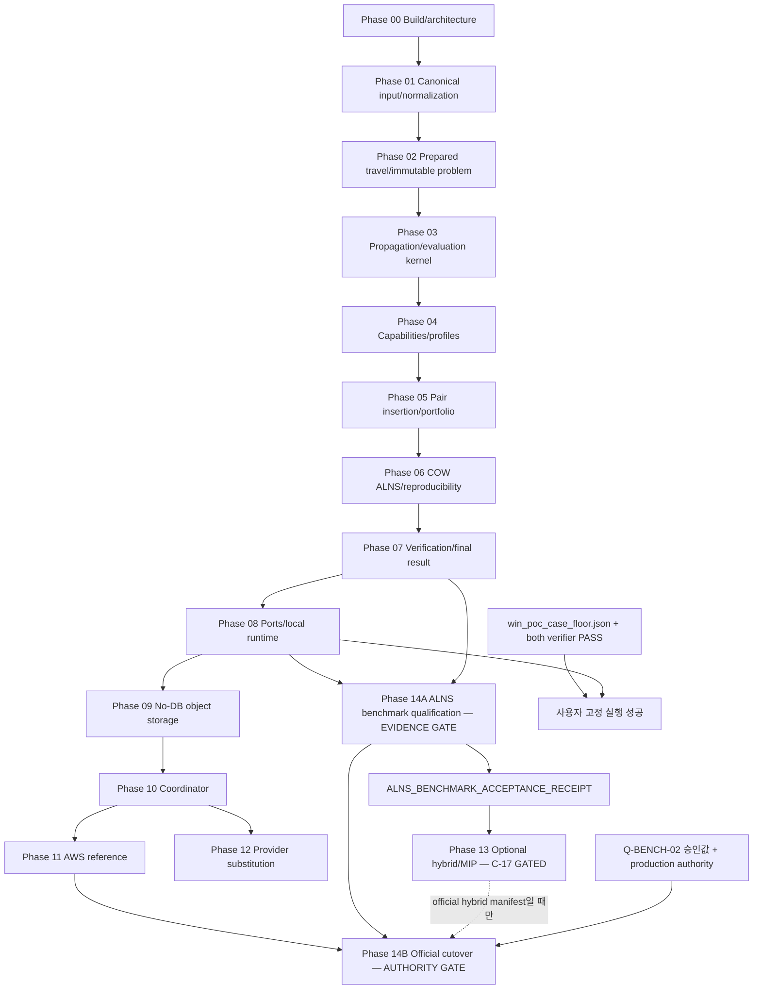

# RPDPTW Master Realization Plan

```yaml
document_status: DOCUMENT_SET_COMPLETE
plan_version: 1.2
baseline_date: 2026-07-28
scope: Phase 0~14의 구현·검증·전환 계획
implementation_status: ACCEPTED_0_OF_15
source_authority: USER_LOCKED_FOR_THIS_DOCUMENT_SET
implementation_direction_decision: ALNS_FIRST_BENCHMARK_BEFORE_OPTIONAL_MIP
direction_revision_task_id: 019fa901-8776-7f61-b467-a8c6595b970d
direction_overlay_contract_version: ALNS_FIRST_1.0
execution_success_fixture: data/win_poc_case_floor.json
execution_success_status: NOT_RUN
```

## 1. 목적과 사용 범위

이 문서는 현재 `ro-next` checkout을 canonical RPDPTW 설계로 실현하기 위한 실행 기준이다. 구현 순서, phase gate, evidence, handoff, 위험과 rollback을 하나의 15 Phase 계획으로 고정한다. 각 Phase 구현자는 이 계획과 해당 Phase 상세 문서, review 문서를 함께 사용해야 한다.

이 계획은 코드 구현 완료 보고가 아니다. 현재 존재하지 않는 module, API, test, 배포와 evidence를 완료된 것으로 간주하지 않는다. 아래의 type·interface·directory 이름은 상위 계약의 의미 경계를 구현하기 위한 **proposed internal design**이며, 승인된 public API나 wire schema가 아니다.

이 문서 세트의 입력 권위는 **사용자 선언으로 고정**되었다. 원문 metadata의 `REVIEW`는 출처 provenance로 보존하지만 이 문서 작성의 중단 조건으로 사용하지 않는다. 반대로 원문이 `REVIEW`라는 이유로 구현 phase의 실제 review·승인·evidence gate를 생략할 수도 없다.

현재 Phase/review 계약은 각 문서의 base `document_version` 또는
`UNVERSIONED_BASE`에 `ALNS_FIRST_1.0` direction overlay와
`019fa901-8776-7f61-b467-a8c6595b970d` task ID를 결합해 식별한다. 따라서 base
version이 유지된 문서도 ALNS-first revision 전 bytes/계약과 동일한 버전으로
해석하지 않는다. 이 합성 identity는 문서 provenance이며 구현/evidence/status를
승격하지 않는다.

### 1.1 사용자 고정 최종 성공 기준

이 구현 작업의 최종 성공 기준은
[win_poc_case_floor.json](../../data/win_poc_case_floor.json)을 실제 solver 실행 경로로
처리하고, 독립 검증된 결과를 생성해 사용자에게 보여주는 것이다. Source 파일·test 파일의
존재, 합성 objective, parser 성공 또는 실행 로그 한 줄은 이 기준을 충족하지 않는다.

실행 입력의 고정 계보는 다음과 같다.

```text
data/win_poc_case.json
  -- scripts/floor_win_poc_matrix.py
     D: exact decimal FLOOR → integer meter
     U: exact decimal FLOOR → integer second
     all other fields unchanged
→ data/win_poc_case_floor.json
```

| Artifact | 역할 | SHA-256 |
|---|---|---|
| `data/win_poc_case.json` | 변경하지 않는 원본 provenance | `ea003bac326ebdbbb5f49595388767ed223c03539fd6579b96f3acbedce6b7d7` |
| `scripts/floor_win_poc_matrix.py` | 사용자 승인 `D/U FLOOR` migration | `0423e0cef4d93ed51525a8f237b48f0c680c7d6e134af1ea70ba3a48b5ed77d0` |
| `data/win_poc_case_floor.json` | 이 계획의 최종 실행 입력 | `c246abd375211877c4ec3467998651deb13fbd01768d2d1d84b8d234f5f56873` |

최종 판정은 §11.3의 AND gate를 사용한다. 이 실행 성공은 solver 구현의 실제
end-to-end acceptance다. 다만 AWS production traffic 전환, Phase 13 optional hybrid
활성화 또는 별도 공식 baseline 승인을 자동으로 의미하지는 않는다.

### 1.2 최신 implementation-direction decision — ALNS-first

2026-07-28 사용자 결정 `ALNS_FIRST_BENCHMARK_BEFORE_OPTIONAL_MIP`을 canonical 원문을
바꾸지 않는 최신 구현 순서·gate로 적용한다.

1. Phase 05가 ALNS에 필요한 stable state, pair insertion과 initial portfolio를 준비한다.
2. Phase 06이 optimizer vendor, solver license 또는 production authority 없이
   ALNS-only 경로를 구현하고 correctness·quality·performance·reproducibility 측정
   artifact를 만든다.
3. Phase 07이 ALNS candidate와 final result를 독립 검증한다.
4. Phase 08 local reference에서 검증된 ALNS-only 경로를 실행한 뒤 Phase 14A가
   승인된 corpus/protocol에 따라 `ALNS_BENCHMARK_ACCEPTANCE_RECEIPT`를 발행한다.
5. Phase 13 ALNS↔MIP 연계는 이 receipt와 `C-17`의 나머지 scope/backend/운영 승인이
   모두 있을 때만 열리는 optional branch다.
6. Phase 14B는 ALNS-only 또는 별도 승인된 hybrid 중 명시적으로 선택된 manifest만
   cutover한다. Phase 13은 ALNS-only production path의 predecessor가 아니다.

이 순서는 MIP를 ALNS 구현의 선행 gate, correctness oracle 또는 필수 production
경로로 사용하지 않는다. Mixed-integer route selection은 조합 최적화 문제이므로
worst-case 난도가 높고 실무 solve time도 instance 규모, 제약·formulation,
backend/config와 hardware에 민감할 수 있다. 이는 모든 MIP가 항상 느리다는 보편
명제가 아니며, 따라서 Phase 13의 가치는 승인된 bounded experiment로만 판정한다.

수치 threshold, benchmark corpus의 최종 구성, repeat 수, resource budget와
solver/backend version은 승인 전 `OPEN — EXPERIMENT_REQUIRED` 또는 `GATED`다.
문서에 예시값이나 library default를 넣어 이 결정을 닫지 않는다.

## 2. 입력 권위와 충돌 규칙

### 2.1 고정 입력

| 우선순위/역할 | 입력 | 이 계획에서의 사용 |
|---|---|---|
| 1. 사용자 선언 | 이 구현 문서 세트의 입력 목록, 15 Phase canonical map, 파일 규칙, `win_poc_case_floor.json` 최종 실행 성공 기준 | 문서 세트의 최상위 scope, phase numbering과 실행 acceptance |
| 2. Canonical Master | [Master Design](../master-design.md) | 전체 requirement, `C-*`/`P-*`, 완료 정의, AWS 최신 결정, 질문 수와 gate |
| 3. 질문/결정 등록부 | [Master Design open questions](../master-design-open-questions.md) | `Q-*` exact 상태, owner boundary, restart/approval 조건 |
| 4. Final Domain | [2026-07-26 Domain Design](../2026-07-26-domain-design.md) | 값, 불변조건, normalization, travel, propagation, evaluation, result 상세 |
| 5. Final Architecture | [2026-07-26 Architecture Design](../2026-07-26-architecture-design.md) | Java/Maven module, package DAG, runtime/port, verifier와 backend 격리 |
| 6. Implementation integrated design | [Architecture-domain implementation design](../architecture-domain-implementation-design.md) | 15 Phase 순서, capability/profile, no-DB object storage, AWS reference와 provider substitution |
| 7. Historical cross-check only | [2026-07-26 Master Design — SUPERSEDED](../2026-07-26-master-design.md) | 누락·퇴행 여부만 대조. 결정 authority로 사용 금지 |

`docs/codex/*`는 2026-07-24의 역사/참고 자료다. 이 문서 세트의 입력 권위가 아니며 복사·수정·삭제하지 않는다.

### 2.2 충돌 해소

1. 사용자 선언과 canonical Master의 최신 결정이 우선한다.
2. 질문 상태는 질문 등록부의 exact 행과 canonical Master의 최신 요약을 사용한다.
3. Domain 의미 충돌은 canonical Master의 불변조건을 유지하면서 Final Domain의 상세 계약으로 해소한다.
4. Module/package/runtime 배치 충돌은 의미를 바꾸지 않는 범위에서 Final Architecture를 적용한다.
5. 15 Phase 번호, no-DB storage와 AWS/reference substitution 구조는 integrated design을 적용한다.
6. Proposed 이름이 확정 의미와 충돌하면 이름을 버리고 의미를 보존한다.
7. Historical master와 `docs/codex/*`는 현재 결정을 되돌릴 수 없다.

현재 확인된 문서 drift는 다음처럼 해소한다.

| Drift | 적용 판단 |
|---|---|
| Final Domain §18과 Final Architecture §6 일부가 `Q-INFRA-01`을 `DEFERRED`, 상태를 `25/1/2`로 표시 | 최신 canonical Master/질문 등록부의 `Q-INFRA-01 RESOLVED`, `26/1/1`을 적용 |
| Final Architecture가 provider 미결정을 전제로 한 package 설명을 포함 | Provider-neutral 경계는 유지하고, integrated design의 AWS S3 + Step Functions + Lambda target/reference를 Phase 11에 적용 |
| AWS target 선택과 실제 AWS 구현·cutover를 혼동할 가능성 | 선택은 확정이지만 Phase 11 parity/evidence와 Phase 14 production authority 전에는 구현·배포·cutover 완료를 주장하지 않음 |
| Route pool/MIP 상세 설계가 존재 | `C-17 GATED TARGET`을 유지한다. Gate-open exact backend는 Google OR-Tools direct CP-SAT로 고정하지만 Phase 13 entry approval 전 구현·기본 활성화는 금지한다. |
| 기존 문서가 decimal Win fixture만 존재한다고 기록 | 원본은 provenance/negative fixture로 유지하고, 사용자 승인 `FLOOR` script로 만든 `win_poc_case_floor.json`을 이 계획의 실행 성공 fixture로 사용 |

## 3. 2026-07-28 current-state inventory

조사 기준은 branch `codex/domain-design`, commit `3424277`이다. 문서 작성 전 `git status --short`는 비어 있었다. 이 inventory는 read-only inspection 결과이며 production 배포 사실을 검증한 것이 아니다.

### 3.1 Build와 dependency

| 항목 | 현재 사실 | 목표와의 차이 |
|---|---|---|
| Maven | Root [pom.xml](../../pom.xml) 하나, `com.ronext:ro-next:0.1.0-SNAPSHOT` 단일 project | Parent/aggregator 기반 multi-module reactor와 architecture enforcement가 없음 |
| Toolchain | `.sdkmanrc`: Corretto `25.0.3-amzn`, Maven `3.9.14`; 로컬 조회도 Java 25.0.3/Maven 3.9.14 | 목표 Java 25 기준과 일치하지만 reproducible build evidence는 아직 없음 |
| Dependencies | Google Workflow Executions, Google Cloud Storage, Jackson, JUnit가 root classpath에 직접 존재 | Core/application/provider dependency 격리가 없음 |
| Packaging | Shade plugin이 `OptimizationHttpServer`를 main으로 한 app JAR 생성 | Target distributions와 module별 artifact가 없음 |
| Container | [Dockerfile](../../Dockerfile)이 Maven build 후 Corretto 25에서 shaded JAR 실행 | 단일 GCP-oriented app image이며 target AWS/local distributions를 증명하지 않음 |
| CI/IaC | Tracked `.github` workflow, AWS IaC, Serverless/SAM/CDK/Terraform source가 없음 | Architecture, contract, provider parity와 deployment automation이 없음 |

### 3.2 Source와 test

| 항목 | 현재 사실 | 해석 |
|---|---|---|
| Main source | `src/main/java`에 6개 Java 파일 | `com.ronext.optimizer`의 HTTP/GCP adapter 5개와 application placeholder 1개뿐 |
| Solver | `AlnsBatchEngine`이 seed/iterations로 합성 `objective` map을 생성 | 입력 parsing, RPDPTW domain, initial portfolio, ALNS, verifier가 아님 |
| API | `/optimizations`, `/internal/batches`, `/internal/finalize`와 `Map<String,Object>` payload | Characterization 대상이며 public target API로 확정하지 않음 |
| Storage | Controller가 GCS client를 직접 만들고 `candidates/{requestId}/` prefix listing 후 최소 objective 선택 | Provider isolation, declared completeness, independent verification, no-list authority와 불일치 |
| Test | `AlnsBatchEngineTest` 한 개 | 합성 candidate status/objective만 검사하며 target phase evidence가 아님 |
| 기존 build artifact | ignored `target/`에 2026-07-26 test report(`1` test pass)와 JAR가 존재 | 이 작업에서 새로 실행한 evidence가 아니며 accepted phase evidence로 사용 금지 |

### 3.3 Deployment와 운영 자료

| 항목 | 현재 사실 | 해석 |
|---|---|---|
| GCP build | [gcp/cloudbuild.yaml](../../gcp/cloudbuild.yaml)이 Docker image를 build | Historical/current migration inventory |
| GCP orchestration | [gcp/workflows/optimization.yaml](../../gcp/workflows/optimization.yaml)이 parallel batch HTTP 호출 후 finalize | 일부 worker 결과·prefix listing·raw objective에 의존하며 target coordinator 의미를 충족하지 않음 |
| GCP guide | [gcp/README.md](../../gcp/README.md)에 Cloud Run API/worker, Workflows, GCS, IAM 예시 | 배포 가이드일 뿐 현재 배포 또는 보안 승인 evidence가 아님 |
| AWS 흔적 | ignored `.serverless/`와 ignored `node_modules/`이 local working tree에 존재하지만 tracked AWS source/config는 없음 | 실제 AWS 배포, target implementation 또는 dependency authority를 추론하지 않음 |
| Data | [ro_input_json_spec.pdf](../../data/ro_input_json_spec.pdf), [win_poc_case.json](../../data/win_poc_case.json), [win_poc_case_floor.json](../../data/win_poc_case_floor.json) | PDF는 legacy 참고, 원본 JSON은 provenance/negative fixture, FLOOR JSON은 205,209개 `D/U`가 integer인 사용자 승인 최종 실행 fixture |

### 3.4 현재 gap 요약

현재 코드는 Phase 0~14 어느 exit gate도 통과했다는 evidence bundle이 없다. 이는 “코드가 전혀 없다”는 뜻이 아니라 **target phase accepted completion이 0/15**라는 뜻이다. GCP placeholder와 build 산출물은 Phase 0/14의 characterization 입력으로 보존한다.

특히 다음을 현재 완료로 주장하지 않는다.

- RPDPTW canonical input, immutable problem 또는 prepared travel
- Pair-aware propagation/evaluation, capability/profile binding
- 최대 8개 initial portfolio와 COW ALNS
- Candidate/result 독립 verifier와 publishable result
- Provider-neutral ports, object-storage CAS, declared-worker coordinator
- AWS reference distribution, provider parity, official cutover
- Route pool/MIP 또는 official benchmark

## 4. 목표 구조와 불변 경계

### 4.1 Proposed target modules

```text
root parent/aggregator
├── build/
│   ├── architecture-rules
│   ├── test-fixtures
│   └── port-contract-tests
├── rpdptw/
│   ├── core
│   ├── solver
│   ├── verification
│   ├── application
│   ├── capabilities
│   └── profile-catalog
├── adapters/
│   ├── common
│   ├── object-common
│   ├── object-filesystem
│   ├── object-s3
│   ├── workflow-aws-stepfunctions
│   ├── compute-aws-lambda
│   └── route-selection-ortools-cpsat   # Phase 13, GATED
├── apps/
│   ├── cli
│   ├── api
│   ├── coordinator
│   └── worker
└── distributions/
    ├── local
    └── aws-serverless
```

이 tree는 proposed internal structure다. Phase 0 ADR/review에서 이름을 바꿀 수 있지만 다음 경계는 바꿀 수 없다.

### 4.2 Compile/runtime invariants

1. Core/solver/verification/application의 cloud SDK reference는 0이다.
2. Generic core/solver/verification의 customer-name branch는 0이다.
3. Verification은 solver/search/cache를 compile-depend하지 않는다.
4. Generic module의 `com.google.ortools` API reference는 0이며 기본 build/ALNS-only runtime은 OR-Tools/native-loader-free다.
5. Search는 immutable normalized problem, complete prepared travel와 exact bound profile만 소비한다.
6. 모든 stable solution은 complete pair와 route/bank exact partition을 만족한다.
7. Search 중 lazy/reverse/symmetric travel fallback은 0이다.
8. COW trial만 step 안에서 mutable하며 reject/fail/cancel 시 전체 폐기한다.
9. 두 verifier `PASS` 없는 result는 정상 publication/retrieval/benchmark 대상이 아니다.
10. Artifact는 create-once immutable이고 authoritative state/pointer만 CAS로 전이한다.
11. Prefix listing 또는 event 도착 순서는 worker completeness와 champion authority가 아니다.
12. Provider workflow는 objective, comparator, verifier와 publication eligibility를 소유하지 않는다.
13. Retry는 logical identity, seed, warm start와 requested work를 바꾸지 않는다.
14. Open/gated/deferred 값은 hidden default로 채우지 않는다.
15. Raw optimizer incumbent는 fresh materialization, full evaluation과 verifier를 우회하지 않는다.

## 5. Canonical Phase 파일명

문서 workflow 사실은 **15개 Phase 상세 문서와 15개 review 문서 완료, 구현 `ACCEPTED` 0개**다. 문서 작성·review 완료는 구현 완료나 Phase `ACCEPTED`를 뜻하지 않는다. 아래 표의 slug가 canonical이며 이후 작업은 다른 slug를 만들지 않는다.

| Phase | Canonical 상세 문서 | Canonical review 문서 |
|---:|---|---|
| 00 | [phase-00-build-architecture-skeleton.md](phases/phase-00-build-architecture-skeleton.md) | [phase-00-review.md](reviews/phase-00-review.md) |
| 01 | [phase-01-canonical-input-normalization.md](phases/phase-01-canonical-input-normalization.md) | [phase-01-review.md](reviews/phase-01-review.md) |
| 02 | [phase-02-prepared-travel-immutable-problem.md](phases/phase-02-prepared-travel-immutable-problem.md) | [phase-02-review.md](reviews/phase-02-review.md) |
| 03 | [phase-03-route-propagation-evaluation-kernel.md](phases/phase-03-route-propagation-evaluation-kernel.md) | [phase-03-review.md](reviews/phase-03-review.md) |
| 04 | [phase-04-capabilities-customer-profiles.md](phases/phase-04-capabilities-customer-profiles.md) | [phase-04-review.md](reviews/phase-04-review.md) |
| 05 | [phase-05-pair-insertion-initial-portfolio.md](phases/phase-05-pair-insertion-initial-portfolio.md) | [phase-05-review.md](reviews/phase-05-review.md) |
| 06 | [phase-06-cow-alns-reproducibility.md](phases/phase-06-cow-alns-reproducibility.md) | [phase-06-review.md](reviews/phase-06-review.md) |
| 07 | [phase-07-independent-verification-final-result.md](phases/phase-07-independent-verification-final-result.md) | [phase-07-review.md](reviews/phase-07-review.md) |
| 08 | [phase-08-application-ports-local-runtime.md](phases/phase-08-application-ports-local-runtime.md) | [phase-08-review.md](reviews/phase-08-review.md) |
| 09 | [phase-09-object-storage-no-database.md](phases/phase-09-object-storage-no-database.md) | [phase-09-review.md](reviews/phase-09-review.md) |
| 10 | [phase-10-provider-neutral-coordinator.md](phases/phase-10-provider-neutral-coordinator.md) | [phase-10-review.md](reviews/phase-10-review.md) |
| 11 | [phase-11-aws-reference-distribution.md](phases/phase-11-aws-reference-distribution.md) | [phase-11-review.md](reviews/phase-11-review.md) |
| 12 | [phase-12-provider-substitution.md](phases/phase-12-provider-substitution.md) | [phase-12-review.md](reviews/phase-12-review.md) |
| 13 | [phase-13-optional-hybrid-route-selection.md](phases/phase-13-optional-hybrid-route-selection.md) | [phase-13-review.md](reviews/phase-13-review.md) |
| 14 | [phase-14-official-calibration-cutover.md](phases/phase-14-official-calibration-cutover.md) | [phase-14-review.md](reviews/phase-14-review.md) |

## 6. Phase DAG, critical path와 병렬 범위



### 6.1 Critical path

ALNS 구현·독립 검증·benchmark qualification critical path는 다음이다.

```text
00 → 01 → 02 → 03 → 04 → 05 → 06 → 07 → 08 → 14A
```

AWS ALNS-only production 후보는 Phase 08 뒤 `09 → 10 → 11`을 진행하고,
`14A + 11 → 14B`에서 합류한다. Phase 12는 승인된 대체 provider가 있을 때 실행하는
portability branch다. Phase 13은 `14A`의 ALNS benchmark acceptance 뒤에만 열 수
있는 `C-17` optional branch다. Phase 12와 Phase 13은 ALNS-only AWS cutover의 필수
predecessor가 아니다. Official hybrid cutover를 명시적으로 선택한 경우에만 accepted
Phase 13이 Phase 14B predecessor가 된다.

### 6.2 허용되는 병렬 작업

| 선행 gate 뒤 병렬 가능 | 허용 범위 | 합류 gate |
|---|---|---|
| Phase 0 뒤 | Phase 8 port signature/test fake scaffold, Phase 7 corruption fixture 설계, profile descriptor schema 초안 | Phase 7 실제 authority와 Phase 8 local E2E 전에는 완료 주장 금지 |
| Phase 1 뒤 | Travel oracle/fixture와 domain ID/property test 준비 | Phase 2 complete travel/problem gate |
| Phase 2 뒤 | Propagation hand oracle, verifier 독립 reference 계산 설계 | Phase 3/7 review |
| Phase 6 뒤 | COW profiling 계측 준비와 ALNS benchmark protocol/corpus 제안 | Phase 07 both-gate와 Phase 08 local execution 전에는 benchmark acceptance 금지 |
| Phase 8 뒤 | Phase 14A ALNS benchmark qualification, Phase 09 storage work | Phase 13은 Phase 14A acceptance receipt + `C-17` 승인 전 시작 금지 |
| Phase 8 뒤 | Filesystem storage contract와 object-common semantics | Phase 9 CAS/contract gate |
| Phase 9 뒤 | Coordinator deterministic fake와 AWS storage adapter contract | Phase 10 semantics 승인 전 AWS workflow 로직 확정 금지 |
| Phase 10 뒤 | Phase 11 AWS adapter, 승인된 경우 Phase 12 대체 provider adapter | 각 provider parity/review |

병렬 branch는 upstream semantic artifact를 임의 stub value로 확정하지 않는다. Fake/test value는 `test-only`로 주입하고 production default가 될 수 없다.

## 7. Phase별 실행·검증 계약

각 Phase 구현은 **Entry 확인 → 상세·review 기준 확인 → 구현 → 자동 검증 → pre-review evidence manifest 봉인 → 독립 review report 봉인 → post-review acceptance receipt 발행 → handoff**의 단방향 순서로 실행한다. 아래 evidence key는 미래 evidence의 요구 이름이며 현재 evidence가 존재한다는 뜻이 아니다.

### Phase 00 — Build와 architecture 뼈대

- 상세/review: [상세 문서](phases/phase-00-build-architecture-skeleton.md) / [review 문서](reviews/phase-00-review.md)
- 목표: 단일 GCP placeholder project를 보존·characterize하면서 proposed multi-module reactor와 forbidden-dependency guard를 만든다.
- Entry gate: 이 계획 baseline, current inventory, source authority/conflict 규칙 승인.
- 입력: root POM/toolchain, current source/test/deployment inventory, target module DAG.
- 산출물: Parent/aggregator, core/solver/verification/application/capability/profile skeleton, architecture rules, legacy characterization, build provenance.
- Exit gate: Optional-backend-free root build 성공, reactor cycle 0, forbidden provider/customer/backend/verifier dependency 0, legacy characterization 통과.
- Evidence/handoff: `E-P00-BUILD`, `E-P00-ARCH`, `E-P00-LEGACY`; Phase 1과 모든 parallel scaffold가 소비.

실행·검증 절차:

1. Current endpoint, payload, storage key, error, GCP workflow와 test behavior를 golden characterization으로 기록한다.
2. Root POM을 business dependency 없는 parent/aggregator로 전환하고 Java 25/Maven/reproducible archive 정책을 중앙화한다.
3. Stable module skeleton과 `com.ronext.rpdptw` namespace를 만들되 기능 stub을 완료 evidence로 계산하지 않는다.
4. Enforcer/architecture/bytecode 검사로 SDK·vendor·customer·verification 역의존을 차단한다.
5. Root `mvn verify`, module DAG, dependency tree, test-scope leakage와 reproducible artifact 검사를 evidence bundle에 저장한다.

### Phase 01 — 내부 표준 입력과 정규화

- 상세/review: [상세 문서](phases/phase-01-canonical-input-normalization.md) / [review 문서](reviews/phase-01-review.md)
- 목표: Versioned external input을 provider-neutral canonical input과 exact normalized facts로 바꾼다.
- Entry gate: Phase 00 accepted; canonical field meaning과 alias/version policy가 상세 문서에 명시됨.
- 입력: External bytes/reference, schema/adapter version, numeric/time/service/size/capability/zone/trip 계약.
- 산출물: Immutable canonical/normalized input, typed pre-solve errors, raw digest, coercion/alias/policy provenance.
- Exit gate: Decimal/overflow/alias/time/service/compatibility의 positive·negative·boundary evidence가 모두 통과.
- Evidence/handoff: `E-P01-NUMERIC`, `E-P01-TIME`, `E-P01-COMPAT`, `E-P01-ERROR`; Phase 2가 소비.

실행·검증 절차:

1. 외부 DTO와 canonical domain type을 분리하고 지원 schema/version 및 alias를 allowlist한다.
2. 무게·부피를 exact decimal `n=3/FLOOR`, item-first 후 qty 곱으로 checked normalization한다.
3. 비용·거리·시간 소수, 음수·비유한 값, overflow, order-level `taskTime`을 거부한다.
4. `[planStart,planEnd)`, inclusive close, repeating/overnight, full-arc work-window 의미와 service-time 조합을 정규화한다.
5. Size/`["ALL"]`/capability subset/one-concrete-zone, ownership, oneway/single-roundtrip 계약을 property test한다.
6. 같은 input은 stable fingerprint를, 의미가 다른 input은 다른 fingerprint를 만드는지 검증한다.

### Phase 02 — 이동 자료 준비와 immutable problem

- 상세/review: [상세 문서](phases/phase-02-prepared-travel-immutable-problem.md) / [review 문서](reviews/phase-02-review.md)
- 목표: 모든 directed physical-location pair와 사용 vehicle의 time을 solve 전에 완성하고 immutable problem을 동결한다.
- Entry gate: Phase 01 accepted; approved Great Circle function/version과 typed travel source policy가 명시됨.
- 입력: Normalized locations/vehicles/requests, provided sparse `D/U`, coordinates/speed, generation policy.
- 산출물: Complete `PreparedTravel`, dense ID bijection, immutable `ProblemInstance`, source/fingerprint provenance.
- Exit gate: `M²` coverage, self `0/0`, asymmetric/provided/generated priority, rounding, ID/reference와 solver/verifier fingerprint equality 통과.
- Evidence/handoff: `E-P02-TRAVEL`, `E-P02-DENSE-ID`, `E-P02-PROBLEM`; Phase 3/5/7이 소비.

실행·검증 절차:

1. Solver node와 physical location identity를 분리하고 external↔dense mapping을 검증한다.
2. Provided integer directed `D/U`를 우선하고 decimal을 거부한다.
3. Missing `D`를 approved Great Circle + meter `HALF_UP`, missing `U`를 vehicle별 `CEILING(D×3.6/speed)`로 생성한다.
4. Missing speed만 `45 km/h`로 처리하고 present-invalid speed는 거부한다.
5. Runtime lazy/reverse/symmetric fallback을 architecture test로 막는다.
6. Pair/node/location/vehicle/travel completeness와 checked range를 생성 시 검증한다.

### Phase 03 — 경로 전파 계산과 평가 kernel

- 상세/review: [상세 문서](phases/phase-03-route-propagation-evaluation-kernel.md) / [review 문서](reviews/phase-03-review.md)
- 목표: Route sequence에서 물리 fact를 cache 없이 재계산하고 hard/metric/score/objective 책임을 분리한다.
- Entry gate: Phase 02 accepted; propagation/evaluation API와 단위 선언이 상세 문서에서 review됨.
- 입력: `ProblemInstance`, `PreparedTravel`, proposed bound constraint/evaluation declarations, immutable `RoutePlan`.
- 산출물: Stateless propagator, typed infeasibility, neutral fact/metric, evaluation SPI, comparator와 cache-free reference.
- Exit gate: Hand-calculated load/time/wait/rest/stop/resource, hard-no-penalty, comparator 법칙, cache equality 통과.
- Evidence/handoff: `E-P03-PROPAGATION`, `E-P03-EVALUATION`, `E-P03-COMPARATOR`; Phase 4/5/7이 소비.

실행·검증 절차:

1. Terminal에서 route 끝까지 full-arc travel, arrival, wait, service, load와 resource를 순서대로 계산한다.
2. Delivery-only initial load와 real pickup/delivery delta를 혼합하고 모든 prefix capacity를 검사한다.
3. Stop/location transition, drive resource와 route operational time breakdown을 독립 보존한다.
4. Structural/hard gate → neutral metric → score → objective → comparator의 단방향 API를 강제한다.
5. Hard violation이 finite penalty/SA/comparator로 통과하지 못하게 한다.
6. Small hand oracle와 property test로 incremental/cache 결과가 full reference와 같은지 검증한다.

### Phase 04 — 재사용 기능과 고객 profile

- 상세/review: [상세 문서](phases/phase-04-capabilities-customer-profiles.md) / [review 문서](reviews/phase-04-review.md)
- 목표: 고객 차이를 reusable typed capability와 immutable data-driven profile/preset으로 bind한다.
- Entry gate: Phase 03 accepted; descriptor format/registry 선택은 ADR로 review되며 public wire로 오인하지 않음.
- 입력: Exact customer/profile/version/preset, approved capability registry, typed parameter/dependency/unit declaration.
- 산출물: Immutable `BoundProfile`, exact dependency closure와 fingerprint, customer authorization/binding errors.
- Exit gate: Unknown/latest/cross-customer/duplicate/missing/unit mismatch 거부, profile 격리와 기존 fingerprint 회귀 통과.
- Evidence/handoff: `E-P04-BINDING`, `E-P04-ISOLATION`, `E-P04-FACET`; Phase 5/7이 소비.

실행·검증 절차:

1. Customer별 POM/JAR 대신 exact versioned descriptor와 reusable capability registry를 구현한다.
2. Binder가 schema, capability version, parameter range, fact/metric dependency, objective direction과 `LEASE`/mandatory 계약을 pre-solve 검증한다.
3. Omitted preset은 exact profile version에 명시된 default만 허용한다.
4. 새 물리 상태만 typed facet으로 추가하고 price/label/objective 차이에 facet을 사용하지 않는다.
5. Customer name branch와 classpath first-wins fallback을 architecture test로 금지한다.
6. 여러 profile을 같은 problem facts에 bind해 결과 격리와 verifier closure를 검증한다.

### Phase 05 — Pickup-delivery pair, 삽입과 초기 후보군

- 상세/review: [상세 문서](phases/phase-05-pair-insertion-initial-portfolio.md) / [review 문서](reviews/phase-05-review.md)
- 목표: Stable route/bank partition, side-effect-free exact pair insertion과 최대 8개 independent construction을 만든다.
- Entry gate: Phase 04 accepted; request/route/vehicle stable total order와 portfolio config가 명시됨.
- 입력: Immutable solve facts/profile, atomic requests, prepared travel, comparator.
- 산출물: `SearchSnapshot`, `SearchRequestBank`, COW trial primitive, pair editor/evaluator, 4×2 initial candidates와 lineage.
- Exit gate: Pair/bank property, insertion brute-force oracle, rollback/no-alias, terminal/vehicle uniqueness, candidate independence 통과.
- Evidence/handoff: `E-P05-PAIR`, `E-P05-INSERTION`, `E-P05-PORTFOLIO`; Phase 06이 소비하며 MIP/backend는 소비자나 oracle이 아님.

실행·검증 절차:

1. Request가 complete same-vehicle pair 또는 bank 중 정확히 하나에 있도록 stable invariant를 구현한다.
2. Destroy/remove/insert 실패 시 route/bank/cache/fingerprint가 원상태인 중앙 atomic editor를 만든다.
3. Cheap shortlist와 모든 합법 pickup/delivery position을 검사하는 exact evaluator를 분리한다.
4. `NEW_ROUTE`가 실제 unused concrete vehicle을 소비하게 한다.
5. `CLOCK`, `SEQ_FARTHEST`, `SEQ_LARGE_DEMAND`, `SEQ_EARLIEST_DEADLINE` × `DIRECT_FIRST_LARGE/SMALL`을 독립 실행한다.
6. 좌표 없는 `CLOCK`은 `UNAVAILABLE`로 남기고 다른 정책으로 위장하지 않는다.

### Phase 06 — 복사 후 변경 방식의 ALNS

- 상세/review: [상세 문서](phases/phase-06-cow-alns-reproducibility.md) / [review 문서](reviews/phase-06-review.md)
- 목표: COW 기반 pair destroy/repair, completed-step 의미, phase-1 screen과 reproducible worker run을 구현한다.
- Entry gate: Phase 05 accepted; algorithm/operator/acceptance config와 모든 test-only step 값이 explicit함.
- 입력: Validated initial candidates, `BoundProfile`/`SolvePlan`, namespaced seed, screen/worker step config.
- 산출물: Phase-1 champion, immutable current/stageBest/solveBest, committed worker candidate, termination/trace/reproducibility record.
- Exit gate: Accept/reject/fault/cancel isolation, cache equality, exact step accounting, same-envelope trace/result fingerprint 통과.
- Evidence/handoff: `E-P06-COW`, `E-P06-ALNS`, `E-P06-REPLAY`; Phase 07/08/10과 Phase 14A가 소비. Phase 13은 Phase 14A acceptance 뒤에만 조건부 소비.

실행·검증 절차:

1. Changed route와 independent bank만 first-write copy하고 current/best는 immutable snapshot 교체로 관리한다.
2. Completed step을 destroy→repair→bounded improvement→full evaluation→accept/discard→adaptive update 전체로 정의한다.
3. `INVALID_CANDIDATE`/`INTERRUPTED`가 step, reward, temperature와 adaptive state를 전진시키지 않게 한다.
4. 각 available initial candidate를 exact test/experiment `screenMaxSteps`로 실행해 stable champion을 고른다.
5. Worker single-run이 exact requested step을 수행하고 watchdog/cancel/resource/platform failure를 정상 종료와 분리한다.
6. Global random, unordered reduction, completion-first winner와 clock tie-break를 제거하고 fixed-envelope repeat를 검증한다.
7. Apply/undo는 구현하지 않는다. COW 병목 evidence와 별도 변경 승인 시에만 후속 제안한다.
8. ALNS-only default build/run은 OR-Tools, MIP solver, solver license/server/token,
   native backend와 production authority 없이 Phase 07·08·14A까지 실행 가능해야 한다.
9. Benchmark용 run은 dataset/fixture, seed/repeat, hardware/runtime, timeout/resource
   envelope를 명시하지만 승인 전 값을 production default로 만들지 않는다.

### Phase 07 — 독립 검증과 최종 결과

- 상세/review: [상세 문서](phases/phase-07-independent-verification-final-result.md) / [review 문서](reviews/phase-07-review.md)
- 목표: Solver와 compile/runtime authority가 분리된 candidate/result verifier로 publication을 봉인한다.
- Entry gate: Phase 06 committed candidate, Phase 02/04 authority, independent corruption oracle 준비.
- 입력: Problem/travel/profile declaration, candidate route/bank, finalization inputs와 proposed payload.
- 산출물: Candidate `PASS`/`FAIL`, `VerifiedSolution`, final audit/outcomes/summary, result `PASS`/`FAIL`, `PublishableResult`.
- Exit gate: Pair/travel/cache/metric/objective/outcome/audit/summary/payload corruption 거부와 both-gate publication block 통과.
- Evidence/handoff: `E-P07-CANDIDATE-VERIFY`, `E-P07-AUDIT`, `E-P07-RESULT-VERIFY`; Phase 08/10/11/14A가 소비. Phase 13은 별도 `ALNS_BENCHMARK_ACCEPTANCE_RECEIPT` 뒤에만 소비.

실행·검증 절차:

1. Verification module이 core만 사용하고 solver/search/cache dependency가 없음을 build로 증명한다.
2. Candidate route/bank를 prepared travel과 bound declaration에서 cache 없이 재계산한다.
3. Candidate `PASS` 뒤에만 preliminary `ASSIGNED/UNASSIGNED` partition을 만든다.
4. Static `PROVEN` 외 모든 unassigned request를 final routes 고정 상태에서 모든 eligible vehicle/positions로 audit한다.
5. Feasible insertion 발견을 자동 적용·재탐색하지 않고 confidence를 evidence 범위로 제한한다.
6. Result verifier가 exactly-one outcome, ownership, audit completeness, summary와 payload digest를 독립 검사한다.
7. 어느 gate든 fail/incomplete이면 정상 result와 benchmark vector를 차단한다.
8. Phase 07 `PASS`는 benchmark quality/performance acceptance가 아니다. Phase 14A가
   immutable benchmark bundle과 독립 acceptance receipt를 별도로 발행해야 한다.

### Phase 08 — Application interface와 local 실행

- 상세/review: [상세 문서](phases/phase-08-application-ports-local-runtime.md) / [review 문서](reviews/phase-08-review.md)
- 목표: Provider-neutral use case/port와 filesystem/same-process reference runtime을 만든다.
- Entry gate: Interface scaffold는 Phase 00 뒤 가능하지만 exit는 Phase 07 both-gate 경로가 accepted되어야 함.
- 입력: Immutable solve/result artifacts, execution identity, local workspace/config.
- 산출물: Inbound use cases, outbound ports, local artifact/state/dispatch/cancel/publication adapter, deterministic local E2E.
- Exit gate: Exact-key artifact digest, state/publication CAS, cancellation 분리, both-gate success/retrieval과 rerun 통과.
- Evidence/handoff: `E-P08-PORT`, `E-P08-LOCAL-E2E`, `E-P08-IDEMPOTENCY`; Phase 09/10이 소비.

실행·검증 절차:

1. Proposed `SubmitSolve`, `PrepareSolveSnapshot`, `ExecuteWorkerRun`, `PublishVerifiedResult`, status/result use case를 application이 소유하게 한다.
2. `ArtifactStore`, `RunStateRepository`, `ResultPublisher`, dispatcher/scheduler/cancel/telemetry port에서 provider type을 제거한다.
3. Explicit local workspace, immutable create/atomic rename/digest, CAS state와 same-process dispatcher를 구현한다.
4. Same key/same digest 수렴과 same key/different digest conflict를 검증한다.
5. Local E2E가 두 verifier 뒤에만 success/result를 공개하고 fixed manifest에서 재현되는지 확인한다.

### Phase 09 — DB 없는 object storage

- 상세/review: [상세 문서](phases/phase-09-object-storage-no-database.md) / [review 문서](reviews/phase-09-review.md)
- 목표: Database 없이 immutable artifact와 단일 authoritative pointer/state CAS로 저장 의미를 구현한다.
- Entry gate: Phase 08 local port semantics accepted; object canonical encoding/key-layout ADR review.
- 입력: Typed `ArtifactKey/Ref`, content digest, state version, tenant scope.
- 산출물: Object-common semantics, filesystem/S3 backend contract, exact-key retrieval, immutable artifact + mutable CAS pointer model.
- Exit gate: Put-if-absent, digest, stale-version conflict, tenant isolation, listing-free completeness, publication CAS contract 통과.
- Evidence/handoff: `E-P09-STORAGE-CONTRACT`, `E-P09-CAS`, `E-P09-TENANT`; Phase 10/11이 소비.

실행·검증 절차:

1. Logical artifact identity와 provider opaque locator를 분리한다.
2. Immutable artifact를 먼저 저장·재독해 digest 검증 후 하나의 state/pointer를 CAS commit한다.
3. Multi-object transaction, directory rename, file lock와 last-write-wins를 공통 계약에서 금지한다.
4. Declared exact key를 authority로 사용하고 prefix listing/event를 wake-up hint로만 취급한다.
5. Filesystem과 S3가 동일 abstract storage suite를 통과하게 한다.
6. No-DB 기본 query를 exact solve/submission/profile key 조회로 제한한다.

### Phase 10 — 여러 round를 조정하는 coordinator

- 상세/review: [상세 문서](phases/phase-10-provider-neutral-coordinator.md) / [review 문서](reviews/phase-10-review.md)
- 목표: Provider-neutral solve/round/worker state machine, declared completeness와 deterministic champion fan-in을 구현한다.
- Entry gate: Phase 09 storage/CAS, Phase 06 worker semantics, Phase 07 verifier, Phase 08 application ports accepted.
- 입력: Immutable execution manifest, declared assignments, exact outcome refs, state version, cancel intent.
- 산출물: Coordinator action/state machine, phase-1/round fan-out/fan-in, retry identity, finalization/publication orchestration.
- Exit gate: Legal transition, duplicate/retry/cancel, missing worker `INCOMPLETE`, completion-order independence와 publication convergence 통과.
- Evidence/handoff: `E-P10-STATE`, `E-P10-COMPLETENESS`, `E-P10-RETRY`; Phase 11/12/14가 소비.

실행·검증 절차:

1. Provider runtime이 호출하는 `AdvanceSolve`와 provider-neutral action을 application에 둔다.
2. `WorkerRunId`를 manifest/round/worker/warm-start/config에 고정하고 retry는 `AttemptId`만 바꾼다.
3. Manifest가 선언한 모든 worker exact key를 읽고 하나라도 없거나 미검증이면 round를 `INCOMPLETE`로 둔다.
4. Stable worker ordinal과 comparator/tie-break로 champion을 정하고 strict improvement만 다음 warm start로 넘긴다.
5. Duplicate success same digest는 수렴하고 different digest는 integrity failure로 만든다.
6. Cancel intent, dispatch stop와 actual worker termination을 분리한다.

### Phase 11 — AWS reference distribution

- 상세/review: [상세 문서](phases/phase-11-aws-reference-distribution.md) / [review 문서](reviews/phase-11-review.md)
- 목표: 선택된 S3 + Step Functions + Lambda target/reference가 같은 application semantics를 보존하게 한다.
- Entry gate: Phase 10 accepted; AWS resource/IAM/network/retention/cost ADR와 non-production integration environment 승인.
- 입력: Provider-neutral actions/ports, S3 state/artifact semantics, Lambda assignments, Step Functions command/wakeup mapping.
- 산출물: S3, Step Functions, Lambda adapters, `aws-serverless` distribution/deployment, parity/shadow/rollback evidence.
- Exit gate: Local↔AWS semantic parity, event/error/retry/cancel mapping, S3 CAS, missing-worker block, both-gate publication, security evidence 통과.
- Evidence/handoff: `E-P11-AWS-CONTRACT`, `E-P11-PARITY`, `E-P11-SECURITY`; Phase 14가 소비.

실행·검증 절차:

1. AWS SDK/ARN/event/resource name을 adapter/distribution/deployment 밖으로 노출하지 않는다.
2. Step Functions는 command, wait/wakeup, provider retry scheduling과 cancel 전달만 수행한다.
3. Lambda API/coordinator/worker handler는 event를 application command로 mapping하고 domain 의미를 구현하지 않는다.
4. Lambda remaining time/platform timeout을 algorithm 정상 종료로 변환하지 않는다.
5. Local과 AWS에서 동일 logical manifest의 canonical artifact, outcome, termination과 digest를 비교한다.
6. Least privilege, tenant isolation, encryption, secret/PII redaction, failure/retry와 rollback을 rehearsal한다.

### Phase 12 — Provider substitution

- 상세/review: [상세 문서](phases/phase-12-provider-substitution.md) / [review 문서](reviews/phase-12-review.md)
- 목표: Storage/workflow/compute 축을 독립 교체할 수 있음을 contract와 승인된 provider migration으로 증명한다.
- Entry gate: Phase 10 accepted; 교체 대상 provider와 adoption scope에 별도 승인. 승인 전에는 future module을 빈 skeleton으로 만들지 않음.
- 입력: Stable port contract, source/destination artifact refs, selected provider adapter, parity manifest.
- 산출물: 승인된 adapter/distribution, content-digest migration record, parity/shadow/cutover/rollback playbook.
- Exit gate: 동일 storage/execution suite, locator leakage 0, artifact digest 보존, semantic parity, security/cost/operations approval.
- Evidence/handoff: `E-P12-PROVIDER-CONTRACT`, `E-P12-MIGRATION`, `E-P12-PARITY`; 향후 provider cutover가 소비.

실행·검증 절차:

1. 변경 요구가 storage, workflow, compute 중 어느 축인지 먼저 분리한다.
2. AWS 내부 Lambda→ECS, S3→GCS/Azure, workflow→approved runtime 등 승인된 최소 축만 adapter로 추가한다.
3. Source artifact read/verify → destination put-if-absent → read-back verify → ref mapping → pointer CAS 순으로 migration한다.
4. Provider URI/locator와 runtime execution ID가 domain/result fingerprint를 바꾸지 않게 한다.
5. 동일 port suite, duplicate/retry/cancel/completeness와 local/AWS/new-provider parity를 실행한다.
6. Shadow와 recoverable rollback 뒤에만 해당 provider를 활성화한다.

### Phase 13 — Optional hybrid

- 상세/review: [상세 문서](phases/phase-13-optional-hybrid-route-selection.md) / [review 문서](reviews/phase-13-review.md)
- 목표: Immutable evaluated route pool, exact-projectable selection과 strictly-better adoption을 optional branch로 검증한다.
- Backend 결정: Boolean route/unassigned 변수와 integer/fixed-point 목적·제약이므로 `MPSolver`가 아니라 `com.google.ortools.sat` direct CP-SAT를 사용한다. Adapter는 selected route IDs만 반환한다.
- Entry gate: Phase 06/07/08 accepted, Phase 14A가 발행한 유효한
  `ALNS_BENCHMARK_ACCEPTANCE_RECEIPT`, `C-17` scope 승인, OR-Tools exact
  version/checksum/config·Apache-2.0/applicable notice/SBOM·native/platform·Security·
  Operations·Cost·compute admission·fallback/rollback 승인. 하나라도 없으면 상태는
  `GATED`다.
- 입력: Cache-free evaluated ALNS routes, bound projection capability, explicit backend/budget/reproducibility config.
- 산출물: Route pool delta/snapshot, projected columns/model/warm start, provider-neutral outcome, fresh materialization, hybrid record/fallback.
- Exit gate: Deterministic pool, tiny oracle, status×incumbent, no-alias, full evaluation, incumbent preservation, adopted-only feedback와 shadow 통과.
- Evidence/handoff: `E-P13-GATE`, `E-P13-POOL`, `E-P13-SELECTION`,
  `E-P13-HYBRID`; official hybrid를 승인한 경우에만 Phase 14B가 소비.

실행·검증 절차:

1. Accepted/rejected `CompletedTrial`의 hard-feasible full-evaluated route만 immutable artifact로 수집한다.
2. Append/import를 같은 merge rule로 처리하고 safe dominance proof 없이는 route를 제거하지 않는다.
3. Exact request partition `Σa_ir x_r + u_i = 1`과 concrete vehicle `Σh_vr x_r ≤ 1`을 tiny brute-force oracle로 검증한다.
4. Non-projectable profile을 typed skip하고 hidden Big-M/surrogate를 production exact mode에 넣지 않는다.
5. Backend outcome에서 incumbent 확인 후 ID만 읽고 새 route/bank로 materialize해 full evaluate한다.
6. ALNS incumbent보다 strictly better인 candidate만 채택한다. Optional failure는 unchanged incumbent, required failure는 `INCOMPLETE`다.
7. OR-Tools-free ALNS-only default build, direct CP-SAT status×incumbent, native load/temp cleanup, OSS notice/SBOM와 reproducibility class를 검증한다.
8. 승인된 experiment가 선택할 수 있는 연계 형태는 solver-neutral route-selection
   interface, bounded route-pool/subproblem, incumbent warm start, repair 또는
   intensification 등이다. 어느 하나도 숨은 기본값이 아니며 scope approval이 정확히
   하나의 proposed mode와 fallback을 명시해야 한다.
9. Budget 초과, timeout, no incumbent, model/native failure 또는 candidate
   invalid/equal/worse에서는 ALNS incumbent fingerprint를 보존하고 typed fallback을
   기록한다.

### Phase 14 — Official calibration/cutover

- 상세/review: [상세 문서](phases/phase-14-official-calibration-cutover.md) / [review 문서](reviews/phase-14-review.md)
- 목표: `14A`에서 ALNS-only benchmark qualification을 수행하고, `14B`에서 승인된
  manifest와 production authority 아래 versioned cutover/rollback을 실행한다.
- Phase 14A entry gate: Phase 06/07/08 accepted, compliant benchmark
  dataset/fixture와 correctness oracle, 사전 등록된 protocol/acceptance criteria 승인.
  AWS/Phase 11, Phase 13, optimizer backend 또는 production authority는 요구하지 않는다.
- Phase 14B entry gate: Phase 11 accepted, 유효한 Phase 14A
  `ALNS_BENCHMARK_ACCEPTANCE_RECEIPT`, `Q-BENCH-02` official value approval,
  workload/security/access/retention/retry/recovery/performance/cost와 production
  authority 승인. Official hybrid이면 accepted Phase 13도 추가로 요구한다.
- 입력: Approved manifest values, immutable fixture/profile/build/runtime/provider identities, legacy compatibility matrix, shadow results.
- 산출물: Phase 14A immutable ALNS benchmark bundle/acceptance receipt, official
  manifest/card, complete verified champion/baseline, production cutover record,
  migration digest와 rollback record.
- Phase 14A exit gate: 아래 benchmark evidence 계약, 독립 review와 acceptance receipt.
- Phase 14B exit gate: All-declared-worker normal completion/verification, exact
  comparator, identical-manifest rerun, local/AWS parity, shadow, operational rehearsal와
  explicit production approval.
- Evidence/handoff: `E-P14-ALNS-BENCHMARK`,
  `E-P14-ALNS-BENCHMARK-ACCEPTANCE`, `E-P14-CALIBRATION`,
  `E-P14-OFFICIAL-RUN`, `E-P14-CUTOVER`, `E-P14-ROLLBACK`; Phase 13은 앞의
  acceptance receipt만 소비하고 production operations는 Phase 14B evidence를 소비.

실행·검증 절차:

1. Calibration corpus/protocol을 실행하고 승인 전 결과를 experiment-only로 보존한다.
2. `screenMaxSteps`, `phase2MaxSteps`, worker count, `maxRounds`, watchdog/resource policy와 seed derivation을 승인 record에 연결한다.
3. Compliant integer travel fixture와 모든 semantic/algorithm/build/provider fingerprint를 official manifest로 고정한다.
4. 모든 declared worker가 exact work와 candidate verification을 완료한 run만 champion/benchmark에 포함한다.
5. Legacy/current와 target을 `LEGACY_ONLY`, `TARGET_ONLY`, `EQUIVALENT`, `INTENTIONAL_BREAK_REQUIRES_APPROVAL`로 비교한다.
6. Shadow, versioned endpoint/adapter, artifact/state migration, cancellation/retry/security와 rollback을 rehearsal한다.
7. 명시적 production authority 승인 후에만 pointer/traffic을 전환하고, 승인 전에는 test/staging 결과를 official/production으로 표시하지 않는다.

Phase 14A benchmark bundle은 최소 다음을 모두 포함해야 한다.

| 항목 | 필수 내용 |
|---|---|
| Dataset/fixture | Corpus ID/version, 모든 file/content digest, 생성·정규화 provenance와 split/applicability |
| Seed/repeat | Seed derivation/version, actual seed 목록, repeat 정책과 완료/누락 run accounting |
| Hardware/runtime | CPU/architecture, memory, OS/JVM/build/toolchain, thread/process와 runtime fingerprint |
| Correctness oracle | Hand/exhaustive/reference oracle identity, oracle independence/sensitivity와 expected result provenance |
| Feasibility | Candidate/result verifier report, route/bank·constraint audit와 both-gate verdict |
| Objective/quality | Bound comparator vector, approved baseline/challenger applicability와 compare-not-allowed 판정 |
| Resource budget | Timeout/watchdog, completed-step/work, CPU/memory/storage budget와 timeout/failure 분리 |
| Variance/replay | Per-run result, distribution/variance, identical-envelope replay와 reproducibility class |
| Evidence authority | Immutable manifest/result/report digests, independent review report와 post-review acceptance receipt |

Threshold, repeat count, corpus size, timeout/resource budget와 허용 variance는 현재
`OPEN — EXPERIMENT_REQUIRED`다. Benchmark/Quality owner가 protocol과 restart condition을
승인하기 전에는 Phase 14A를 `ACCEPTED`로 만들거나 Phase 13을 열 수 없다.

### Plan-final execution — `win_poc_case_floor.json`

- 목표: 사용자 승인 integer travel fixture를 실제 end-to-end 경로로 실행해 검증된 결과를 생성하고 표시한다.
- Entry gate: Phase 01~08의 local critical path가 실행 가능하고, Phase 07 candidate/result verifier가 독립적으로 동작하며, 입력·profile·algorithm config가 immutable identity로 고정됨.
- 입력: `data/win_poc_case_floor.json` exact bytes/digest, 명시적 seed/step/worker envelope와 bound profile.
- 산출물: Machine-readable result, 사람이 읽을 수 있는 summary, 실행 manifest, trace/termination, candidate/result verification report와 artifact fingerprints.
- Exit gate: §11.3의 모든 항목이 통과하고 실제 명령, exit code, result path/digest와 핵심 결과가 사용자에게 제시됨.
- 비범위: AWS production cutover, optional hybrid 활성화, 승인되지 않은 quality threshold 또는 서로 다른 manifest 간 우열 주장.

계획된 canonical 실행기는 다음 형태를 제공해야 한다. 최종 구현에서 launcher 내부
배치는 달라질 수 있지만 입력·출력·exit semantics는 유지한다.

```bash
./scripts/run_win_poc.sh data/win_poc_case_floor.json
```

## 8. 공통 테스트 전략

### 8.1 Test pyramid

```text
value/unit/property
→ module/architecture contract
→ hand oracle + cache-free equivalence
→ fault/corruption injection
→ application fake/local E2E
→ storage/workflow/compute contract
→ isolated provider integration
→ semantic parity/shadow/cutover rehearsal
```

### 8.2 필수 test 종류

| 종류 | 목적 | 완료 판정에 필요한 것 |
|---|---|---|
| Unit/boundary | Fixed-point, time/window, travel formula, typed state | Positive/negative/boundary와 overflow |
| Property | Pair/bank XOR, comparator law, ID bijection, deterministic merge | Seed와 shrink 가능한 failure record |
| Oracle | Small insertion, propagation, exact partition | Hand calculation 또는 exhaustive reference |
| Architecture | Dependency/package/vendor/customer/provider leakage | Root build에서 자동 실패 |
| Fault injection | COW exception/cancel, stale cache, CAS conflict, missing worker | Pre-state/fingerprint 보존과 typed failure |
| Corruption | Route/bank/travel/metric/outcome/audit/payload 손상 | 두 verifier가 독립적으로 거부 |
| Port contract | Filesystem/S3/향후 provider 동등성 | 같은 abstract suite와 result semantics |
| Reproducibility | Stable order/seed/step/manifest | Trace, champion, canonical result fingerprint 일치 |
| Security/operations | Tenant/IAM/secret/timeout/cancel/retry/rollback | 승인된 environment의 rehearsal record |

Test-only/experiment 수치는 fixture/config에 명시하고 이름·manifest에 `test-only` 또는 `experiment`를 포함한다. 누락된 official 값의 fallback으로 사용하지 않는다.

## 9. Evidence bundle 규칙

### 9.1 Pre-review evidence manifest

각 Phase의 자동 검증이 끝나면 review를 시작하기 **전에** pre-review evidence manifest를 content-addressed immutable artifact 또는 동등한 digest-protected local artifact로 봉인한다. 이 manifest는 당시 존재하는 immutable implementation·test evidence만 담으며, schema는 아래 allowlist로 닫혀 있다.

<!-- PRE_REVIEW_MANIFEST_ALLOWLIST_BEGIN -->
```yaml
preReviewEvidenceManifest:
  phase
  canonicalPhasePlanDigest
  reviewCriteriaDigest
  sourceCommitDigest
  inputArtifactDigests
  configProfileBuildRuntimeDigests
  commandEnvironmentToolchainExitCodeRecordDigest
  testResultAndFixtureDigests
  requiredEvidenceKeyArtifactDigests
  architectureDependencySecurityReportDigests
  openGatedDeferredSnapshotDigest
  handoffCandidateArtifactDigest
  rollbackPointDigest
```
<!-- PRE_REVIEW_MANIFEST_ALLOWLIST_END -->

`reviewCriteriaDigest`는 review 결과가 아니라 review 전에 고정된 canonical 기준 문서의 digest다. Canonical serialization이 끝난 manifest bytes의 digest를 외부 content address인 `preReviewEvidenceManifestDigest`로 계산한다. 이 digest를 manifest 본문에 self-reference로 삽입하지 않는다.

Pre-review manifest에는 reviewer identity, review verdict·timestamp, review report reference·digest, `independentReviewRef`, acceptance status 또는 acceptance receipt reference·digest를 **절대 포함하지 않는다**. Review 중이나 review 뒤에도 이 정보를 backfill하거나 manifest bytes를 변경할 수 없다.

### 9.2 Independent review report

독립 reviewer는 `preReviewEvidenceManifestDigest`로 봉인된 evidence만 입력으로 사용한다. Review 결과는 manifest를 수정하지 않고 별도의 immutable `independentReviewReport`로 봉인하며 다음을 포함한다.

1. Phase와 `preReviewEvidenceManifestDigest`.
2. 적용한 `reviewCriteriaDigest`.
3. Reviewer identity/role과 independence 확인.
4. Verdict, finding, residual blocker와 required follow-up.
5. Review timestamp와 review command/tool provenance.

Canonical review report bytes의 외부 content address를 `independentReviewReportDigest`로 계산한다. Review report는 이전 manifest digest만 참조하고 acceptance receipt를 참조하지 않는다. Verdict가 exit gate를 통과하지 못하면 acceptance receipt를 발행하지 않고 `FAILED` 또는 사유에 맞는 `BLOCKED`로 전이한다.

### 9.3 Post-review acceptance receipt

Exit gate와 독립 review가 모두 통과한 뒤에만 별도의 immutable `postReviewAcceptanceReceipt`를 발행한다. Receipt는 최소한 Phase, `preReviewEvidenceManifestDigest`, `independentReviewReportDigest`, acceptance authority, acceptance timestamp, handoff artifact digest와 rollback point digest를 포함한다. 두 선행 digest 중 하나라도 없거나 일치하지 않으면 receipt는 무효이며 `ACCEPTED` 전이를 허가하지 않는다.

단방향 provenance는 다음과 같다.

```text
immutable implementation/test evidence
  → preReviewEvidenceManifest [digest M]
  → independentReviewReport [references M, digest R]
  → postReviewAcceptanceReceipt [references M + R]
  → ACCEPTED / handoff
```

Receipt는 manifest나 review report에 다시 삽입되지 않고 두 선행 artifact를 변경하지도 않는다. 따라서 review 또는 acceptance에서 pre-review evidence로 향하는 역참조·역변경 edge는 없다.

### 9.4 금지

- Working tree의 `target/` 파일이나 console 한 줄만 evidence로 인용
- Source/test 파일 존재만으로 `DONE` 처리
- Failed/skipped test를 숨기거나 이전 run과 섞기
- 서로 다른 manifest의 최솟값을 조합해 가상 결과 생성
- Secret, raw PII 또는 credential value를 bundle에 저장
- Digest 없이 mutable “latest” 경로만 참조
- Pre-review manifest에 reviewer/review result/`independentReviewRef`/acceptance receipt를 기록하거나 review 후 backfill
- 두 선행 digest가 없는 acceptance receipt를 만들거나 receipt 없이 `ACCEPTED`로 전이
- `REVIEW`, `PASS`, `VERIFIED`, `OFFICIAL` 용어를 해당 authority 없이 사용

## 10. 상태 전이와 진행률

Phase 실행 상태는 다음을 사용한다.

```text
PLANNED
→ READY
→ IN_PROGRESS
→ IMPLEMENTED_PENDING_EVIDENCE
→ REVIEW_PENDING
→ ACCEPTED

side states:
BLOCKED
FAILED
ROLLED_BACK
GATED
DEFERRED
```

- `READY`: entry gate와 owner가 확인됨.
- `IMPLEMENTED_PENDING_EVIDENCE`: 코드가 있어도 required immutable evidence 또는 pre-review evidence manifest가 완전하게 봉인되지 않음.
- `REVIEW_PENDING`: `preReviewEvidenceManifestDigest`는 고정되었지만 독립 review report와 유효한 post-review acceptance receipt가 아직 없음.
- `ACCEPTED`: exit gate가 통과하고, 별도 acceptance receipt가 일치하는 `preReviewEvidenceManifestDigest`와 `independentReviewReportDigest`를 함께 참조함.
- `BLOCKED`: 해결 가능한 predecessor/authority/evidence가 없음.
- `GATED`: 별도 scope/activation 승인 전 시작 금지.
- `DEFERRED`: restart condition 전 질문·활성화 금지.
- `ROLLED_BACK`: accepted/cutover 결과를 승인된 이전 point로 되돌리고 원인/evidence를 남김.

구현 완료율은 `ACCEPTED phase 수 / applicable phase 수`로만 계산한다. 문서 파일 작성률, source file 수, test pass 수, 배포 성공률과 섞지 않는다. Phase 12/13처럼 조건부인 branch는 applicability 결정 전 분모에 억지로 넣거나 완료 처리하지 않는다. 실제 registry/status/result summary는 [Execution Progress and Results](execution-progress-and-results.md)에서 총괄 스케줄러만 갱신한다.

## 11. Definition of Done

### 11.1 Phase DoD

Phase 하나는 다음을 모두 만족할 때만 `ACCEPTED`다.

- Entry gate와 authority가 확인됨.
- Canonical 상세 문서와 review 문서가 존재하고 승인됨.
- 구현이 해당 scope와 금지 범위를 지킴.
- Positive, negative, boundary, fault/corruption test가 통과함.
- Architecture/security/reproducibility 요구가 적용 범위에서 통과함.
- Pre-review evidence manifest가 immutable identity와 digest를 가지며 reviewer, review result/reference 또는 acceptance 정보를 포함하지 않음.
- 독립 review report가 봉인된 pre-review manifest digest를 참조하여 exit gate를 확인함.
- Post-review acceptance receipt가 pre-review manifest digest와 review report digest를 모두 참조함.
- 다음 Phase가 소비할 handoff artifact와 rollback point가 명시됨.
- OPEN/GATED/deferred 항목을 값으로 채우지 않음.

### 11.2 System DoD

일반 ALNS-only production system은 최소 다음 AND gate를 모두 만족해야 한다.

1. Phase 00~11의 applicable critical-path Phase가 `ACCEPTED`.
2. 모든 stable state에서 complete pair, same vehicle, precedence와 route/bank XOR.
3. Input/travel/profile/config가 solve 전에 immutable fingerprint로 고정.
4. Customer policy가 profile/capability에 격리되고 core customer branch가 0.
5. Cache-free full recomputation과 search 결과 일치.
6. 정상 fixed-envelope 실행의 trace/result reproducibility.
7. Candidate와 result verifier 모두 `PASS`.
8. Declared worker completeness와 completion-order-independent champion.
9. Immutable artifact + CAS publication, idempotency/cancel/retry semantics.
10. AWS reference parity/security/operations evidence.
11. Phase 14 calibration, official manifest, shadow, rollback과 production authority 승인.

Phase 13 hybrid는 별도 applicable 결정과 `C-17` gate를 통과한 경우에만 System DoD에 추가한다.
그 경우에도 Phase 14A의 ALNS benchmark acceptance가 먼저 존재해야 하며, Phase 13
결과는 ALNS-only acceptance receipt를 소급 변경하지 않는다.

### 11.3 사용자 고정 실행 성공 DoD

이 구현 요청은 다음을 **모두** 만족할 때만 성공이다.

1. `data/win_poc_case_floor.json`의 SHA-256이 실행 manifest에 기록되고 예상 digest와 일치한다.
2. 입력의 452개 order, 31개 vehicle, 205,209개 directed matrix cell이 누락·중복 없이 해석된다.
3. 모든 provided `D/U`는 integer meter/second이며 solver와 verifier가 같은 immutable prepared travel fingerprint를 소비한다.
4. Synthetic objective가 아닌 initial portfolio와 실제 search step이 실행되고 정상 termination reason과 requested/completed work가 기록된다.
5. 모든 request가 결과에서 `ASSIGNED` 또는 `UNASSIGNED` 정확히 한 번 나타나며 route/bank partition, vehicle, capacity, time window, stop과 terminal 규칙을 만족한다.
6. Candidate solution verifier와 result-integrity verifier가 각각 독립 report로 `PASS`한다.
7. 결과에는 최소한 unassigned count, used vehicle count, total distance meter, total operational time second, route별 vehicle/order sequence와 diagnostic이 포함된다.
8. 같은 manifest를 재실행했을 때 정상 종료 trace, objective vector와 canonical result fingerprint가 일치한다.
9. 실행 명령이 exit code `0`으로 끝나고 machine-readable result와 human-readable summary의 path 및 SHA-256을 남긴다.
10. 사용자에게 실제 objective/result summary, 두 verifier verdict, termination, fingerprint와 재현 명령을 보여준다.

하나라도 실패하거나 실행되지 않았으면 상태는 `NOT_RUN`, `FAILED` 또는
`BLOCKED`이며 성공으로 표시하지 않는다. 숫자 품질 threshold는 `Q-BENCH-02` 승인
전까지 성공 gate가 아니다. 본 §11.3 성공은 §11.2의 AWS production System DoD를
자동 충족시키지 않는다.

## 12. 변경, rollback과 release 전략

### 12.1 변경 통제

문제 의미, invariant, input/output, objective, numeric/time/travel, phase gate 또는 logical responsibility를 바꾸는 변경은 다음을 같은 변경 단위에서 수행한다.

1. 영향 source/decision/phase/evidence 식별.
2. ADR 또는 질문 상태 변경과 승인 record.
3. Canonical Master/상세 설계/이 계획 및 phase 문서 영향 반영.
4. Compatibility와 migration 분류.
5. Regression/corruption/parity evidence 갱신.

이름/package 내부 변경만으로 의미를 바꾸지 않는다. Public API/schema는 별도 승인 전 `proposed` 상태를 유지한다.

### 12.2 Rollback

- Code: 마지막 accepted build/commit/digest로 되돌릴 수 있는 release artifact를 보존한다.
- State: Mutable state/pointer 하나를 CAS로 승인된 이전 immutable artifact에 재지정한다.
- Provider migration: Source artifact와 destination mapping/digest를 보존하고 pointer cutback을 rehearsal한다.
- Cutover: Versioned endpoint/adapter와 traffic/pointer rollback을 사용하며 artifact를 덮어쓰거나 삭제하지 않는다.
- Algorithm: 이전 approved manifest/profile/build fingerprint로 되돌리고 서로 다른 결과를 합성하지 않는다.
- Schema: Reader compatibility 또는 explicit migration을 사용하고 same identity/different bytes overwrite를 금지한다.

## 13. 위험, 보안, 운영, 관측과 재현성

| 영역 | 핵심 위험 | 예방/검증 |
|---|---|---|
| Semantic drift | Adapter/solver/verifier가 같은 값을 다르게 해석 | Exact policy/source fingerprint, shared immutable authority, independent corruption |
| Pair/COW | Partial pair, rollback 오염, stale cache | Central atomic editor, no-alias COW, fault injection, full recomputation |
| Customer extension | Core/customer branch와 profile fallback | Exact registry/binding, architecture rule, cross-customer denial |
| Benchmark | 다른 manifest/incomplete worker 비교 | Immutable card, all-worker gate, compare-not-allowed |
| Object storage | Listing/last-write-wins/multi-object transaction 의존 | Exact-key declared completeness, put-if-absent, single-pointer CAS |
| Provider coupling | SDK/event/locator가 core/application 의미에 침투 | Ports/adapters, dependency rules, local/provider parity |
| Security | Tenant crossing, PII/secret/log 유출, 과도한 IAM | Typed tenant key, least privilege, classification/encryption, redaction test |
| Operations | Timeout/cancel/retry가 정상 종료로 오인 | Typed state/termination, idempotent attempt identity, rehearsal |
| Observability | Elapsed/completion order가 품질 input이 됨 | Requested/completed work 분리, correlation IDs, elapsed는 metadata만 |
| Reproducibility | Global random, unordered merge, mutable latest | Namespaced seed, stable order, exact version/fingerprint, normal termination |
| Optional MIP | Unsafe dominance, raw incumbent, CP-SAT native/packaging failure | Gated pool/oracle/full evaluation, unchanged ALNS fallback, direct status×incumbent와 cleanup |
| ALNS benchmark | Corpus/seed/hardware 차이, timeout 혼합, 선택적 repeat 또는 quality cherry-pick | 사전 등록 manifest, complete run accounting, both verifier, variance/replay, immutable independent acceptance |

필수 correlation은 적용 가능한 범위에서 tenant/solve/manifest/round/worker/run/attempt/problem/travel/profile/build/termination/verifier/artifact digest를 포함한다. Raw address, full input과 secret value는 log/trace에서 제외한다.

## 14. OPEN, GATED, deferred와 restart condition

| 항목 | 상태 | Owner boundary | 막는 범위 | Restart/해제 조건 |
|---|---|---|---|---|
| `Q-BENCH-02` official 수치 | `OPEN — EXPERIMENT_REQUIRED` | Benchmark·Quality | Phase 14 official manifest/baseline/cutover | Calibration corpus와 protocol 실행, measured result review, explicit approval |
| Raw `win_poc_case.json` decimal `D/U` | `RESOLVED_FOR_PLAN_EXECUTION` | Input·Matrix + Benchmark | 원본 bytes를 직접 canonical 실행하는 경로만 차단 | 사용자 승인 script와 `win_poc_case_floor.json` digest/검증 완료; 원본은 provenance/negative fixture로 유지 |
| `win_poc_case_floor.json` 실제 solver run | `NOT_RUN` | Implementation + Verification | 이 계획의 사용자 고정 최종 성공 | Phase 01~08 local path 구현, both-verifier PASS, deterministic replay와 §11.3 결과 제시 |
| ALNS benchmark acceptance | `NOT_PRODUCED / OPEN — EXPERIMENT_REQUIRED` | Benchmark·Quality + Independent Review | Phase 13 착수와 ALNS quality/performance acceptance 주장 | Phase 06/07/08 accepted, approved corpus/protocol/criteria, complete immutable benchmark bundle, independent review와 `ALNS_BENCHMARK_ACCEPTANCE_RECEIPT` |
| `C-17` route pool/MIP | `GATED TARGET`; backend policy resolved | Product·Algorithm·Architecture + OR-Tools/Legal/Supply-chain/Security/Operations/Cost owners | Phase 13 착수와 production default | 유효한 ALNS benchmark acceptance receipt, separate scope, OR-Tools version/config/native/OSS-license/SBOM/security/operations/cost/compute-admission/fallback/rollback 승인, RM-9A~C/Phase 13 evidence |
| `Q-VAR-01` optional variants | `DEFERRED` | Product·Domain·Algorithm | MDVRP/OVRP/SDVRP 질문·구현 | Variant/시점 선택, representative fixture, core-impact feasibility와 별도 승인 |
| Multi-trip/rotation | Deferred feature | Product·Domain·Algorithm | Single-trip 밖 route 의미 | Trip/reset/depot/resource 계약, pair non-crossing, example/evidence와 승인 |
| Phase 12 provider adoption | Approval-gated per provider | Platform·Operations·Security | 특정 GCS/Azure/ECS/Cloud Run/Kubernetes adapter/cutover | Workload, parity, security, retention, retry/recovery, cost와 별도 adoption 승인 |
| Phase 14 production authority | Gate | Product·Operations·Security·Release | 실제 traffic/pointer cutover | Phase 11, approved calibration/fixture, shadow/rollback, operational evidence와 explicit production approval |
| Proposed public API/schema/수치 | OPEN until separately approved | Product/API/Data owner | External compatibility 약속 | Versioned contract, compatibility/security review와 approval |

`Q-INFRA-01`은 더 이상 deferred가 아니다. AWS S3 + Step Functions + Lambda 선택은 `RESOLVED`다. 다만 구현, parity, sizing, security와 cutover는 위 Phase 11/14 gate로 남는다.

## 15. Requirement/source/phase/evidence traceability

아래 evidence key는 **planned requirement**이며 완료 evidence가 아니다.

| Requirement | Source | Phase | Planned evidence |
|---|---|---:|---|
| `REQ-ARCH-DAG` stable module/provider/vendor/verifier dependency | [Architecture §2](../2026-07-26-architecture-design.md#2-module과-package-경계), [Integrated §3](../architecture-domain-implementation-design.md#3-목표-project-architecture) | 00 | `E-P00-ARCH` |
| `REQ-NUMERIC` n=3/FLOOR/item-first/integer-only/checked | [Master §7.2](../master-design.md#72-fixed-point와-checked-arithmetic), 질문 `Q-NUM-*` | 01 | `E-P01-NUMERIC` |
| `REQ-TIME` plan/window/work/service meaning | [Master §7.3](../master-design.md#73-planning-period와-time), 질문 `Q-TIME-*`/`Q-IN-*` | 01,03 | `E-P01-TIME`, `E-P03-PROPAGATION` |
| `REQ-COMPAT` size/capability/zone/ownership | [Domain §5.3](../2026-07-26-domain-design.md#53-size-capability와-zone) | 01,04 | `E-P01-COMPAT`, `E-P04-BINDING` |
| `REQ-TRAVEL` complete directed prepared authority | [Master §8](../master-design.md#8-directed-distancetime-matrix-계약), 질문 `Q-MTX-*` | 02 | `E-P02-TRAVEL` |
| `REQ-PAIR` same-vehicle/exactly-once/precedence/route-bank XOR | [Master §6](../master-design.md#6-핵심-불변조건과-atomic-mutation), `C-06` | 02,05,07 | `E-P05-PAIR`, `E-P07-CANDIDATE-VERIFY` |
| `REQ-EVAL` hard/metric/score/objective/SolvePlan 분리 | [Master §9](../master-design.md#9-extensible-policy-evaluation과-profile-architecture), `C-04` | 03,04 | `E-P03-EVALUATION`, `E-P04-ISOLATION` |
| `REQ-PROFILE` exact customer profile/preset, no fallback | 질문 `Q-OBJ-*`, [Integrated §8](../architecture-domain-implementation-design.md#8-phase-4--capability와-data-driven-customer-profile) | 04 | `E-P04-BINDING` |
| `REQ-PORTFOLIO` 4×2 initial candidates | `C-16`, 질문 `Q-ALG-01`, [Master §11.2](../master-design.md#112-현재-범위의-initial-solution-portfolio) | 05 | `E-P05-PORTFOLIO` |
| `REQ-COW-ALNS` pair operator, COW, exact step, replay | `C-08`, `C-09`, `C-22`, 질문 `Q-ALG-02` | 05,06 | `E-P06-COW`, `E-P06-REPLAY` |
| `REQ-RESULT` bank/outcome 분리와 final audit | `C-15`, 질문 `Q-RES-*`, [Master §10](../master-design.md#10-search-solution과-final-result) | 07 | `E-P07-AUDIT` |
| `REQ-VERIFY` 두 독립 verifier와 publication block | `C-21`, [Master §14.1](../master-design.md#141-publication-gate) | 07 | `E-P07-CANDIDATE-VERIFY`, `E-P07-RESULT-VERIFY` |
| `REQ-LOCAL-PORT` provider-neutral local reference | [Integrated §12](../architecture-domain-implementation-design.md#12-phase-8--application-ports와-local-reference-runtime) | 08 | `E-P08-LOCAL-E2E` |
| `REQ-FINAL-EXEC` `win_poc_case_floor.json` actual run, both-verifier PASS, replay와 결과 제시 | 사용자 고정 기준, 이 계획 §1.1/§11.3 | 01~08 | `E-WIN-POC-EXECUTION`, `E-WIN-POC-REPLAY`, `E-WIN-POC-RESULT` |
| `REQ-ALNS-BENCHMARK` MIP-independent correctness/quality/performance/reproducibility acceptance | 사용자 결정 `ALNS_FIRST_BENCHMARK_BEFORE_OPTIONAL_MIP`, 이 계획 §1.2/Phase 14A | 05~08,14A | `E-P14-ALNS-BENCHMARK`, `E-P14-ALNS-BENCHMARK-ACCEPTANCE` |
| `REQ-NODB` immutable object + exact key + CAS, listing 금지 | [Integrated §13](../architecture-domain-implementation-design.md#13-phase-9--database-없는-object-storage-architecture) | 09 | `E-P09-STORAGE-CONTRACT`, `E-P09-CAS` |
| `REQ-COORD` declared worker completeness/retry identity | `C-22`, [Integrated §14](../architecture-domain-implementation-design.md#14-phase-10--provider-neutral-logical-coordinator) | 10 | `E-P10-COMPLETENESS`, `E-P10-RETRY` |
| `REQ-AWS` selected S3/Step Functions/Lambda with semantic parity | `C-20`, 질문 `Q-INFRA-01`, [Integrated §15](../architecture-domain-implementation-design.md#15-phase-11--selected-aws-targetreference-distribution) | 11 | `E-P11-AWS-CONTRACT`, `E-P11-PARITY` |
| `REQ-SUBSTITUTION` independent storage/workflow/compute replacement | [Integrated §16](../architecture-domain-implementation-design.md#16-phase-12--ecs-gcp와-kubernetes-future-substitution) | 12 | `E-P12-PROVIDER-CONTRACT`, `E-P12-PARITY` |
| `REQ-HYBRID` accepted ALNS benchmark 뒤 immutable pool/exact selection/full-eval fallback | `C-17`, `P-15~P-19`, 사용자 ALNS-first 결정, [Master §11.7~11.10](../master-design.md#117-immutable-route-pool) | 13 | `E-P14-ALNS-BENCHMARK-ACCEPTANCE`, `E-P13-GATE`, `E-P13-POOL`, `E-P13-SELECTION`, `E-P13-HYBRID` |
| `REQ-OFFICIAL` approved values, comparator, all-worker official run | `C-18`, `Q-BENCH-01~03`, [Master §14.2~14.4](../master-design.md#142-primary-fixture와-manifest) | 14 | `E-P14-CALIBRATION`, `E-P14-OFFICIAL-RUN` |
| `REQ-CUTOVER` versioned shadow/cutover/rollback/operations | [Master §16.2](../master-design.md#162-migration), [Integrated §18](../architecture-domain-implementation-design.md#18-phase-14--calibration-migration과-cutover) | 11,14 | `E-P11-PARITY`, `E-P14-CUTOVER`, `E-P14-ROLLBACK` |

Phase 상세 작성자는 이 표의 requirement를 삭제하거나 다른 의미로 축약하지 않는다. 새로운 requirement/evidence가 필요하면 source와 owner를 연결하고 총괄 스케줄러의 registry에 반영한다.
