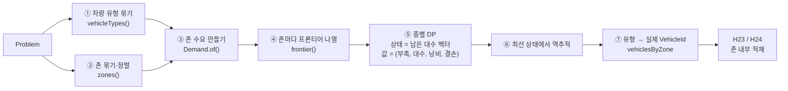
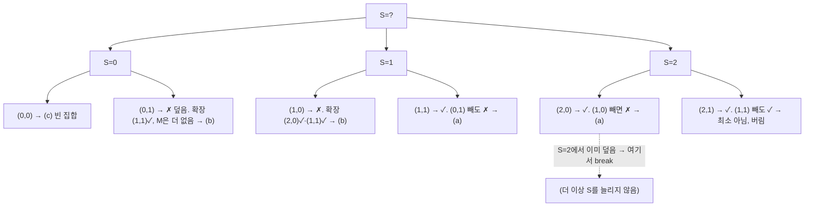
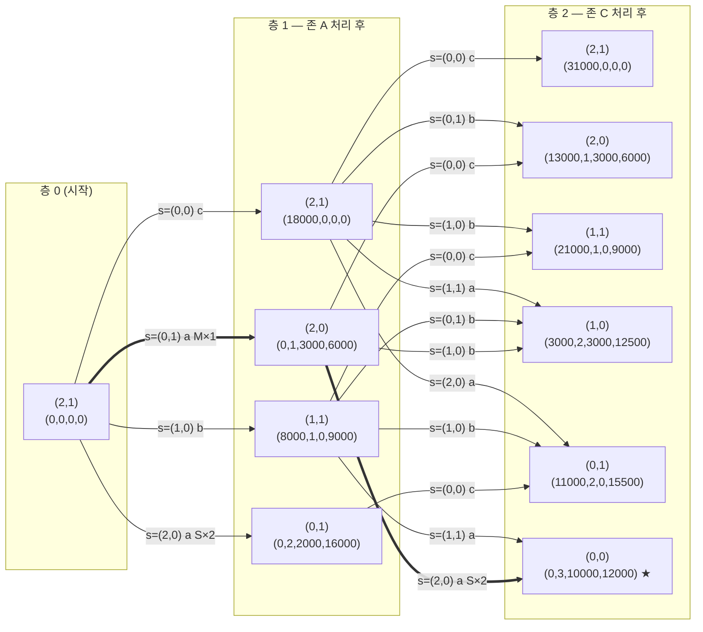

# `ZoneQuotaAllocation` — 존 배정 DP는 어떻게 최적화하는가

> **성격**: 코드 해설 노트(비규범). [H23 코드 해설](heuristics/zone-quota-balanced-fill-construction.md)의 §2.1을 깊게 파고든 보강 자료다.
> 규범은 [heuristics 문서 §3.4·§5 H23 공통](../implementation/stage-04-initial-solution-heuristics.md), 근거 실측은
> [survey §2.5](../implementation/stage-04-initial-solution-heuristics-survey.md)다. 어긋나면 그쪽이 이긴다.
>
> **대상 독자**: [H23 코드 해설](heuristics/zone-quota-balanced-fill-construction.md)을 읽은 사람. 그 문서의 용어 각주(bank·오라클·Hall 조건 등)를
> 전제한다. DP 자체는 처음이라고 가정하고 한 예제를 끝까지 손으로 푼다.
>
> **대상 파일**: `solver-core/src/main/java/com/ronext/rpdptw/solve/ZoneQuotaAllocation.java` (약 330줄).
>
> **예제 검증**: 이 문서의 모든 숫자(`covers` 표·프론티어·층별 값·최종 배정)는 실제 코드를 실행해 대조했다. 실행 방법은 [부록](#부록-예제를-코드로-재현하기).

---

## 0. 한 장 요약



**풀려는 문제**: "존마다 어떤 차량 유형을 몇 대 줄 것인가"를 **모든 존을 동시에 보고** 정한다.
**왜 DP인가**: 차량 부피 여유가 4.2%뿐이라, 한 존이 지금 당장 낭비가 적은 조합을 고르면 뒤 존이 굶는다.
**최적화 대상**: (총 부족 부피, 총 사용 대수, 총 낭비 부피, 총 결손)을 사전식으로 최소화한다 — 부족이 0인 배정 중 차량을 가장 덜 쓰고, 그중 낭비가
가장 적고, 그중 "존의 차 한 대마다 평균 단품 하나가 더 들어갈 여유"의 부족분(결손)이 가장 작은 것. 앞 두 축은 정식 score (미배정, 차량 수)와 같은 순서다
(2026-09-05 개정 — 종전 (부족, 낭비, 대수). [설계안](../implementation/stage-04-zone-value-function.md)).
**근사인가 정확인가**: DP 자체는 이 모델 안에서 **정확한 최적**이다. 다만 모델이 부피·무게·방문 수·호환만 보고 시간창·거리는 안 본다.
그 축은 뒤의 삽입 오라클이 판정한다 — 그래서 결과는 "근사적으로 좋은 출발점"이다.

---

## 1. 입력과 출력을 먼저 고정한다

### 1.1 입력 — `Problem`에서 읽는 것

| 읽는 것 | 어디서 | 쓰임 |
|---|---|---|
| 차량마다 `maxVolume`·`maxWeight`·`effectiveMaxStopCount` | `Vehicle` | 유형 정의, `covers` 계산 |
| 요청마다 `totalVolume`·`totalWeight`·방문 수(단일 1, PD 2) | `Request` | 존 수요 |
| 요청 ↔ 차량 호환표 | `problem.compatibleVehicles(requestId)` | 유형 정의, 존 순서, Hall 조건 |
| 요청의 anchor side `zoneId` | `RequestSide` | 존 묶기 |

**읽지 않는 것**: 시간창·근무창·차고·이동표·속도. DP는 "적재량이 맞는가"만 본다.

### 1.2 출력 — `Allocation`

```java
record Allocation(List<VehicleType> types, List<Zone> zones, Map<String, List<VehicleId>> vehiclesByZone) {}
```

H23이 실제로 쓰는 것은 `zones()`(순서 포함)와 `vehiclesByZone()`이다. **한 차량은 정확히 한 존에만** 나타나고, 배정을 못 받은 존은 빈 목록이다.

### 1.3 왜 "차량 한 대씩"이 아니라 "유형별 대수"인가

같은 조건(호환 집합·부피·무게·정차 한도)의 차량은 어느 것을 줘도 같다. 31대를 개별로 다루면 상태가 2³¹이지만, 유형 6종에 대수
(5, 8, 6, 3, 4, 3)이면 상태는 (5+1)(8+1)(6+1)(3+1)(4+1)(3+1) = 25,920이다. **대칭을 접는 것**이 이 DP가 성립하는 첫 번째 이유다.

---

## 2. 계속 쓸 예제

이 문서는 아래 작은 입력 하나를 끝까지 따라간다. 숫자는 코드 실행으로 검증했다(부록).

**차량 3대 → 유형 2종**

| 유형 | 차량 | `maxVolume` | 호환 요청 |
|---|---|---:|---|
| `S` (type 0) | S1, S2 | 10,000 | a1, a2, c1, c2 (전부) |
| `M` (type 1) | M1 | 21,000 | a1, a2, c2 (**c1은 S만 허용**) |

유형 순서는 `maxVolume` 오름차순이라 S가 type 0, M이 type 1이다. 조합 수 = (2+1)(1+1) = **6** ≤ 65,536 → 실행.

**요청 4건 → 존 2개**

| 존 | 요청 | 부피 | 허용 차급 | 존 합계 |
|---|---|---:|---|---:|
| A | a1, a2 | 9,000 × 2 | S, M | 18,000 |
| C | c1 | 8,000 | **S만** | 13,000 |
| C | c2 | 5,000 | S, M | |

존 순서 = (호환 유형 수 ASC, Σ부피 DESC, zoneId ASC). 두 존 다 유형 2종과 호환이라(C는 c2 덕분에 M도 센다) 부피로 갈린다 → **A, C** 순.

**직관으로 미리 보는 답**: 부피 합 31,000 vs 차량 합 41,000이라 넉넉해 보이지만, c1은 S에만 탈 수 있고 c1+c2 = 13,000은 S 한 대(10,000)에
안 든다. 그러니 **존 C는 S 두 대가 필요**하고, 그러면 A는 M을 받아야 한다. 존 A만 보면 S×2(낭비 2,000)가 M(낭비 3,000)보다 싸 보이는 것이 함정이다.

---

## 3. 왜 greedy가 아니라 DP인가 — 반례

존 순서대로 "이 존에 지금 가장 싼 조합"을 고르는 greedy를 같은 예제에 적용하면:

| 단계 | 남은 대수 (S, M) | 선택 | 근거 | 누적 (부족, 낭비, 대수) — 2026-09-05 개정 전 값 |
|---|---|---|---|---|
| 존 A | (2, 1) | **S×2** | 낭비 2,000 < M의 3,000 | (0, 2,000, 2) |
| 존 C | (0, 1) | 없음 | M만 남았는데 c1은 M에 못 탄다 | (**13,000**, 2,000, 2) |

DP는 존 A에서 3,000을 더 낭비하는 대신 존 C를 살린다:

| 단계 | 선택 | 누적 (개정 전 값) |
|---|---|---|
| 존 A | M×1 | (0, 3,000, 1) |
| 존 C | S×2 | (**0**, 10,000, 3) |

사전식 비교에서 첫 축(부족)이 13,000 vs 0이므로 DP가 이긴다.
(이 표는 개정 전 값 `(부족, 낭비, 대수)`로 적었다. 2026-09-05 개정 값 `(부족, 대수, 낭비, 결손)`에서는 존 A의 M×1이 `(0, 1, 3,000, 6,000)`으로
S×2 `(0, 2, 2,000, 16,000)`보다 대수 축에서 앞서므로 **이 예제에서는 greedy도 M×1을 고른다** — 반례가 되려면 낭비가 아니라 대수로 함정을 파야 한다.
greedy가 전역 최적을 놓친다는 사실 자체는 값 함수와 무관하고, 실물 실측(아래 32 미배정)이 그 근거다.)

실물 fixture에서도 같은 현상이 크게 나타났다 — 부피 수준 근사 잣대로
**존 순서 greedy 32 미배정 · Hall 조건 없는 DP 180+ · 완전한 DP 0** (survey §2.5).

---

## 4. 모델링 — 상태·층·전이·값

DP를 설계하는 네 가지 질문에 이 코드가 답하는 방식이다.

| 질문 | 답 | 코드 |
|---|---|---|
| **상태**[^state]는 무엇인가 | "아직 안 쓴 차량이 유형별로 몇 대 남았나" = 정수 벡터 `remaining[t]` | `decode(from, counts, radix)` |
| **층**(단계)은 무엇인가 | 존 하나. 존 순서대로 한 층씩 내려간다 | `for (Zone zone : zones)` |
| **전이**는 무엇인가 | 이 존에 유형별 대수 벡터 `s`를 준다 → 상태 `remaining − s` | `to -= s[t] * radix[t]` |
| **값**은 무엇인가 | (Σ부족, Σ사용 대수, Σ낭비, Σ결손) — 작을수록 좋고 사전식. 길이는 `VALUE_AXES = 4` | `long[] value = {…}` |

```text
f₀(전 대수) = (0, 0, 0, 0)
f_{z+1}(r − s) = min_사전식 { f_z(r) + (부족(z, s), Σs, 낭비(z, s), 결손(z, s)) : s ∈ 프론티어(r, z) }
답 = min_사전식 f_Z(r) over 모든 r  → 역추적
```

부족·낭비·결손의 정의:

```text
capacity(s) = Σ_t s_t · maxVolume_t
covers(s)   = 이 존의 요청이 s로 전부 실릴 수 있는가 (§5)
부족        = covers ? 0 : max(1, Σvolume_z − capacity(s))
낭비        = covers ? capacity(s) − Σvolume_z : 0
평균_z      = ⌊Σvolume_z / n_z⌋                       (n_z = 존의 요청 수, Demand.count)
결손        = Σs = 0 ? 0 : max(0, Σs × 평균_z − 낭비)
```

`max(1, …)`는 "부피는 충분한데 Hall 조건 때문에 못 덮는" 경우에도 부족을 최소 1로 세어, **못 덮은 존이 공짜가 되지 않게** 한다.
결손(2026-09-05 추가)은 "존의 차 한 대마다 평균 단품 하나를 더 실을 여유"의 부족분이다 — 실물 fixture에서 앞 세 축이 전부 동률인 배정이
209개였고 그중 17%가 2단계에서 미배정을 남겼는데, 그 실패는 여유가 존 크기에 비해 조각난 배정에서 났다. 결손은 그 동점을 깨는 자리이고
여유가 `Σs × 평균` 이상이면 0이라 더 큰 여유를 보상하지는 않는다(낭비 축이 이미 벌한다). 축 순서에서 대수가 낭비보다 앞선 것은 정식 score의
2번 축(차량 수)과 맞추기 위해서다. 값 함수는 `Demand`·유형 용량·`s` 밖의 것(이동표·시간창·요청 순서)을 읽지 않는다.

### 4.1 상태 부호화 — 혼합 진법[^mixed-radix]

상태 벡터를 배열 인덱스 하나로 바꾼다. 유형 t의 자리값 `radix[t]` = 앞 유형들의 (대수+1)의 곱.

예제: counts = (2, 1) → radix = [1, 3], 전체 크기 = 3 × 2 = 6.

| 남은 (S, M) | index = S·1 + M·3 |
|---|---:|
| (0, 0) | 0 |
| (1, 0) | 1 |
| (2, 0) | 2 |
| (0, 1) | 3 |
| (1, 1) | 4 |
| (2, 1) | 5 |

배열 인덱스로 순회하므로 **상태를 도는 순서가 항상 같다** — 동률 처리("먼저 계산된 값 유지")가 결정적이 되는 근거다.
`Layer` 하나는 `value[size][]`·`parent[size]`·`chosen[size][]` 세 배열이고, `value == null`이면 도달 불가 상태다.

---

## 5. `covers(s)` — "이 조합으로 이 존을 다 실을 수 있나"

가장 오해하기 쉬운 부분이다. 부피 합만 비교하면 안 된다 — **일부 요청은 일부 유형에만 탈 수 있기 때문**이다.

### 5.1 호환 그룹과 접두 누적

존의 요청을 "호환 유형 집합(비트마스크[^bitmask])"으로 묶고, **호환 유형 수가 적은 그룹부터** 정렬한 뒤 누적한다.

예제 존 C:

| 그룹 k | 호환 마스크 | 요청 | Σ부피 | 최대 단품 | 누적 마스크 `prefixMask[k]` | 누적 Σ부피 `prefixVolume[k]` |
|---:|---|---|---:|---:|---|---:|
| 0 | {S} | c1 | 8,000 | 8,000 | {S} | 8,000 |
| 1 | {S, M} | c2 | 5,000 | 5,000 | {S, M} | 13,000 |

존 A는 그룹이 하나뿐이다: k=0, 마스크 {S, M}, Σ 18,000, 최대 단품 9,000.

### 5.2 판정 — 접두마다 두 가지

```text
∀k:  (1) 누적 검사   Σ_{t ∈ prefixMask[k]} s_t · maxVolume_t ≥ prefixVolume[k]      (무게·방문 수도 같은 꼴)
     (2) 최대 단품   그룹 k와 호환이고 s_t > 0인 유형 중 maxVolume ≥ 그룹 최대 단품인 것이 존재
```

(1)이 **Hall 조건**이다. "호환 폭이 좁은 요청들부터 누적해 갔을 때, 그 요청들이 탈 수 있는 유형만으로 감당되는가". k=0에서는 S에
탈 수밖에 없는 c1을 S 대수만으로 감당해야 하고, k=1에서는 c1+c2를 S+M으로 감당하면 된다. (2)는 "총합은 되지만 한 덩어리가 너무 커
어느 차에도 안 들어가는" 경우를 막는다.

### 5.3 예제의 `covers` 표 (코드 실행 결과와 일치)

| s = (S, M) | 존 A (Σ18,000) | 존 C (c1 8,000 S만 · c2 5,000) | 존 C가 그렇게 판정된 이유 |
|---|:-:|:-:|---|
| (0, 0) | ✗ | ✗ | 아무것도 없다 |
| (0, 1) | ✓ 21,000 ≥ 18,000 | **✗** | k=0: S 대수 0 → 0 < 8,000. **부피 21,000이 충분해도 c1이 M에 못 탄다** |
| (1, 0) | ✗ 10,000 < 18,000 | ✗ | k=0: 10,000 ≥ 8,000 ✓ · k=1: 10,000 < 13,000 |
| (1, 1) | ✓ | ✓ | k=0 ✓ · k=1: 31,000 ≥ 13,000 ✓ · 최대 단품 ✓ |
| (2, 0) | ✓ 20,000 ≥ 18,000 | ✓ | k=1: 20,000 ≥ 13,000 ✓ · 최대 단품 8,000 ≤ 10,000 ✓ |
| (2, 1) | ✓ | ✓ | |

(0, 1) 행이 이 절의 요점이다 — Hall 조건이 없으면 "M 한 대면 21,000 ≥ 13,000이니 존 C를 덮는다"고 잘못 판단하고, 그러면 실물에서는 T5(큰 차)가
≤T1.9 전용 존으로 배정돼 180건 이상이 미배정된다.

### 5.4 캐시

같은 존 안에서 `covers(s)`는 s에만 의존하므로, `cached(radix)`가 상태 수 크기의 `byte[]`(0 미계산·1 거짓·2 참)를 두고 한 번 계산한 결과를
기억한다. 프론티어 나열이 같은 s를 여러 번 묻기 때문에 효과가 크다.

---

## 6. 프론티어 — 시도할 만한 조합만 남기기

상태 r에서 존 z에 줄 수 있는 벡터 s는 Π(r_t + 1)개다. 전부 전이하면 상태 × 조합이라 너무 많고, 대부분은 볼 가치가 없다.
"딱 덮는 것보다 더 주면 낭비만 늘고, 덜 주면 부족만 는다"는 관찰이 세 부류만 남긴다.

| 부류 | 정의 | 뜻 |
|---|---|---|
| **(a) 최소 덮개** | `covers(s)` ∧ ¬`covers(s − e_min)`[^unit-vector] (가장 작은 유형 하나를 빼면 못 덮음) | 이 존을 덮는 조합 중 더 줄일 수 없는 것 |
| **(b) 한 대 모자란 최대 비덮개** | ¬`covers(s)` ∧ 더 줄 유형이 있음 ∧ 더 줄 수 있는 모든 유형 t에 대해 `covers(s + e_t)` | 부분 배정. 공급이 모자랄 때 "이만큼이라도 주고 나머지는 leftover" |
| **(c) 빈 집합** | s = 0 | 이 존을 건너뛴다 |

### 6.1 나열 — `enumerate`의 가지치기

유형 순서(작은 차부터)로 재귀하며 대수를 0..r_t로 늘리는데, **뒤 유형이 전부 0인 상태에서 이미 덮이면 그 유형은 더 늘리지 않는다**.



위 그림은 **존 C, 남은 (2, 1)**의 나열이다. 결과 프론티어 = {(0,0), (0,1), (1,0), (1,1), (2,0)} — 코드 실행 결과와 같다.

### 6.2 분류 — `classify` 판정을 표로

존 C, 남은 (2, 1):

| s | covers | 판정 절차 | 부류 |
|---|:-:|---|---|
| (0,0) | ✗ | 전부 0 | (c) |
| (0,1) | ✗ | 확장 가능 유형: S(2 > 0) → (1,1) covers ✓. M(1 = 1)은 확장 불가라 검사 생략 | (b) |
| (1,0) | ✗ | S → (2,0) ✓ · M → (1,1) ✓ | (b) |
| (1,1) | ✓ | 가장 작은 유형 S 하나 빼기 → (0,1) ✗ → 최소 | (a) |
| (2,0) | ✓ | (1,0) ✗ → 최소 | (a) |
| (2,1) | ✓ | (1,1) ✓ → 최소 아님 | 버림 |

존 C, 남은 (0, 1)이면 프론티어는 **{(0,0)}뿐**이다 — (0,1)은 못 덮고 확장할 유형도 없어 (b)도 아니다. 이것이 greedy 반례에서 존 C가
아무것도 못 받은 이유다.

**(b)가 왜 필요한가**: 프론티어에 (a)와 (c)만 있으면 "덮거나 포기"뿐이라, 공급이 전체적으로 모자랄 때 부분 배정으로 부족을 줄일 길이 없다.
(b)는 "한 대만 더 있으면 덮는" 최대 조합이라, 남은 요청 수를 최소로 만드는 부분 배정이다. 단 **덮을 수 없는 존에 남은 차를 전부 쏟아붓지는
않는다** — 확장해도 못 덮는 조합은 (b)가 아니다.

---

## 7. DP 실행 — 층별로 전부 따라가기

### 7.1 상태 격자



굵은 화살표가 최종 답의 경로다. 각 노드의 값은 그 상태로 들어오는 여러 화살표 중 사전식 최소를 취한 것이고, 아래 표가 그 경쟁을 전부 보여 준다.

### 7.2 층 0 → 층 1 (존 A: Σ18,000, 그룹 {S,M} 하나)

시작 상태 (2,1), 값 (0,0,0,0). 프론티어(2,1) = {(0,0), (0,1), (1,0), (2,0)}. 존 A의 평균 단품 = ⌊18,000 / 2⌋ = 9,000.

| s | 부류 | capacity | covers | 부족 | 대수 | 낭비 | 결손 = max(0, 대수×9,000 − 낭비) | 도착 상태 | 층 1 값 |
|---|:-:|---:|:-:|---:|---:|---:|---:|---|---|
| (0,0) | c | 0 | ✗ | 18,000 | 0 | 0 | 0 | (2,1) | (18,000, 0, 0, 0) |
| (0,1) | a | 21,000 | ✓ | 0 | 1 | 3,000 | 6,000 | (2,0) | (0, 1, 3,000, 6,000) |
| (1,0) | b | 10,000 | ✗ | 8,000 | 1 | 0 | 9,000 | (1,1) | (8,000, 1, 0, 9,000) |
| (2,0) | a | 20,000 | ✓ | 0 | 2 | 2,000 | 16,000 | (0,1) | (0, 2, 2,000, 16,000) |

층 1에서 (1,0)·(0,0)은 도달 불가(null)다.

### 7.3 층 1 → 층 2 (존 C: c1 8,000 S만 · c2 5,000)

상태는 인덱스 오름차순(§4.1 표)으로 순회한다: (2,0)=2 → (0,1)=3 → (1,1)=4 → (2,1)=5. 존 C의 평균 단품 = ⌊13,000 / 2⌋ = 6,500.

| from | 기본값 | s | 부류 | capacity | covers | +(부족, 대수, 낭비, 결손) | to | 후보 값 | 층 2 결과 |
|---|---|---|:-:|---:|:-:|---|---|---|---|
| (2,0) | (0,1,3000,6000) | (0,0) | c | 0 | ✗ | (13,000, 0, 0, 0) | (2,0) | (13,000, 1, 3,000, 6,000) | **채택** |
| | | (1,0) | b | 10,000 | ✗ | (3,000, 1, 0, 6,500) | (1,0) | (3,000, 2, 3,000, 12,500) | **채택** |
| | | (2,0) | a | 20,000 | ✓ | (0, 2, 7,000, 6,000) | (0,0) | **(0, 3, 10,000, 12,000)** | **채택 ★** |
| (0,1) | (0,2,2000,16000) | (0,0) | c | 0 | ✗ | (13,000, 0, 0, 0) | (0,1) | (13,000, 2, 2,000, 16,000) | 채택(임시) |
| (1,1) | (8000,1,0,9000) | (0,0) | c | 0 | ✗ | (13,000, 0, 0, 0) | (1,1) | (21,000, 1, 0, 9,000) | **채택** |
| | | (0,1) | b | 21,000 | ✗ | (1, 1, 0, 6,500) | (1,0) | (8,001, 2, 0, 15,500) | 기각 — (3,000, …)가 더 좋음 |
| | | (1,0) | b | 10,000 | ✗ | (3,000, 1, 0, 6,500) | (0,1) | (11,000, 2, 0, 15,500) | **채택** — (13,000, …)를 밀어냄 |
| | | (1,1) | a | 31,000 | ✓ | (0, 2, 18,000, 0) | (0,0) | (8,000, 3, 18,000, 9,000) | 기각 — (0, 3, 10,000, 12,000)가 더 좋음 |
| (2,1) | (18000,0,0,0) | (0,0) | c | 0 | ✗ | (13,000, 0, 0, 0) | (2,1) | (31,000, 0, 0, 0) | **채택** |
| | | (0,1) | b | 21,000 | ✗ | (1, 1, 0, 6,500) | (2,0) | (18,001, 1, 0, 6,500) | 기각 |
| | | (1,0) | b | 10,000 | ✗ | (3,000, 1, 0, 6,500) | (1,1) | (21,000, 1, 0, 9,000) | **동률** → 먼저 계산된 값 유지 |
| | | (1,1) | a | 31,000 | ✓ | (0, 2, 18,000, 0) | (1,0) | (18,000, 2, 18,000, 0) | 기각 |
| | | (2,0) | a | 20,000 | ✓ | (0, 2, 7,000, 6,000) | (0,1) | (18,000, 2, 7,000, 6,000) | 기각 |

눈여겨볼 행:

- **(1,1)에서 s=(0,1)**: M 한 대(21,000)는 부피로는 13,000을 넘지만 `covers`가 ✗라(Hall) 부족이 `max(1, 13,000 − 21,000) = 1`이 된다.
  "못 덮은 존은 최소 1의 부족"이라는 규칙이 여기서 작동한다. 낭비는 0이라 결손은 대수 × 평균 = 6,500 그대로다(X36 — 부족 축이 앞서 영향 없음).
- **(2,1)에서 s=(1,0) → (1,1)**: (1,1)에서 온 (21,000, 1, 0, 9,000)과 정확히 동률이다. `compare(...) < 0`일 때만 교체하므로 **먼저 계산된 쪽**
  (인덱스 4에서 온 것)이 남는다. 순회 순서가 고정이라 결과도 고정이다.
- **(1,1)에서 s=(1,1) → (0,0)**: 결손이 0인 유일한 전이(낭비 18,000 ≥ 2 × 6,500)지만 부족 8,000이 앞서 진다. 결손은 앞 세 축이 동점일 때만
  고르는 자리다 — 이 예제는 유형 2종·존 2개라 그런 동점이 없고, 답은 개정 전과 같다.

### 7.4 층 2 최종 — 답 고르기와 역추적[^backtrack]

| 남은 (S,M) | index | 층 2 값 | 비고 |
|---|---:|---|---|
| (0,0) | 0 | **(0, 3, 10,000, 12,000)** | 부족 0 — 유일한 완전 덮개 |
| (1,0) | 1 | (3,000, 2, 3,000, 12,500) | |
| (2,0) | 2 | (13,000, 1, 3,000, 6,000) | |
| (0,1) | 3 | (11,000, 2, 0, 15,500) | |
| (1,1) | 4 | (21,000, 1, 0, 9,000) | |
| (2,1) | 5 | (31,000, 0, 0, 0) | 아무것도 안 줌 |

최선 = index 0. 동률이면 인덱스가 작은 쪽(남은 벡터 사전식 최소 = 차량을 더 많이 쓴 쪽)이 남는다.

역추적은 `parent`·`chosen`을 층 2 → 층 1 순으로 거슬러 간다:

```text
층 2 index 0 (0,0)  ← chosen s=(2,0), parent index 2 (2,0)     ⇒ 존 C ← S×2
층 1 index 2 (2,0)  ← chosen s=(0,1), parent index 5 (2,1)     ⇒ 존 A ← M×1
```

유형 → 실제 차량은 유형 순서 × 유형 안 `VehicleId` 오름차순으로 소비한다(`cursor[t]++`):

| 존 | quota (S, M) | 차량 |
|---|---|---|
| A | (0, 1) | [M1] |
| C | (2, 0) | [S1, S2] |

이것이 코드 실행 결과 `allocation: {A=[M1], C=[S1, S2]}`와 같고, H23이 이어받아 A는 M1 한 경로에 a1·a2, C는 S1에 c1·S2에 c2를 실어 **bank 0**으로 끝난다.

---

## 8. 결정성·동률·종료·비용

| 항목 | 방식 |
|---|---|
| 존 순서 | (호환 유형 수, Σ부피 DESC, zoneId ASC) — 제약이 센 존이 앞 층 |
| 상태 순회 | 배열 인덱스 오름차순 |
| 프론티어 순서 | 유형 순서 재귀 나열 순 |
| 전이 동률 | **먼저 계산된 값 유지** (`compare < 0`일 때만 교체). 비교는 4축 `(Σ부족, Σ대수, Σ낭비, Σ결손)` 사전식 — 실물 fixture에서는 앞 세 축이 동률인 배정이 209개라 4번 축(결손)이 그 대부분을 가른다(최소 집합 5개, 그 안은 여전히 이 규칙) |
| 최종 동률 | 인덱스 최소 = 남은 벡터 사전식 최소 |
| 유형 → 차량 | 유형 순서 × VehicleId ASC |

세 순서가 전부 고정이라 같은 `Problem`이면 같은 `Allocation`이다. 난수도, `HashMap` 순회도 없다.

**종료**는 루프 상한이 아니라 구조다: 층 수 = 존 수, 층당 상태 ≤ Π(대수+1), 상태당 전이 ≤ 프론티어 크기. 프론티어 나열은 재귀 깊이가
유형 수라 유한하다. `MAX_COMBINATIONS = 65,536`은 `Layer`의 `long[][]`·`int[][]`가 상태 수만큼 잡히므로 메모리와 시간을 상수로 묶는 한계이고,
넘으면 H23·H24가 기권한다(X20).

**비용**(규범 §5 표): `O(Z · S · F · G)` — Z 존 수, S 상태 수, F 프론티어 크기(≤ S), G 호환 그룹 수. 실물 fixture는 Z = 11(ZONE_15~29),
S = 25,920, 유형 6종이고, H23 전체 507 ms 중 DP는 그 일부다.

---

## 9. 최적화의 층위 — DP가 어디까지 책임지는가

H23 전체를 "무엇을 무엇으로 최적화하는가"로 다시 보면 네 층이다. DP는 첫 층이다.

| 층 | 결정 | 방법 | 정확도 | 보는 것 | 못 보는 것 |
|---:|---|---|---|---|---|
| 1 | 존 ← 유형별 대수 | **DP (전역 정확)** | 모델 안에서 최적 | 부피·무게·방문 수·호환(Hall) | 시간창·거리·근무창 |
| 2 | 존 안 요청 ← 차량 | greedy (부호 있는 정차 예산 best-fit) | 휴리스틱 | 부피·정차 한도 + 오라클 판정 | 다른 존 |
| 3 | 못 넣은 요청 | 1-1 교환 | 국소 개선 | 같은 존 안 | 2건 이상 교환 |
| 4 | 남은 요청 | leftover pass (어느 차든) | 마지막 시도 | 전 경로·미사용 차량 | — |
| — | 그 뒤 | ALNS (Stage 4-ALNS) | 메타휴리스틱[^metaheuristic] | 전부 | — |

**DP가 시간창을 무시하는 이유**는 계산 가능성이다. 시간창까지 넣으면 "이 조합으로 존을 덮는가"가 그 자체로 VRPTW[^vrptw]라 상태 값을 O(1)에 못 구한다.
대신 DP는 "적재 축에서 확실히 말이 되는 배정"을 고르고, 시간창은 층 2에서 요청 하나를 넣을 때마다 오라클이 경로 전체를 재전파해 판정한다.
실물에서 이 분업이 통한 근거가 survey §2.5의 표다 — 부피 수준 근사 잣대의 예측(2 미배정)보다 정식 오라클 결과(0)가 오히려 좋았다.

**DP가 틀릴 수 있는 방향**: 적재로는 덮이지만 시간창·거리 때문에 실제로는 한 존을 그 대수로 못 도는 경우. 그때 층 2가 leftover를 남기고
층 3·4가 수습한다. 이 실패는 DP의 버그가 아니라 모델의 범위다.

---

## 부록: 예제를 코드로 재현하기

아래 클래스를 스크래치 디렉터리에 두고 `solver-core`의 컴파일 산출물에 대해 실행하면 §5·§6·§7의 표를 그대로 찍는다.
패키지가 `com.ronext.rpdptw.solve`인 이유는 `ZoneQuotaAllocation`·`ConstructionFixtures`가 package-private이기 때문이다. 저장소에 넣지 않는다.

```java
package com.ronext.rpdptw.solve;

import static com.ronext.rpdptw.solve.ConstructionFixtures.*;

import java.util.*;
import com.ronext.rpdptw.domain.*;
import com.ronext.rpdptw.problem.Problem;
import com.ronext.rpdptw.solve.ZoneQuotaAllocation.*;

public class DpTrace {
    public static void main(String[] args) {
        LocationId la1 = new LocationId("LA1"), la2 = new LocationId("LA2"),
                   lc1 = new LocationId("LC1"), lc2 = new LocationId("LC2");
        Problem problem = freeze(
                List.of(new Depot(DEPOT, List.of(ALL_DAY), Optional.empty())),
                List.of(
                        withFeatures(delivery("a1", la1, 9_000L, ALL_DAY, Optional.of("A")), Set.of("S", "M")),
                        withFeatures(delivery("a2", la2, 9_000L, ALL_DAY, Optional.of("A")), Set.of("S", "M")),
                        withFeatures(delivery("c1", lc1, 8_000L, ALL_DAY, Optional.of("C")), Set.of("S")),
                        withFeatures(delivery("c2", lc2, 5_000L, ALL_DAY, Optional.of("C")), Set.of("S", "M"))),
                List.of(
                        vehicle("S1", 10_000L, Optional.of(DEPOT), Optional.empty(), OptionalInt.empty(), Optional.of("S")),
                        vehicle("S2", 10_000L, Optional.of(DEPOT), Optional.empty(), OptionalInt.empty(), Optional.of("S")),
                        vehicle("M1", 21_000L, Optional.of(DEPOT), Optional.empty(), OptionalInt.empty(), Optional.of("M"))),
                locations(at(DEPOT, 37.0, 127.0), at(la1, 37.01, 127.0), at(la2, 37.02, 127.0),
                          at(lc1, 37.0, 127.01), at(lc2, 37.0, 127.02)),
                List.of());
        List<VehicleType> types = ZoneQuotaAllocation.vehicleTypes(problem);
        List<Zone> zones = ZoneQuotaAllocation.zones(problem, types);
        int[] counts = new int[types.size()];
        for (int t = 0; t < counts.length; t++) counts[t] = types.get(t).vehicles().size();
        for (Zone z : zones) {
            System.out.println("zone " + z.zoneId() + " " + z.members());
            Demand d = Demand.of(problem, types, z);
            for (int s0 = 0; s0 <= counts[0]; s0++) for (int s1 = 0; s1 <= counts[1]; s1++)
                System.out.println("  covers(" + s0 + "," + s1 + ") = " + d.covers(new int[] {s0, s1}));
            for (int r0 = 0; r0 <= counts[0]; r0++) for (int r1 = 0; r1 <= counts[1]; r1++) {
                StringBuilder sb = new StringBuilder();
                for (int[] s : ZoneQuotaAllocation.frontier(new int[] {r0, r1}, d)) sb.append(Arrays.toString(s)).append(' ');
                System.out.println("  frontier(remaining=" + r0 + "," + r1 + ") = " + sb);
            }
        }
        System.out.println("allocation " + ZoneQuotaAllocation.allocate(problem).vehiclesByZone());
        Solution sol = new ZoneQuotaBalancedFillConstruction().construct(problem, new com.ronext.rpdptw.eval.DefaultProfile());
        for (Route r : sol.routes()) System.out.println("route " + r.vehicleId() + " " + r.visits());
        System.out.println("bank " + sol.bank());
    }
}
```

```bash
source "$HOME/.sdkman/bin/sdkman-init.sh" && sdk env
mvn -q -o test-compile -pl solver-core                     # target/classes · target/test-classes 준비
CP=solver-core/target/classes:solver-core/target/test-classes
javac -cp $CP -d /tmp/dp-out path/to/com/ronext/rpdptw/solve/DpTrace.java
java  -cp $CP:/tmp/dp-out com.ronext.rpdptw.solve.DpTrace
```

기대 출력(요약):

```text
zone A [a1, a2]     covers(0,1)=true  covers(2,0)=true  covers(1,0)=false
  frontier(remaining=2,1) = [0, 0] [0, 1] [1, 0] [2, 0]
zone C [c1, c2]     covers(0,1)=false covers(2,0)=true  covers(1,1)=true
  frontier(remaining=2,1) = [0, 0] [0, 1] [1, 0] [1, 1] [2, 0]
  frontier(remaining=0,1) = [0, 0]
allocation {A=[M1], C=[S1, S2]}
route M1 [a1:D, a2:D]   route S1 [c1:D]   route S2 [c2:D]   bank []
```

---

## 용어 각주

이 문서에만 나오는 용어다. bank·오라클·Hall 조건·프론티어·정차 한도 등은 [H23 코드 해설의 각주](heuristics/zone-quota-balanced-fill-construction.md#용어-각주)를 본다.

[^state]: **상태(state)** — DP가 "지금까지 무엇을 했는지" 중 앞으로의 선택에 영향을 주는 정보만 남긴 요약. 여기서는 어느 존에 무엇을
    줬는지는 잊고 "남은 대수"만 기억한다. 같은 남은 대수에 도달한 두 경로는 앞으로 똑같이 행동하므로, 값이 나쁜 쪽은 버려도 된다 —
    이것이 DP가 지수적 탐색을 피하는 원리다.

[^mixed-radix]: **혼합 진법(mixed radix)** — 자리마다 진법이 다른 수 표기. 시:분:초(24·60·60)가 그 예다. 여기서는 유형 t의 자리가
    (대수_t + 1)진법이라, 벡터 (S, M)이 정수 하나 `S·1 + M·3`으로 부호화되고 나눗셈·나머지로 복원된다(`decode`).

[^bitmask]: **비트마스크** — 집합을 정수의 비트로 표현하는 방법. 유형 t가 들어 있으면 t번째 비트가 1이다. {S} = 0b01, {S, M} = 0b11.
    `Integer.bitCount`로 원소 수를 세고, `&`로 교집합을 검사한다.

[^unit-vector]: **e_t** — t번째 원소만 1이고 나머지는 0인 벡터. `s − e_min`은 "가장 작은 유형(인덱스가 가장 낮은, 0이 아닌 유형)을
    한 대 뺀 조합", `s + e_t`는 "유형 t를 한 대 더한 조합"이다. 코드에서는 `probe[smallest]--`·`probe[t]++`다.

[^backtrack]: **역추적(backtracking)** — DP는 앞으로 갈 때 "값"만 갱신하고 "어떤 선택으로 왔는지"(`parent`·`chosen`)를 따로 적어 둔다.
    끝에서 최선 상태를 고른 뒤 그 기록을 거꾸로 따라가 각 층의 선택을 복원하는 절차다.

[^metaheuristic]: **메타휴리스틱** — 특정 문제에 묶이지 않는 일반 탐색 틀. ALNS(Adaptive Large Neighborhood Search)는 해의 일부를
    부수고(destroy) 다시 채우는(repair) 것을 반복하며 개선한다. 이 저장소에서는 초기해 다음 단계이고 아직 구현 전이다.

[^vrptw]: **VRPTW** — 시간창이 있는 차량 경로 문제. "이 요청들을 이 차량들로 시간창을 지키며 다 돌 수 있는가"라는 판정 자체가 NP-hard라,
    DP의 상태 값 계산에 넣으면 상태 하나가 곧 문제 하나가 된다.
